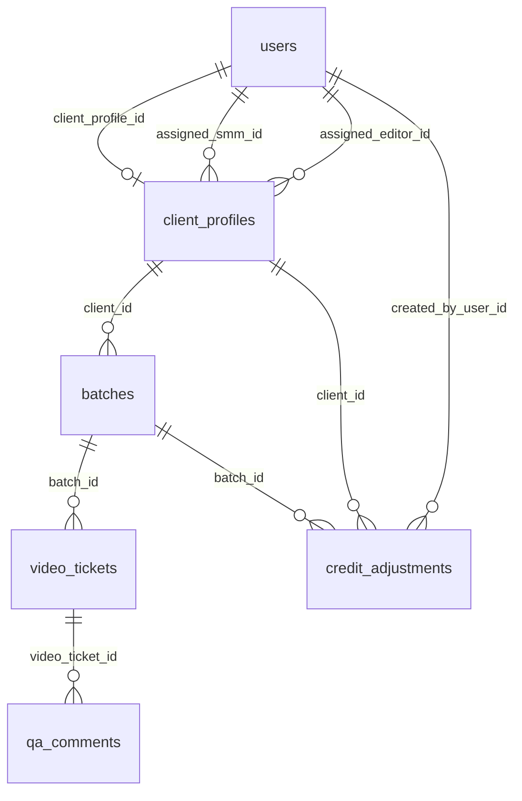

# Path B — Canonical Storage Design

**Status:** Approved (consolidated from B0–B11 epic plans; epic plans reconciled 2026-05-23)  
**Supersedes:** Draft “Storage design” sections in `B0-auth-and-core-schema.md` through `B10-deadlines-pipeline.md`  
**Implementation:** Alembic waves below; execute backend epics **B0 → B11** per [README.md](./README.md)

---

## 1. Conflict report

| # | Issue | Epics | Resolution |
|---|-------|-------|------------|
| 1 | `video_tickets` vs `batch_videos` | — | **`video_tickets`** only (B0) |
| 2 | QA in JSONB on ticket vs `qa_comments` table | B4, B6, B7, B8 | **`qa_comments` table** (B7); optional legacy `qa_flags` / `qa_general_note` on ticket for timestamp send-back compat |
| 3 | `demoStage` vs `pipeline_stage` | B0–B2 | Server **`pipeline_stage`** enum only in API; no client-writable `demoStage` |
| 4 | Stage on batch vs ticket | B0, B5, B2 | **Both:** `batches.pipeline_stage` = batch rollup; `video_tickets.pipeline_stage` = per-ticket after split; gate tickets use batch stage when `deliverable_index` IS NULL |
| 5 | `footageUrl` vs `source_media_url` | B0, B1, B2 | **`source_media_url`** canonical; API may echo `footageUrl` alias on read for compat |
| 6 | `clients` vs `client_profiles` | B0, B1 | **`client_profiles`** + `users` (B0); no separate `clients` table |
| 7 | `credit_adjustments` optional | B1, B9 | **Recommended** audit table; not required for UI v1 |
| 8 | Drive manifest in Mongo | B6 | **Defer** — client-side manifest v1; persist **`deliverable_drive_slots`** JSONB on ticket after sync |
| 9 | `setVideoOwner` manual override | B10 | **Out of v1 schema** — no column; admin deadline only |
| 10 | B11 new tables | B11 | **None** — cutover only |

**Deferred (product / later):**

| # | Question | Default for v1 |
|---|----------|------------------|
| D1 | Re-submit deliverables drive after split | `409 Conflict` (B5); no wipe-and-resplit |
| D2 | `batch_events` audit log | Defer (B3 open question) |
| D3 | JWT httpOnly cookie vs `localStorage` | Implementer choice in B0; schema unchanged |
| D4 | `legacy_id` mapping for demo `c-1` | Dev seed only; API uses UUID |
| D5 | Backend Google Drive proxy | Out of scope — URLs + JSONB snapshots only |

---

## 2. Entity relationship (Postgres)

---

## 3. Postgres tables

### 3.1 `users`

| Column | Type | Notes |
|--------|------|-------|
| id | UUID PK | `Base.id` |
| email | VARCHAR UNIQUE | Case-insensitive login; client `loginId` → email |
| password_hash | VARCHAR | Never expose in API |
| display_name | VARCHAR | `AuthUser.name` |
| role | `user_role` | `client`, `admin`, `employee` |
| employee_kind | `employee_kind` NULL | `editor`, `smm` when `role=employee` |
| client_profile_id | UUID FK NULL | Set when `role=client` |
| is_active | BOOLEAN | Decommission → false |
| created_at, updated_at | TIMESTAMPTZ | |

**Indexes:** unique `email`; `(role)`; `(client_profile_id)`.

### 3.2 `client_profiles`

| Column | Type | Notes |
|--------|------|-------|
| id | UUID PK | |
| display_name | VARCHAR | |
| credits_balance | INTEGER | Default 0; debited in B9 transaction |
| account_status | `client_account_status` | `active`, `decommissioned` |
| decommission_reason | TEXT NULL | |
| decommissioned_at | TIMESTAMPTZ NULL | |
| assigned_smm_id | UUID FK → users | |
| assigned_editor_id | UUID FK → users | |
| brand_guidelines_source | `brand_guidelines_source` | |
| brand_guidelines_summary | TEXT | |
| brand_guidelines_google_doc_url | VARCHAR NULL | |
| brand_guidelines_updated_at | TIMESTAMPTZ | |
| created_at, updated_at | TIMESTAMPTZ | |

### 3.3 `batches`

| Column | Type | Notes | Epic |
|--------|------|-------|------|
| id | UUID PK | | B0 |
| client_id | UUID FK | | B0 |
| batch_number | INTEGER | UNIQUE `(client_id, batch_number)` | B0, B1 |
| title | VARCHAR | | B0 |
| status | `batch_status` | `active`, `completed` | B0, B9 |
| pipeline_stage | `pipeline_stage` | Batch rollup | B0 |
| video_count | INTEGER | 0 until B5 split | B0, B5 |
| intake_path | `batch_intake_path` NULL | `source_media`, `clips_ready` | B0, B3 |
| clip_review_phase | `batch_clip_review_phase` NULL | | B0, B4 |
| source_media_url | VARCHAR NULL | Replaces `footageUrl` | B0, B3 |
| clips_folder_url | VARCHAR NULL | | B0, B4 |
| editor_deliverables_drive_url | VARCHAR NULL | | B0, B5 |
| credit_cost | INTEGER | | B0, B1 |
| credits_debited | BOOLEAN | Default false | B0, B9 |
| batch_schedule | JSONB NULL | Set on batch complete (B9) | B9 |
| completed_at | TIMESTAMPTZ NULL | | B0, B9 |
| created_at, updated_at | TIMESTAMPTZ | | B0 |

**Indexes:** `(client_id)`, `(client_id, status)`, `(pipeline_stage)`.

### 3.4 `video_tickets`

| Column | Type | Notes | Epic |
|--------|------|-------|------|
| id | UUID PK | | B0 |
| batch_id | UUID FK | | B0 |
| client_id | UUID FK | Denormalized for role filters | B0, B2 |
| title | VARCHAR | | B0 |
| deliverable_index | INTEGER NULL | NULL = gate ticket; 1…n post-split | B0, B5 |
| pipeline_stage | `pipeline_stage` | Per-ticket after split | B0 |
| pipeline_owner | `video_pipeline_owner` | | B0 |
| stage_label | VARCHAR | **Derived on write** in services; stored for stable sorting | B0, B2 |
| deadline_at | TIMESTAMPTZ NULL | | B0, B10 |
| deadline_role | VARCHAR NULL | `smm` \| `editor` \| NULL | B0, B10 |
| editor_workflow_phase | `editor_workflow_phase` NULL | `videos`, `thumbnails`, `titles`, `handed_off` | B0, B6, B8 |
| editor_publish_title | VARCHAR NULL | | B0, B6 |
| released_to_client_final_review | BOOLEAN | Default false | B0, B7, B8 |
| last_revision_requested_by | VARCHAR NULL | `smm` \| `client` | B0, B8 |
| asset_versions | JSONB NULL | `{ "video": n, "thumbnail": n }` | B0, B7 |
| deliverable_drive_slots | JSONB NULL | `{ "video"?: DriveMediaEntry, "thumbnail"?: DriveMediaEntry }` | B6 |
| drive_slots_synced_at | TIMESTAMPTZ NULL | | B6 |
| video_schedule | JSONB NULL | `platform`, `go_live_at`, `scheduled_at` | B9 |
| qa_flags | JSONB NULL | Legacy timestamp flags on SMM send-back | B7 |
| qa_general_note | TEXT NULL | Legacy general note on send-back | B7 |
| created_at, updated_at | TIMESTAMPTZ | | B0 |

**Indexes:** `(batch_id)`, `(client_id)`, `(batch_id, deliverable_index)` unique where index NOT NULL; `(pipeline_owner, pipeline_stage)` for admin pipeline.

### 3.5 `qa_comments`

| Column | Type | Notes | Epic |
|--------|------|-------|------|
| id | UUID PK | | B7 |
| video_ticket_id | UUID FK | | B7 |
| slot | `qa_media_slot` | `clip`, `video`, `thumbnail` | B7 |
| asset_version | INTEGER | Aligns with `asset_versions` for slot | B7 |
| kind | `qa_comment_kind` | `timestamp`, `general`, `clip_note` | B7, B4 |
| author_role | VARCHAR | `smm`, `client`, `editor` | B7, B8 |
| author_user_id | UUID FK NULL | Optional | B7 |
| at_seconds | INTEGER NULL | | B7 |
| body | TEXT | | B7 |
| deprecated | BOOLEAN | `true` = sold (UI strikethrough) | B7 |
| created_at | TIMESTAMPTZ | | B7 |

**Indexes:** `(video_ticket_id, slot, deprecated)`, `(video_ticket_id, created_at)`.

### 3.6 `credit_adjustments` (recommended)

| Column | Type | Notes | Epic |
|--------|------|-------|------|
| id | UUID PK | | B1 |
| client_id | UUID FK | | B1 |
| batch_id | UUID FK NULL | Set on `debit_batch` | B9 |
| amount | INTEGER | Positive top-up; negative debit | B1, B9 |
| kind | VARCHAR | `top_up`, `debit_batch` | B1, B9 |
| note | TEXT NULL | | B1 |
| created_by_user_id | UUID FK NULL | Admin or NULL (system) | B1, B9 |
| created_at | TIMESTAMPTZ | | B1 |

---

## 4. Enums

### 4.1 `user_role`

`client`, `admin`, `employee`

### 4.2 `employee_kind`

`editor`, `smm` (NULL for non-employees)

### 4.3 `client_account_status`

`active`, `decommissioned`

### 4.4 `batch_status`

`active`, `completed`

### 4.5 `batch_intake_path`

`source_media`, `clips_ready`

### 4.6 `batch_clip_review_phase`

`smm_identifying`, `awaiting_client`, `with_smm`, `approved`

### 4.7 `pipeline_stage` (canonical — replaces `PathBDemoStage` / `demoStage`)

`intake_pending`, `clips_identifying`, `clip_client_review`, `clips_ready_intake`, `pre_split_production`, `production`, `smm_qa`, `editor_fix`, `client_qa`, `revision_via_smm`, `scheduling`, `completed`

### 4.8 `video_pipeline_owner`

`client`, `smm`, `editor`, `scheduling`, `done`

### 4.9 `editor_workflow_phase`

`videos`, `thumbnails`, `titles`, `handed_off`

### 4.10 `brand_guidelines_source`

`internal`, `google_doc`

### 4.11 `qa_media_slot`

`clip`, `video`, `thumbnail`

### 4.12 `qa_comment_kind`

`timestamp`, `general`, `clip_note`

### 4.13 Prototype `demoStage` → `pipeline_stage` mapping

| Prototype `PathBDemoStage` | `pipeline_stage` | Typical `pipeline_owner` |
|----------------------------|------------------|---------------------------|
| `intake_pending` | `intake_pending` | `client` or `smm` |
| `clips_identifying` | `clips_identifying` | `smm` |
| `clip_client_review` | `clip_client_review` | `client` |
| `clips_ready_intake` | `clips_ready_intake` | `editor` |
| `pre_split_production` | `pre_split_production` | `editor` |
| `production` | `production` | `editor` |
| `smm_qa` | `smm_qa` | `smm` |
| `editor_fix` | `editor_fix` | `editor` |
| `client_qa` | `client_qa` | `client` |
| `revision_via_smm` | `revision_via_smm` | `smm` |
| `scheduling` | `scheduling` | `scheduling` |
| `completed` | `completed` | `done` |

**UI `stage_label`:** Computed in services from `pipeline_stage` + batch/ticket context (same strings as `getPathBDemoStageLabel` today). Stored on `video_tickets.stage_label` on each transition for list sorting.

---

## 5. State machine

### 5.1 Batch-level transitions

| From | Trigger | To | Actor | Tables |
|------|---------|-----|-------|--------|
| `intake_pending` | Admin create batch | `intake_pending` | admin | INSERT batch |
| `intake_pending` | Client intake `source_media` | `clips_identifying` | client | B3: `intake_path`, `source_media_url`, `clip_review_phase=smm_identifying` |
| `intake_pending` | Client intake `clips_ready` | `clips_ready_intake` | client | B3: skip clip review phase `approved` |
| `clips_identifying` | SMM/Editor clips folder | `clip_client_review` | smm/editor | B4: `clips_folder_url`, gate ticket |
| `clip_client_review` | Client approve clips | `pre_split_production` | client | B4 |
| `clip_client_review` | Client reject clips | `clips_identifying` | client | B4: `clip_review_phase=with_smm` + `qa_comments` clip_note |
| `pre_split_production` / `clips_ready_intake` | Editor deliverables drive | `production` | editor | B5: split tickets, `video_count=n` |
| `production` | (rollup) | … | — | Batch stage follows dominant open work |
| `scheduling` | All videos done + debit | `completed` | system | B9: `status=completed`, `credits_debited` |

### 5.2 Video-level transitions (post-split: `deliverable_index >= 1`)

| From | Trigger | To | Owner after | Epic |
|------|---------|-----|-------------|------|
| `production` | Submit to SMM QA (readiness OK) | `smm_qa` | `smm` | B6 |
| `smm_qa` | SMM approve | `client_qa` | `client` | B7: `released_to_client_final_review=true` |
| `smm_qa` | SMM send back | `editor_fix` | `editor` | B7 |
| `editor_fix` | Editor resubmit | `smm_qa` | `smm` | B7: bump `asset_versions.video`, sold comments |
| `client_qa` | Client approve | `scheduling` | `scheduling` | B8 |
| `client_qa` | Client reject | `revision_via_smm` | `smm` | B8 — **never** `editor` |
| `revision_via_smm` | SMM triage → editor | `editor_fix` or `production` | `editor` | B8 |
| `revision_via_smm` | SMM triage → smm assets | `production` | `smm` | B8 |
| `scheduling` | SMM schedule | `completed` | `done` | B9 |

**Gate tickets (`deliverable_index` IS NULL):** Stages `clip_client_review`, `clips_ready_intake`, `pre_split_production` — deleted on B5 split (transaction).

### 5.3 `adminWorkspaceStore` → storage map

| Store action | Primary writes | Epic |
|--------------|----------------|------|
| `provisionClient` | `users`, `client_profiles` | B1 |
| `topUpCredits` | `client_profiles.credits_balance`, `credit_adjustments` | B1 |
| `decommissionClient` | `client_profiles`, `users.is_active` | B1 |
| `updateClientTeam` | `client_profiles` FKs | B1 |
| `updateBrandGuidelines` | `client_profiles` guidelines columns | B1 |
| `createBatchFolder` | `batches` | B1 |
| `submitBatchIntake` | `batches` | B3 |
| `submitSmmClipsFolder` | `batches`, gate `video_tickets` | B4 |
| `approveBatchClips` / `rejectBatchClips` | `batches`, gate ticket, `qa_comments` | B4 |
| `submitEditorVideosDrive` | `batches`, DELETE gates, INSERT n tickets | B5 |
| `saveVideoPublishTitle` / drive sync | `video_tickets` production fields | B6 |
| `sendEditorDeliverableToSmmQa` | `video_tickets` stage/owner | B6 |
| `submitSmmQaReview` | `video_tickets`, `qa_comments`, legacy qa fields | B7 |
| `appendSmmQaComment` / `appendClientQaComment` | `qa_comments` | B7, B8 |
| `applyClientVideoDecision` | `video_tickets` | B8 |
| `smmTriageClientRevision` | `video_tickets` | B8 |
| `scheduleVideo` | `video_tickets`, `batches`, `client_profiles`, `credit_adjustments` | B9 |
| `setVideoDeadline` | `video_tickets.deadline_at` | B10 |

---

## 6. Invariants (server-enforced)

1. **Client QA gate:** `released_to_client_final_review=true`, `pipeline_stage=client_qa`, `deliverable_index >= 1`, and internal SMM QA approved path completed (B7).
2. **Submit to SMM QA (B6):** `editor_publish_title` set; `deliverable_drive_slots` has video + thumbnail for index; batch has `editor_deliverables_drive_url`.
3. **Client reject (B8):** `pipeline_owner=smm`, `pipeline_stage=revision_via_smm` — never assign `pipeline_owner=editor` on client reject.
4. **Credit debit (B9):** Single transaction when all tickets with `deliverable_index >= 1` have `pipeline_owner=done`; set `batches.credits_debited=true` idempotently; debit `credit_cost` from `client_profiles.credits_balance`.
5. **Clips-ready intake (B3/B4):** `clip_review_phase=approved` without client clip review modal.
6. **Deliverables split (B5):** One transaction: delete all `video_tickets` for batch, insert `n` indexed tickets; `409` if `editor_deliverables_drive_url` already set (v1).
7. **SMM QA resubmit (B7):** On video version bump, `UPDATE qa_comments SET deprecated=true` where `slot=video` and `asset_version < new_version`.
8. **RBAC:** Match [`problem-context.md`](../problem-context.md) access table; mutations guarded by `require_roles`.

---

## 7. MongoDB

**Not used for Path B v1.**

Drive manifests (`driveManifests.ts`, `MANIFEST_ALIASES`) remain **client-side**. Server stores URLs and optional `deliverable_drive_slots` JSONB after UI sync.

---

## 8. Redis

| Use | v1 |
|-----|-----|
| JWT denylist / sessions | Optional — defer |
| Login rate limit | Optional — defer |
| Drive manifest cache | **No** |

---

## 9. Migration waves

| Wave | Epics | DDL |
|------|-------|-----|
| **1** | B0, B1, B2 | `users`, `client_profiles`, `batches`, `video_tickets`, enums, core indexes; optional `credit_adjustments` |
| **2** | B3, B4 | Intake + clip review columns (if not in wave 1); `qa_comments` early if clip reject uses table |
| **3** | B5 | Split logic unchanged schema; enforce `deliverable_index` uniqueness |
| **4** | B6 | `deliverable_drive_slots`, `drive_slots_synced_at` |
| **5** | B7, B8 | `qa_comments` + legacy `qa_flags` / `qa_general_note` if not in wave 2 |
| **6** | B9, B10 | `video_schedule`, `batch_schedule` JSONB; deadline indexes |
| **7** | B11 | No DDL — API cutover only |

---

## 10. Query patterns (board loads — B2)

| Query | Index / join |
|-------|----------------|
| Client batches | `batches.client_id`, `status=active` |
| Client tickets | `video_tickets.client_id` + batch FK |
| Editor/SMM tickets | `video_tickets` JOIN `batches` WHERE assigned staff on `client_profiles` |
| Admin pipeline rollup | Aggregate `video_tickets.pipeline_owner` for active batches (B10) |
| Workspace DTO | Eager-load `qa_comments` per ticket (avoid N+1 in v2) |
| `clientReservedCredits` | `SUM(credit_cost)` WHERE `status=active` AND `credits_debited=false` |

---

## 11. Prototype-only (excluded from production)

| Prototype | Production |
|-----------|--------------|
| `demoStage` on batch/ticket writes | `pipeline_stage` only |
| `MOCK_*` runtime arrays | API + dev seed script |
| Plaintext `password` in mocks | `users.password_hash` |
| `MockAuthProvider` / sessionStorage user | JWT + `GET /auth/me` |
| `loginId` column | `users.email` |
| `assignedSmmName` / `assignedEditorName` | JOIN `users.display_name` in read DTOs |
| `footageUrl` | `source_media_url` (+ read alias) |
| `PathBDemoScenario` catalog | Optional `batches.is_demo` — defer |
| `DRIVE_MANIFESTS` / `MANIFEST_ALIASES` | Not persisted server-side v1 |
| `videoPublishLinks` on schedule | Do not write (B9) |
| `setVideoOwner` | Not in API v1 |
| Role dashboard duplicate mocks | B2 workspace endpoints |

---

## 12. Open questions

| # | Question | Decision for implementation |
|---|----------|----------------------------|
| 1 | JWT storage (cookie vs localStorage) | B0 implementer; no schema impact |
| 2 | API IDs UUID vs `c-1` | UUID in DB; dev seed maps demo ids in docs only |
| 3 | `stage_label` stored vs computed-only | **Stored on transition** (this doc) for stable sorts |
| 4 | `credit_adjustments` required? | Recommended, not blocking UI |
| 5 | Re-submit deliverables drive | **409** until product defines reset epic |

**Epic plans B0–B11 reconciled against this document.** Proceed with Alembic B0 implementation.
