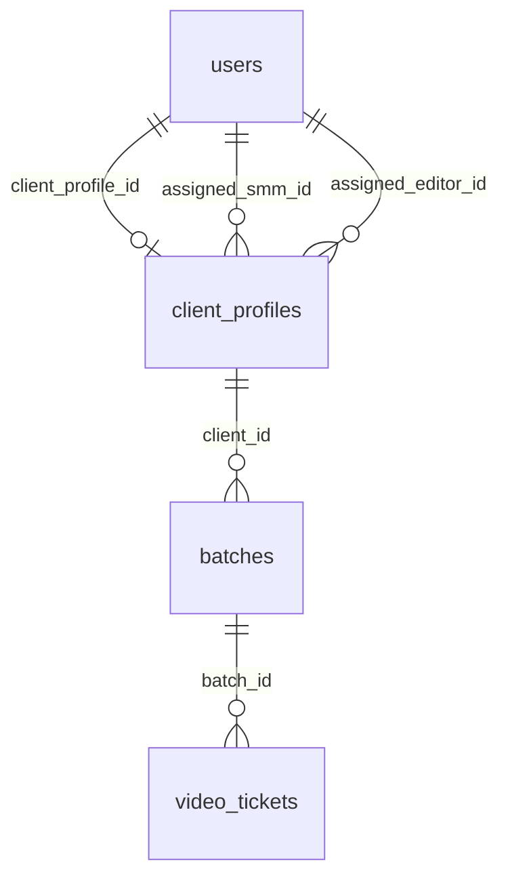

# Backend plan: B0 — Auth & core schema

**Epic:** B0  
**Status:** Done  
**Depends on:** —  
**Blocks:** B1–B11  
**Index:** [`README.md`](./README.md)

---

## Summary

Establish real authentication (JWT + role guards), a unified `users` table linked to client and staff identities, and baseline Postgres models for `client_profiles`, `batches`, and `video_tickets` with canonical pipeline enums. Ship `POST /auth/login` and `GET /auth/me` so the frontend can replace `MockAuthProvider` incrementally; full login cutover may finish in B11, but the API contract and schema must be stable after B0.

**Account creation (v1):** There is **no public self-service sign-up** (`POST /auth/register` is out of scope). The **first admin** is created from **environment variables** at seed/bootstrap time. **Editors and SMMs** are created by an authenticated admin via **`POST /admin/staff`** in [B1](./B1-admin-clients-batches.md) (same pattern as client provision). **Clients** are provisioned in B1 via `POST /admin/clients`.

B0 does **not** implement board reads, batch mutations, or Drive sync — those are B1+.

---

## Scope

### Screens & routes

| Route | Role | B0 involvement |
|-------|------|----------------|
| `/login` | Public | `POST /auth/login` |
| `/` (`RootRedirect`) | Any | Uses `GET /auth/me` or token claims |
| `/client/*`, `/editor/*`, `/smm/*`, `/admin/*` | Protected | `require_roles` + portal mapping (same as `ProtectedRoute`) |

No new UI routes in B0.

### Roles & permissions

| Portal | `UserRole` | Extra | Access rule (prototype → server) |
|--------|------------|-------|----------------------------------|
| Client | `client` | `client_profile_id` | Own client data only (enforced in B2+) |
| Admin | `admin` | — | All clients/batches |
| Editor | `employee` | `employee_kind=editor` | Batches for clients where `assigned_editor_id = user.id` |
| SMM | `employee` | `employee_kind=smm` | Batches for clients where `assigned_smm_id = user.id` |

Mirror [`batchAccess.ts`](../../frontend/src/lib/batchAccess.ts) in a shared service helper `assert_client_access(user, client_id)` used from B2 onward.

Align with [`problem-context.md`](../problem-context.md) access table; Path A features remain out of scope.

### User-visible operations (B0 only)

| Action | API |
|--------|-----|
| Sign in with email + password | `POST /auth/login` |
| Sign out (client clears token; optional server revoke) | Local logout; optional `POST /auth/logout` |
| Restore session on load | `GET /auth/me` with `Authorization: Bearer` |

---

## Account provisioning (v1)

There is **no sign-up API** on `/auth/*` for any role. Login is **authentication only** (`POST /auth/login`).

| Role | How the account is created | Who can create it |
|------|----------------------------|-------------------|
| **Admin** | **Bootstrap seed** from `.env` (idempotent: create if no `role=admin` exists) | Ops / deploy — not via HTTP in production |
| **Editor / SMM** | **`POST /admin/staff`** (B1) — inserts `users` with `role=employee`, `employee_kind` | Logged-in **admin** only |
| **Client** | **`POST /admin/clients`** (B1) — inserts `client_profiles` + `users` | Logged-in **admin** only |

### Bootstrap admin (B0 seed)

Read from `Settings` / monorepo `.env` (see `.env.example`):

| Variable | Purpose |
|----------|---------|
| `BOOTSTRAP_ADMIN_EMAIL` | Email for the first admin login (e.g. `admin@scalebrandslab.demo`) |
| `BOOTSTRAP_ADMIN_PASSWORD` | Plaintext **only in env** — hashed into `users.password_hash` at seed; never stored in code |
| `BOOTSTRAP_ADMIN_DISPLAY_NAME` | Optional; default `"Studio Admin"` |
| `SEED_DEMO_USERS` | Optional `true` — also seed prototype quartet (client, editor, smm, admin) with password `demo1234` for local QA |

**Seed command** (implementation): `poetry run python -m app.scripts.seed` or Alembic post-migration hook — runs after `alembic upgrade head`.

**Idempotency:**

- If any user with `role=admin` exists → skip bootstrap admin insert (do not overwrite password).
- If `SEED_DEMO_USERS=true` → upsert demo emails from [`README.md`](./README.md) demo table (dev only; disable in production).

**Production:** Set `BOOTSTRAP_ADMIN_*` in secrets manager / deploy env; set `SEED_DEMO_USERS=false`. Do **not** expose an HTTP endpoint that creates admins.

### Optional demo staff (dev only)

When `SEED_DEMO_USERS=true`, seed editor + SMM accounts so team pickers work before you call `POST /admin/staff`. In production without demo seed, create staff explicitly via B1 after first admin login.

---

## Mock inventory

| Symbol | File | Consumers | B0 persistence |
|--------|------|-----------|----------------|
| `MOCK_USERS` | `mockData/users.ts` | `MockAuthProvider` | `users` table + dev seed |
| `MockUserRecord.password` | `mockData/users.ts` | Login check | `password_hash` (bcrypt/argon2); **never** store plaintext |
| `MockUserRecord.clientProfileId` | `mockData/users.ts` | `resolveClientProfileId` | `users.client_profile_id` FK |
| `AuthUser` | `auth/types.ts` | All portals | `MeResponse` schema |
| `readStoredUser` / `writeStoredUser` | `auth/mockAuthStorage.ts` | Session | JWT in `localStorage` or httpOnly cookie (decide in open questions) |
| `MOCK_ADMIN_CLIENT_PROFILES` | `mockData/adminWorkspace.ts` | Boards, admin | `client_profiles` (schema only; seed in B0/B1) |
| `AdminClientProfile.loginId` / `.password` | `mockData/adminWorkspace.ts` | Admin credentials UI | Client user `email` = loginId; password on `users` only |
| `MOCK_STAFF_SMM` / `MOCK_STAFF_EDITORS` | `mockData/adminWorkspace.ts` | Admin team pickers | `users` with `employee_kind`; **create via `POST /admin/staff` (B1)** or `SEED_DEMO_USERS` |
| `MOCK_ADMIN_BATCH_FOLDERS` | `mockData/adminWorkspace.ts` | All boards | `batches` (minimal columns + seed) |
| `MOCK_ADMIN_VIDEO_TICKETS` | `mockData/adminWorkspace.ts` | Kanban | `video_tickets` (minimal columns + seed) |
| `PathBDemoStage` | `mockData/pathBDemoScenarios.ts` | State machine, demos | `pipeline_stage` enum (batch and/or ticket) |
| `DRIVE_MANIFESTS` | `mockData/driveManifests.ts` | Drive sync UI | **Out of B0** — client-side v1 |
| `MOCK_CLIENT_DASHBOARD`, `MOCK_SMM_*`, `MOCK_EDITOR_*` | role dashboard mocks | Legacy/read projections | **Out of B0** — replaced by B2 read APIs |

### Out of scope for B0 (inventory only)

- `adminWorkspaceStore` mutations — B1–B9
- `QaComment`, `qaCommentHistory` — table stub optional; full model in B7
- `clientDashboard.ts` / `smmDashboard.ts` duplicate indexes — B2 consolidates to batch/ticket reads

---

## Domain model

### Entities



| Entity | Purpose | ID strategy |
|--------|---------|-------------|
| **users** | Login identity for all roles | UUID (`Base.id`) |
| **client_profiles** | Business client (credits, team, guidelines) | UUID; expose string `slug` or keep UUID in API |
| **batches** | One content cycle per client | UUID |
| **video_tickets** | Gate card or per-clip deliverable (`1…n`) | UUID |

**Linking rules:**

- One `users` row per login (client, admin, editor, smm).
- Client portal user: `role=client`, `client_profile_id` set.
- Employee users: `role=employee`, `employee_kind` in (`editor`, `smm`).
- Admin: `role=admin`, no client_profile_id.
- `client_profiles.assigned_smm_id` / `assigned_editor_id` → `users.id` (matches prototype `u-smm-1`, `u-editor-1`).

### Canonical enums (Postgres)

Map prototype TypeScript unions to DB enums — canonical names in [`00-storage-design.md`](./00-storage-design.md) §4:

| TS type | Proposed SQL enum | Notes |
|---------|-------------------|--------|
| `UserRole` | `user_role` | `client`, `admin`, `employee` |
| `EmployeeKind` | `employee_kind` | `editor`, `smm`; NULL for non-employees |
| `AdminClientAccountStatus` | `client_account_status` | `active`, `decommissioned` |
| `AdminBatchFolderStatus` | `batch_status` | `active`, `completed` |
| `BatchIntakePath` | `batch_intake_path` | `source_media`, `clips_ready` |
| `BatchClipReviewPhase` | `batch_clip_review_phase` | `smm_identifying`, `awaiting_client`, `with_smm`, `approved` |
| `VideoPipelineOwner` | `video_pipeline_owner` | `client`, `smm`, `editor`, `scheduling`, `done` |
| `EditorWorkflowPhase` | `editor_workflow_phase` | nullable on ticket |
| `PathBDemoStage` | `pipeline_stage` | **Server source of truth**; drop `demoStage` from API responses |
| `BrandGuidelinesSource` | `brand_guidelines_source` | embed on `client_profiles` or JSON column |
| `QaCommentKind`, `QaMediaSlot` | defer | B7 |

### State transitions (ownership sketch)

B0 stores **initial** `pipeline_stage`, `video_pipeline_owner`, and `batch_clip_review_phase` on seed rows; transition logic lives in services starting B3.

Reference implementation today: [`pathBStateMachine.ts`](../../frontend/src/lib/pathBStateMachine.ts).

| Trigger (later epic) | Batch `pipeline_stage` | Ticket owner (typical) |
|----------------------|------------------------|-------------------------|
| Intake `source_media` | `clips_identifying` | `smm` |
| Intake `clips_ready` | `clips_ready_intake` | `editor` |
| SMM submits clips folder | `clip_client_review` | `client` |
| Client approves clips | `pre_split_production` | `editor` |
| Editor submits deliverables drive | `production` | `editor` (N tickets) |
| Send to SMM QA | `smm_qa` | `smm` |
| SMM send back | `editor_fix` | `editor` |
| Release to client QA | `client_qa` | `client` |
| Client reject | `revision_via_smm` | `smm` |
| Schedule | `scheduling` → `completed` | `scheduling` / `done` |

**Invariant (document now, enforce B6+):** `stage_label` on tickets is **derived** from `pipeline_stage` + context for display, not authoritative.

### Prototype-only (exclude or replace)

| Field / pattern | Action |
|-----------------|--------|
| `demoStage` on batch/ticket | Replace with `pipeline_stage` enum |
| Plaintext `password` in mocks | Hash in `users.password_hash`; admin “show password” only at provision time (B1) |
| `MOCK_USERS` in runtime login | Dev seed (`SEED_DEMO_USERS`) or bootstrap env only |
| Public `POST /auth/register` | **Excluded** — no self-service signup |
| `sessionStorage` user blob | JWT + `/me` |
| `loginId` vs `email` for clients | Single `users.email`; provision sets email = former loginId |
| `assignedSmmName` / `assignedEditorName` | Denormalized UI only → JOIN `users` in read APIs (B2) |
| `footageUrl` deprecated | Use `source_media_url` column |
| `PathBDemoScenario` catalog | Dev/docs only; optional `is_demo` flag on batch, not required for prod |
| In-app Drive manifest | Stays frontend; URLs stored on batch/ticket columns |

---

## Storage design

> **Superseded.** Canonical schema: [00-storage-design.md](./00-storage-design.md). Do not duplicate table definitions in this epic.

## Storage (final)

Canonical design: [00-storage-design.md](./00-storage-design.md) §§ [3.1–3.4](./00-storage-design.md#3-postgres-tables), [4](./00-storage-design.md#4-enums), [5](./00-storage-design.md#5-state-machine), [9 Wave 1](./00-storage-design.md#9-migration-waves).

**Epic-specific deltas (B0 only):**

| Deliverable | Detail |
|-------------|--------|
| Auth | `users` + JWT; `get_current_user`, `require_roles` |
| Enums | All §4 enums in Alembic wave 1 |
| Core DDL | `users`, `client_profiles`, `batches`, `video_tickets` (columns per canonical; optional `credit_adjustments` table if created in B0/B1) |
| Bootstrap admin | `BOOTSTRAP_ADMIN_*` env → one `users` row `role=admin` (idempotent seed) |
| Dev seed | Optional `SEED_DEMO_USERS` + `c-1` batch subset; API IDs are UUID (D4) |
| Mongo / Redis | None (§§ 7–8) |

**API DTOs:** Responses use `pipelineStage` / `pipelineOwner` — not client-writable `demoStage` (conflict #3).

### Dev seed / bootstrap

`app/scripts/seed.py` (or equivalent), invoked after migrations:

1. **Bootstrap admin** — always attempt if no admin exists: read `BOOTSTRAP_ADMIN_EMAIL` / `BOOTSTRAP_ADMIN_PASSWORD` from settings; fail fast if password missing when bootstrap is required.
2. **Demo users** — if `SEED_DEMO_USERS=true`: insert/update 4 logins from [`README.md`](./README.md) demo table (hashed `demo1234`).
3. **Demo data** — client profiles `c-1`..`c-3` + Path B batches/tickets for `c-1` (minimal set for smoke tests; full catalog optional).

Use UUIDs in DB. Document seeded emails in README; do not hardcode passwords in source — only in `.env` / `SEED_DEMO_USERS` path.

---

## API catalog

Base path: `/api/v1` (`API_V1_STR`).

### Reads

| Method | Path | Roles | Response | Replaces |
|--------|------|-------|----------|----------|
| GET | `/auth/me` | Any authenticated | `MeResponse` | `readStoredUser` / `AuthUser` |

**`MeResponse`** (align with `AuthUser`):

```json
{
  "id": "uuid",
  "email": "client@scalebrandslab.demo",
  "name": "TechWithTim",
  "role": "client",
  "employeeKind": null,
  "clientProfileId": "uuid"
}
```

- `employeeKind` present only when `role === "employee"`.
- `clientProfileId` present only when `role === "client"`.

### Commands

| Method | Path | Roles | Body | Effects | Replaces |
|--------|------|-------|------|---------|----------|
| POST | `/auth/login` | Public | `{ "email", "password" }` | Validate hash; issue JWT | `MockAuthProvider.login` |
| POST | `/auth/logout` | Authenticated | — | Optional Redis revoke | `logout` (optional B0) |

**`LoginResponse`:**

```json
{
  "accessToken": "eyJ...",
  "tokenType": "bearer",
  "expiresIn": 3600,
  "user": { /* MeResponse */ }
}
```

**Errors:** `401` invalid credentials (generic message, same as prototype).

### Auth implementation notes

| Piece | Location |
|-------|----------|
| `CurrentUser` extend | `app/core/auth.py` — add `role`, `employee_kind`, `client_profile_id` |
| `get_current_user` | Decode JWT; load user from DB; check `is_active` |
| `require_roles("admin")` | Factory returning dependency |
| Password hashing | `app/services/auth_service.py` or `app/utils/security.py` |
| JWT settings | `SECRET_KEY`, `ACCESS_TOKEN_EXPIRE_MINUTES` in `Settings` |
| Bootstrap admin | `BOOTSTRAP_ADMIN_EMAIL`, `BOOTSTRAP_ADMIN_PASSWORD`, `BOOTSTRAP_ADMIN_DISPLAY_NAME`, `SEED_DEMO_USERS` in `Settings` |

Register router: `app/controllers/auth.py` → `api_v1_router`.

### Endpoints explicitly not in B0

| Planned | Epic |
|---------|------|
| `POST /auth/register` (public signup) | **Out of scope v1** |
| `POST /admin/staff` (provision editor/SMM) | B1 |
| CRUD clients/batches | B1 |
| Board list/detail | B2 |
| All pipeline commands | B3–B9 |

---

## Frontend cutover

| Current | Replacement | When |
|---------|-------------|------|
| `MockAuthProvider.login` | `AuthService.login` + store token | B0 backend + thin frontend hook |
| `readStoredUser` / `writeStoredUser` | Token storage + `useMeQuery` on boot | B0 or B11 |
| `useMockAuth` | `useAuth` wrapping React Query | B0 hook; keep alias until B11 |
| `resolveClientProfileId` | `me.clientProfileId` from API | B0 for client role |
| `ProtectedRoute` | Same; read user from auth context fed by `/me` | B0 |
| `MOCK_USERS` | Remove from login path | B11 |
| `main.tsx` `MockAuthProvider` | `AuthProvider` | B0/B11 |

**Files to touch (implementation phase):**

- `frontend/src/auth/*` — API-backed provider
- `frontend/src/hooks/api/useAuthLogin.ts`, `useMeQuery.ts`
- `frontend/src/config/api.ts` — attach `Authorization` header on axios/OpenAPI client
- `frontend/src/main.tsx`
- `frontend/src/pages/LoginPage.tsx`

Regenerate client after OpenAPI: `task frontend:generate-client`.

**B0 done criteria for frontend:** Login page obtains real token; refresh loads `/me`; portals still use mock workspace data until B2.

---

## RBAC matrix (B0 routes)

| Route | client | employee (editor) | employee (smm) | admin |
|-------|--------|-------------------|----------------|-------|
| POST `/auth/login` | ✓ | ✓ | ✓ | ✓ |
| GET `/auth/me` | ✓ | ✓ | ✓ | ✓ |
| POST `/auth/logout` | ✓ | ✓ | ✓ | ✓ |

---

## Risks & open questions

| # | Question | Recommendation |
|---|----------|----------------|
| 1 | JWT in `localStorage` vs httpOnly cookie? | `localStorage` + Bearer for SPA simplicity v1; document XSS risk |
| 2 | Refresh tokens? | Access token only in B0; add refresh in B11 if needed |
| 3 | API IDs: UUID vs prototype `c-1`, `b-new`? | **Resolved:** UUID in DB; demo string ids in dev docs/seed only ([§12](./00-storage-design.md#12-open-questions) #2) |
| 4 | Single `pipeline_stage` on batch vs ticket? | **Resolved:** Both — batch rollup + per-ticket after split ([§1](./00-storage-design.md#1-conflict-report) #4) |
| 5 | `stage_label` stored or computed? | **Resolved:** Stored on each transition for stable sorts ([§12](./00-storage-design.md#12-open-questions) #3) |
| 6 | Client decommissioned — block login? | Yes, `is_active=false` + `account_status` |
| 7 | Admin creates client password (B1) | Return once; store hash only |
| 8 | How to create first admin in prod? | `BOOTSTRAP_ADMIN_*` env + seed script only — no signup API |
| 9 | How to create editor/SMM? | `POST /admin/staff` (B1) after admin login |

---

## Suggested implementation order (B0 execution)

1. **Settings** — `ACCESS_TOKEN_EXPIRE_MINUTES`, JWT algorithm; `BOOTSTRAP_ADMIN_*`, `SEED_DEMO_USERS`.  
2. **Enums** — SQLAlchemy/SQLModel enum types in `app/models/enums.py`.  
3. **Models** — `User`, `ClientProfile`, `Batch`, `VideoTicket` + `app/models/__init__.py`.  
4. **Alembic** — `revision --autogenerate` + review; upgrade head.  
5. **Seed** — bootstrap admin from env; optional demo users + minimal `c-1` batch.  
6. **Auth service** — hash verify, token create/decode.  
7. **Implement `get_current_user` / `require_roles`**.  
8. **Schemas** — `LoginRequest`, `LoginResponse`, `MeResponse`.  
9. **Controller** — `auth.py` login + me.  
10. **Tests** — login success/fail, me with/without token, role guard on sample protected route stub.  
11. **OpenAPI** — register routes; `task frontend:generate-client`.  
12. **Frontend hook** — login + me (workspace still mock).

---

## Quality checks

- [x] Mock symbols for auth and core entities inventoried or marked out of scope  
- [x] B0 user actions have APIs (`login`, `me`)  
- [x] RBAC matches problem-context roles; employee sub-types preserved  
- [x] Single state owner: `pipeline_stage` + `pipeline_owner` in Postgres (not `demoStage`)  
- [x] `MeResponse` sufficient for `ProtectedRoute` + `homePathForUser` without UI redesign  
- [x] Passwords and Drive called out  
- [x] Bootstrap admin from env documented; no public register endpoint  
- [x] Staff provisioning deferred to B1 `POST /admin/staff`  

---

## Links

| Artifact | Path |
|----------|------|
| Epic index | [`README.md`](./README.md) |
| UI spec | [`../path-b-ui-spec.md`](../path-b-ui-spec.md) |
| State machine (TS) | [`../../frontend/src/lib/pathBStateMachine.ts`](../../frontend/src/lib/pathBStateMachine.ts) |
| Backend layout | [`../../.cursor/skills/backend-coding-structure/SKILL.md`](../../.cursor/skills/backend-coding-structure/SKILL.md) |
