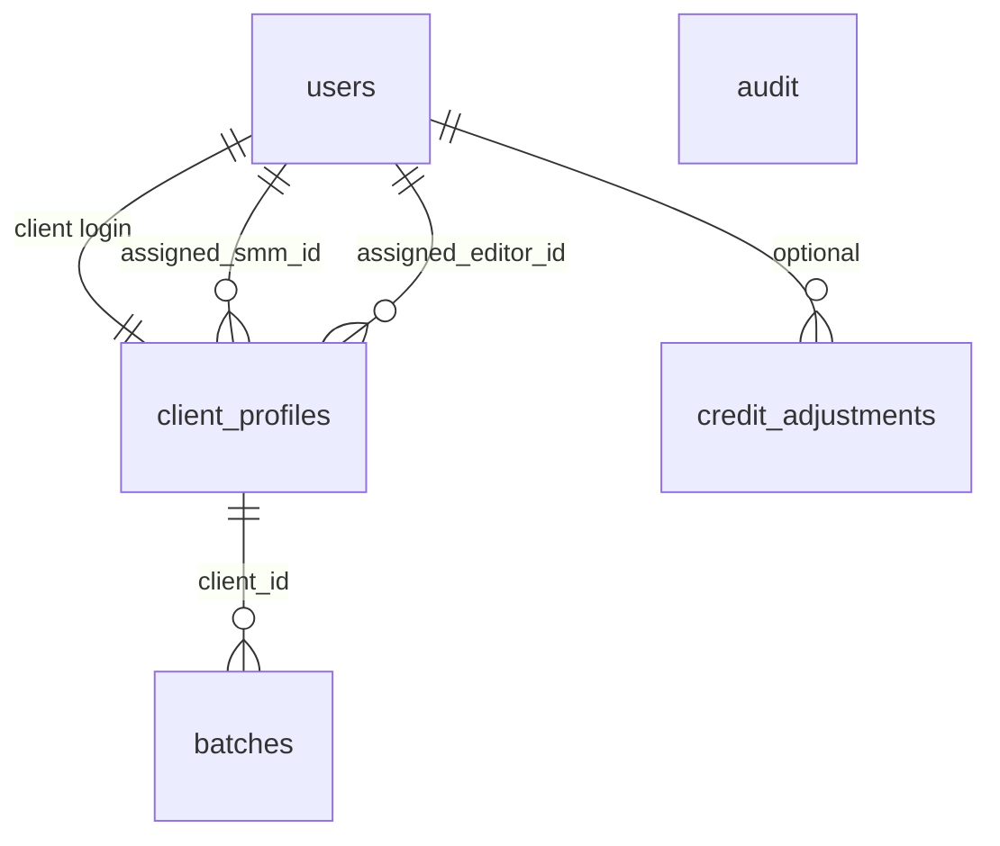

# Backend plan: B1 — Admin: clients, credits, create batch

**Epic:** B1  
**Status:** Storage reconciled  
**Depends on:** [B0 — Auth & core schema](./B0-auth-and-core-schema.md)  
**Blocks:** B2 (full board reads for all roles)  
**Index:** [`README.md`](./README.md)

---

## Summary

Give admins API-backed control over **client accounts** (provision, decommission, credits, team assignment, brand guidelines), **staff accounts** (provision Editor and SMM logins), and **batch folder creation** with `creditCost`. Client provisioning atomically creates a `client_profiles` row plus a `users` login (hashed password). Staff provisioning creates a `users` row with `role=employee` and `employee_kind` (`editor` | `smm`) — this is the v1 “sign-up” path for internal employees (admin-only, not public self-registration). The **admin login itself** is **not** created via API; it comes from B0 bootstrap seed (`BOOTSTRAP_ADMIN_*` in `.env`). New batches start in `intake_pending` with no video tickets until later epics.

---

## Scope

### Screens & routes

| Route | Component | B1 operations |
|-------|-----------|---------------|
| `/admin` | `AdminWorkspace` | List clients; pipeline overview (computed); provision client |
| `/admin/clients/:clientId` | `AdminClientDetail` | Client detail; team/guidelines edit; top-up; decommission; create batch; view batches + kanban (tickets from read API) |
| `/admin/deadlines` | `AdminDeadlines` | **Out of B1** — B10 (`setVideoDeadline`) |

Redirects: `/admin/clients/:clientId/batches/:batchId` → client detail with `?batch=` (unchanged).

### Roles & permissions

| Action | client | editor | smm | admin |
|--------|--------|--------|-----|-------|
| All B1 routes | — | — | — | ✓ |

Use `Depends(require_roles("admin"))` on `/api/v1/admin/*` router.

Non-admin must receive `403` (not `404`) on admin paths.

### User-visible operations

| Action | UI entry | API (proposed) |
|--------|----------|----------------|
| List active + decommissioned clients | Workspace table | `GET /admin/clients` |
| Provision client | `ProvisionClientModal` | `POST /admin/clients` |
| View client detail | `AdminClientDetail` | `GET /admin/clients/{id}` |
| Top up credits | `TopUpCreditsModal` | `POST /admin/clients/{id}/credits/top-up` |
| Decommission client | `DecommissionClientModal` | `POST /admin/clients/{id}/decommission` |
| Assign SMM + Editor | Team editor on detail | `PATCH /admin/clients/{id}/team` |
| Edit brand guidelines | Guidelines editor | `PATCH /admin/clients/{id}/brand-guidelines` |
| List staff for pickers | Team `<select>` | `GET /admin/staff` |
| Provision editor or SMM | API / admin tooling (no UI in prototype v1) | `POST /admin/staff` |
| Create batch folder | `CreateBatchFolderModal` | `POST /admin/clients/{id}/batches` |
| List client batches | Detail sidebar | `GET /admin/clients/{id}/batches` |
| Pipeline summary + items | `AdminPipelineOverview` | `GET /admin/pipeline` (derived server-side) |
| Show credentials after provision | `ClientCredentialsModal` | One-time in `POST /admin/clients` response only |

**Not in B1:** deadline edits, batch workflow commands (intake, clips, QA, schedule), credit **debit** at batch complete (B9).

---

## Mock inventory

| Symbol | File | Consumers | B1 persistence |
|--------|------|-----------|----------------|
| `MOCK_ADMIN_CLIENT_PROFILES` | `adminWorkspace.ts` | Admin pages, `resolveClientProfileId` | `client_profiles` + `users` |
| `AdminClientProfile.loginId` | `adminWorkspace.ts` | Credentials modal, table | `users.email` |
| `AdminClientProfile.password` | `adminWorkspace.ts` | Provision, credentials | Hash on create; **never** in GET responses |
| `AdminClientProfile.credits` | `adminWorkspace.ts` | Credits UI, reserved calc | `client_profiles.credits_balance` |
| `assignedSmmId` / `assignedEditorId` | `adminWorkspace.ts` | Team, `batchAccess` | FK on `client_profiles` |
| `assignedSmmName` / `assignedEditorName` | `adminWorkspace.ts` | Labels | JOIN `users.display_name` in responses |
| `brandGuidelines` | `adminWorkspace.ts` | Detail page | Columns on `client_profiles` (B0) |
| `MOCK_STAFF_SMM` / `MOCK_STAFF_EDITORS` | `adminWorkspace.ts` | Team pickers | `GET /admin/staff`; create via `POST /admin/staff` |
| *(no store action)* | — | New employee accounts | `POST /admin/staff` (B1) |
| `MOCK_ADMIN_BATCH_FOLDERS` | `adminWorkspace.ts` | Admin detail, pipeline | `batches` |
| `createBatchFolder` | `adminWorkspaceStore.tsx` | `CreateBatchFolderModal` | `POST .../batches` |
| `provisionClient` | `adminWorkspaceStore.tsx` | `ProvisionClientModal` | `POST /admin/clients` |
| `topUpCredits` | `adminWorkspaceStore.tsx` | `TopUpCreditsModal` | Top-up endpoint |
| `decommissionClient` | `adminWorkspaceStore.tsx` | `DecommissionClientModal` | Decommission endpoint |
| `updateClientTeam` | `adminWorkspaceStore.tsx` | Detail team save | `PATCH .../team` |
| `updateBrandGuidelines` | `adminWorkspaceStore.tsx` | Detail guidelines save | `PATCH .../brand-guidelines` |
| `getActiveBatchNumber` | `adminWorkspaceStore.tsx` | Clients table | Computed: max `batch_number` where `status=active` |
| `clientReservedCredits` | `clientBoard.ts` | Table, detail, client badge | Computed: sum `credit_cost` on active batches where `credits_debited=false` |
| `computeAdminPipelineSummary` | `adminPipeline.ts` | Workspace | `GET /admin/pipeline` or shared service |
| `listAdminPipelineItems` | `adminPipeline.ts` | Workspace | Same |
| `AdminPipelineSummary` / `AdminPipelineItem` | `adminDashboard.ts` | `AdminPipelineOverview` | Response DTOs |
| `AdminClientAccount` | `adminDashboard.ts` | Legacy type | Superseded by `AdminClientProfile` in UI |

### Out of scope (B1)

| Symbol | Epic |
|--------|------|
| `MOCK_ADMIN_VIDEO_TICKETS` mutations | B3–B9 |
| `setVideoDeadline` | B10 |
| `listAdminDeadlineTasks` | B10 |
| Full client/editor/smm board reads | B2 |

---

## Domain model

### Entities touched



**B1 creates/updates:**

- `users` — client login on provision; employee login on staff provision; `is_active=false` on decommission  
- `client_profiles` — business record, credits, team, guidelines, status  
- `batches` — new folder per `createBatchFolder`  
- *(optional)* `credit_adjustments` — ledger row per top-up  

**B1 does not create** `video_tickets` for new batches (client intake in B3 may later create gate tickets). **B1 does not create admin users** — see [B0 bootstrap](./B0-auth-and-core-schema.md#account-provisioning-v1).

### Provision staff — Editor / SMM (transaction)

`POST /admin/staff` — admin-only. Creates internal employee login (v1 substitute for “employee sign-up”).

Single DB transaction:

1. Insert `users` (`role=employee`, `employee_kind` = `editor` | `smm`, `email`, `password_hash`, `display_name`, `is_active=true`, `client_profile_id=NULL`).

**`ProvisionStaffRequest`:**

```json
{
  "email": "jane.editor@scalebrandslab.com",
  "displayName": "Jane Editor",
  "password": "generated-or-entered",
  "employeeKind": "editor"
}
```

**`ProvisionStaffResponse`:**

```json
{
  "staff": { "id": "uuid", "name": "Jane Editor", "role": "editor" },
  "credentials": {
    "email": "jane.editor@scalebrandslab.com",
    "password": "plaintext-once-only"
  }
}
```

**Validation:** unique email (case-insensitive); `employeeKind` ∈ `{ editor, smm }`; password min length; reject `employeeKind=admin` (admins only via bootstrap).

**UI v1:** No prototype modal — call via OpenAPI/curl/Postman or add minimal admin “Add staff” later. Team pickers consume `GET /admin/staff` after provision.

**Not in v1:** `POST /auth/register`, self-service employee signup, decommission staff endpoint (defer; set `is_active=false` manually in DB if needed).

### Provision client (transaction)

Single DB transaction:

1. Insert `client_profiles` (`display_name`, `credits_balance=initialCredits`, `account_status=active`, default team = first active smm/editor or from request body if extended later).
2. Insert `users` (`role=client`, `email=loginId` normalized, `password_hash`, `client_profile_id`, `display_name`, `is_active=true`).
3. Return `AdminClientProfileResponse` + **`credentials: { email, plaintextPassword }`** once (prototype `ClientCredentialsModal`).

**Validation:**

- `loginId` → valid email format (or allow username-style ids if product insists — prototype uses email-like strings).
- Unique `users.email` (case-insensitive).
- `initialCredits >= 0`.
- Password min length (e.g. 8) — stronger than prototype `demo1234` for prod.

**Default team (match prototype):** assign `MOCK_STAFF_SMM[0]` / `MOCK_STAFF_EDITORS[0]` equivalents — first `employee` user per kind, or require explicit ids in API later.

### Decommission client

- `client_profiles.account_status = decommissioned`
- `decommission_reason`, `decommissioned_at`
- `users.is_active = false` for linked client login
- Reject new batch creation for decommissioned clients (`409` or `422`)

Does **not** delete batches/tickets (historical data).

### Top-up credits

- `credits_balance += amount` where `amount > 0`
- Optional `credit_adjustments` row: `{ client_id, amount, kind: 'top_up', admin_user_id, created_at }`

### Update team

- Set `assigned_smm_id`, `assigned_editor_id`
- Validate target users: `role=employee`, `employee_kind` matches slot
- Reject decommissioned client (`422`)

### Brand guidelines

- Mirror `deriveGuidelinesSource(summary, googleDocUrl)` in service:
  - google doc URL present → `google_doc`
  - summary non-empty → `internal`
  - else `internal` with empty summary
- Update `brand_guidelines_*` columns + `brand_guidelines_updated_at`

### Create batch folder

Prototype behavior ([`adminWorkspaceStore.tsx`](../../frontend/src/pages/admin/adminWorkspaceStore.tsx)):

| Field | Server initial value |
|-------|----------------------|
| `batch_number` | `MAX(batch_number)+1` per client (transaction lock) |
| `title` | From request |
| `status` | `active` |
| `pipeline_stage` | `intake_pending` |
| `video_count` | `0` |
| `credit_cost` | From request (`> 0`) |
| `credits_debited` | `false` |
| `source_media_url` | Optional `footageUrl` (admin reference only; spec § Create batch) |
| `intake_path` | `NULL` until client intake (B3) |
| `clip_review_phase` | `NULL` |

**Business rules:**

- Client must be `active`.
- No duplicate constraint on title (prototype allows).
- Reserved credits: UI warns if `credit_cost > available`; prototype does **not** block create — document as **open question** (soft warning vs hard reject).

### Computed fields (responses, not stored)

| Mock helper | Computation |
|-------------|-------------|
| `getActiveBatchNumber` | `max(batch_number)` where `client_id` and `status=active` |
| `clientReservedCredits` | `sum(credit_cost)` active batches, `credits_debited=false` |
| `creditsDebitedTotal` on detail | `sum(credit_cost)` completed + debited |
| Pipeline owner/stage | Port `pipelineOwnerForBatch`, `stageLabelForBatch` from [`adminPipeline.ts`](../../frontend/src/lib/adminPipeline.ts) into backend service for `GET /admin/pipeline` |

Use `pipeline_stage` from DB; fall back to ticket rollup when tickets exist (B2+ seeds).

### Prototype-only (exclude)

| Field | Action |
|-------|--------|
| `password` on `AdminClientProfile` in GET | Omit; only on create response |
| `c-${Date.now()}` string ids | UUID in API |
| `b-${Date.now()}` batch ids | UUID |
| `demoStage` on new admin-created batches | Omit or NULL; not `intake_pending` alias needed in API |
| Plaintext passwords in DB | B0 `password_hash` only |

---

## Storage design

> **Superseded.** Canonical schema: [00-storage-design.md](./00-storage-design.md).

## Storage (final)

Canonical design: [00-storage-design.md](./00-storage-design.md) §§ [3.2](./00-storage-design.md#32-client_profiles), [3.3](./00-storage-design.md#33-batches), [3.6](./00-storage-design.md#36-credit_adjustments-recommended).

**Epic-specific deltas (B1 only):**

| Area | Detail |
|------|--------|
| Tables | No new core tables — uses B0 `users`, `client_profiles`, `batches` |
| Staff rows | `users` only (`role=employee`, `employee_kind`); no separate `staff` table |
| `credit_adjustments` | Recommended audit table; `kind`: `top_up` (B1), `debit_batch` (B9) — §3.6 |
| Batch create | `footageUrl` in request → `batches.source_media_url` (conflict #5); `pipeline_stage=intake_pending` |
| Concurrency | `SELECT … FOR UPDATE` (or serializable tx) when allocating `batch_number` |

No separate `clients` table — **`client_profiles` + `users`** only (conflict #6).

---

## API catalog

Base: `/api/v1`. All routes require admin JWT unless noted.

### Reads

| Method | Path | Response type | Replaces |
|--------|------|---------------|----------|
| GET | `/admin/clients` | `AdminClientListResponse` | `MOCK_ADMIN_CLIENT_PROFILES` (workspace list) |
| GET | `/admin/clients/{client_id}` | `AdminClientProfileResponse` | `getClient(id)` |
| GET | `/admin/clients/{client_id}/batches` | `AdminBatchFolderResponse[]` | `getBatchesForClient` |
| GET | `/admin/clients/{client_id}/batches/{batch_id}/videos` | `AdminVideoTicketResponse[]` | `getVideosForBatch` (read-only; often `[]` for new batches) |
| GET | `/admin/staff` | `StaffListResponse` | `MOCK_STAFF_SMM` + `MOCK_STAFF_EDITORS` |
| GET | `/admin/pipeline` | `{ summary, items }` | `computeAdminPipelineSummary` + `listAdminPipelineItems` |

`GET /admin/staff` returns `{ smm: StaffMember[], editors: StaffMember[] }` or flat list grouped by `employeeKind` — match OpenAPI/codegen preference.

**`AdminClientListResponse` row** (per client):

```typescript
{
  id: string
  displayName: string
  loginEmail: string          // was loginId
  credits: number
  accountStatus: 'active' | 'decommissioned'
  activeBatchNumber: number | null
  reservedCredits: number
  assignedSmm: { id, name }
  assignedEditor: { id, name }
  createdAt: string
}
```

**`AdminClientProfileResponse`:** full profile + computed `reservedCredits`, `creditsDebitedTotal`, `activeBatchNumber`; **no** `password`.

**`AdminBatchFolderResponse`:** align with `AdminBatchFolder` (camelCase in JSON per OpenAPI convention); expose `pipelineStage` (canonical). Optional read alias `demoStage` = same value until frontend rename (B2/B11).

**`StaffMember`:** `{ id, name, role: 'smm' | 'editor' }`.

### Commands

| Method | Path | Body | Effects | Replaces |
|--------|------|------|---------|----------|
| POST | `/admin/clients` | `ProvisionClientRequest` | profile + user + credits | `provisionClient` |
| POST | `/admin/staff` | `ProvisionStaffRequest` | employee user | *(new — provision editor/SMM)* |
| POST | `/admin/clients/{id}/credits/top-up` | `{ amount: number }` | balance += amount | `topUpCredits` |
| POST | `/admin/clients/{id}/decommission` | `{ reason: string }` | status, deactivate user | `decommissionClient` |
| PATCH | `/admin/clients/{id}/team` | `{ smmId, editorId }` | FK updates | `updateClientTeam` |
| PATCH | `/admin/clients/{id}/brand-guidelines` | `{ summary, googleDocUrl? }` | guidelines columns | `updateBrandGuidelines` |
| POST | `/admin/clients/{id}/batches` | `CreateBatchRequest` | insert batch | `createBatchFolder` |

**`ProvisionClientRequest`:**

```json
{
  "loginId": "acme.creative",
  "displayName": "Acme Creative",
  "password": "generated-or-entered",
  "initialCredits": 24
}
```

**`ProvisionClientResponse`:**

```json
{
  "client": { /* AdminClientProfileResponse */ },
  "credentials": {
    "email": "acme.creative",
    "password": "plaintext-once-only"
  }
}
```

**`CreateBatchRequest`:**

```json
{
  "title": "Q3 launch clips",
  "creditCost": 6,
  "footageUrl": "https://drive.google.com/..."
}
```

(`clientId` in path, not body — matches detail page default client.)

**Errors:**

| Case | Status |
|------|--------|
| Duplicate login email | `409` |
| Duplicate staff email on `POST /admin/staff` | `409` |
| Invalid `employeeKind` on staff provision | `422` |
| Decommissioned client mutation | `422` |
| Invalid staff ids | `422` |
| `creditCost <= 0` | `422` |
| `amount <= 0` on top-up | `422` (prototype no-ops; server should reject) |
| Client/batch not found | `404` |

### Pydantic / OpenAPI layout

| Module | Contents |
|--------|----------|
| `app/schemas/admin.py` | Request/response models |
| `app/services/admin_clients_service.py` | Provision, decommission, credits, team, guidelines |
| `app/services/admin_staff_service.py` | Provision employee (`editor` / `smm`) |
| `app/services/admin_batches_service.py` | Create batch, list batches |
| `app/services/admin_pipeline_service.py` | Port `adminPipeline.ts` logic |
| `app/controllers/admin.py` | Router prefix `/admin` |

Register in `app/controllers/__init__.py`.

---

## Frontend cutover

| Current | Replacement | Files |
|---------|-------------|-------|
| `provisionClient` | `useProvisionClientMutation` → `POST /admin/clients` | `AdminWorkspace.tsx`, `ProvisionClientModal.tsx` |
| `createBatchFolder` | `useCreateBatchMutation` | `AdminClientDetail.tsx`, `CreateBatchFolderModal.tsx` |
| `topUpCredits` | `useTopUpCreditsMutation` | `AdminClientDetail.tsx` |
| `decommissionClient` | `useDecommissionClientMutation` | `AdminClientDetail.tsx` |
| `updateClientTeam` | `useUpdateClientTeamMutation` | `AdminClientDetail.tsx` |
| `updateBrandGuidelines` | `useUpdateBrandGuidelinesMutation` | `AdminClientDetail.tsx` |
| `clients` from store (admin pages) | `useAdminClientsQuery`, `useAdminClientQuery` | `AdminWorkspace.tsx`, `AdminClientDetail.tsx` |
| `smmStaff` / `editorStaff` | `useAdminStaffQuery` | `AdminClientDetail.tsx` |
| Pipeline memos | `useAdminPipelineQuery` | `AdminWorkspace.tsx` |
| `getBatchesForClient` / `getVideosForBatch` (admin only) | `useAdminClientBatchesQuery`, `useAdminBatchVideosQuery` | `AdminClientDetail.tsx` |
| Credentials modal | Use `credentials` from provision response | `ClientCredentialsModal.tsx` |

**Keep in store temporarily (until B2–B11):** workflow mutations (`submitBatchIntake`, QA, schedule, etc.).

**Provider strategy:** Narrow `AdminWorkspaceProvider` to pipeline/ticket mutations only, or split `AdminDataProvider` (B1 reads) vs `AdminMutationsProvider` (later epics).

After OpenAPI: `task frontend:generate-client` → hooks under `frontend/src/hooks/api/admin/`.

### B1 done criteria (frontend)

- Provision → navigate to detail with credentials from API response  
- Create batch appears in sidebar after refetch  
- Top-up updates credits on refetch  
- Decommission moves client to decommissioned table  
- Team/guidelines save persists  
- `npm run build` passes  

---

## RBAC (B1)

All `/admin/*` routes: **admin** only. Enforced server-side; `ProtectedRoute portal="admin"` remains on frontend.

---

## Risks & open questions

| # | Question | Recommendation |
|---|----------|----------------|
| 1 | Block batch create if `credit_cost > credits - reserved`? | v1: warn in UI only (prototype); add server check in B9 if needed |
| 2 | Auto-generate client password vs admin-entered? | Support both; optional `generatePassword: true` |
| 3 | `loginId` without `@`? | Validate as email per spec; or relax to unique username |
| 4 | Pipeline on B1 without tickets | New batches → owner `client`, stage “Awaiting client intake” via `batchNeedsClientIntake` logic |
| 5 | Link provisioned user to `MOCK_USERS` seed | Dev: `SEED_DEMO_USERS`; prod: bootstrap admin + `POST /admin/staff` |
| 6 | Admin kanban on detail still needs videos | `GET .../videos` returns `[]` until pipeline creates tickets |
| 7 | Admin UI for “Add staff” | v1: API-only; optional admin modal later |
| 8 | Creating additional admins | Out of v1 — only bootstrap env + manual DB if needed |

---

## Suggested implementation order (B1 execution)

1. Schemas: `ProvisionClientRequest`, `AdminClientProfileResponse`, `CreateBatchRequest`, etc.  
2. `admin_clients_service.provision` (transaction + hash password).  
3. `POST /admin/clients`, `GET /admin/clients`, `GET /admin/clients/{id}`.  
4. Top-up, decommission, team, guidelines PATCH/POST endpoints.  
5. `GET /admin/staff` + `POST /admin/staff` (provision editor/SMM).  
6. `admin_batches_service.create_batch` + list batches.  
7. `GET .../videos` (read mapper from `video_tickets`).  
8. `admin_pipeline_service` + `GET /admin/pipeline`.  
9. pytest: provision, duplicate email, decommission blocks batch create, batch number sequence.  
10. OpenAPI + frontend hooks + swap admin pages (mutations + lists).  
11. Leave `adminWorkspaceStore` workflow actions for B3–B9.  

---

## Quality checks

- [x] B1 store/mock symbols inventoried  
- [x] Each admin user action mapped to an API  
- [x] RBAC: admin-only per `problem-context.md`  
- [x] Credits top-up separate from batch debit (B9)  
- [x] Password only on provision response  
- [x] Response shapes cover `AdminClientsTable`, detail page, modals without redesign  
- [x] Batch create aligns with Path B spec (intake pending, optional admin footage URL)  
- [x] Staff provision (`POST /admin/staff`) documented; admin bootstrap remains B0 env seed  
- [x] No public `/auth/register`  

---

## Links

| Artifact | Path |
|----------|------|
| B0 plan | [`B0-auth-and-core-schema.md`](./B0-auth-and-core-schema.md) |
| Epic index | [`README.md`](./README.md) |
| UI spec § Admin | [`../path-b-ui-spec.md`](../path-b-ui-spec.md) §11 |
| Store mutations | [`../../frontend/src/pages/admin/adminWorkspaceStore.tsx`](../../frontend/src/pages/admin/adminWorkspaceStore.tsx) |
| Pipeline logic | [`../../frontend/src/lib/adminPipeline.ts`](../../frontend/src/lib/adminPipeline.ts) |
