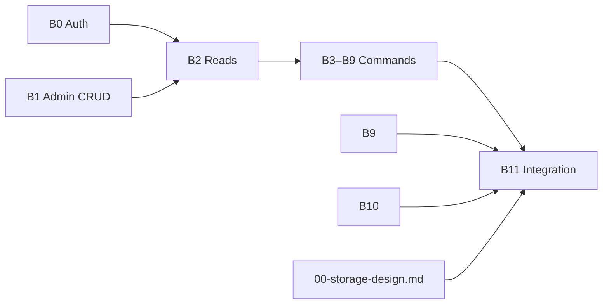

# Backend plan: B11 — Mock removal & integration

**Epic:** B11  
**Status:** Done  
**Depends on:** [B0](./B0-auth-and-core-schema.md) through [B10](./B10-deadlines-pipeline.md) **implemented** on the backend; OpenAPI spec complete  
**Blocks:** Production Path B cutover; [`00-storage-design.md`](./00-storage-design.md) reconciliation should land **before or as step 1** of B11 execution  
**Index:** [`README.md`](./README.md)

---

## Summary

**Integration epic** — no new domain features. Remove the prototype’s **in-memory studio** (`AdminWorkspaceProvider` + `MOCK_*` hydration) and **mock login** (`MockAuthProvider` / `MOCK_USERS`), and wire every Path B screen to **B0–B10 APIs** via React Query + generated OpenAPI client. Keep **client-side Drive manifests** and shared **TypeScript domain types** (or generated DTOs) where mocks are not runtime data. Finish with **fix mode** ([`test-ui.md`](../test-ui.md)) against a running API + dev seed.

---

## Scope

### In scope

| Area | B11 work |
|------|----------|
| Auth | Real `POST /auth/login`, `GET /auth/me`, JWT on `OpenAPI` client |
| Reads | Role workspaces (B2) + admin pipeline/deadlines (B10) + admin CRUD reads (B1) |
| Writes | All store mutations → mutation hooks (B1–B10 catalog below) |
| Provider tree | Remove `AdminWorkspaceProvider`; optional thin `AuthProvider` only |
| Types | Stop importing `MOCK_*` from pages; retain types / move to `types/domain` |
| Dev UX | Backend seed replaces `MOCK_ADMIN_*` initial state |
| Verification | `rg` cleanliness + FLOW-1–7 on real API |

### Out of scope

| Area | Notes |
|------|--------|
| New workflow states | Already defined in B3–B10 |
| Google Drive API proxy | Stays client-side manifest v1 |
| Path A / legacy modals | Already removed from UI; delete dead `mockData/clientDashboard` exports if unused |
| `setVideoOwner` | No UI — do not wire |
| E2E Playwright suite | Optional follow-up; manual fix mode is v1 gate |

### Screens & routes (all portals)

Every route in [`path-b-ui-spec.md`](../path-b-ui-spec.md) that today calls `useAdminWorkspace()` or `useMockAuth()` must use API hooks. No exceptions for Path B.

---

## Prerequisites



| Gate | Check |
|------|--------|
| Backend | `alembic upgrade head`; dev seed loads demo users + `c-1` Path B batches |
| OpenAPI | All endpoints from master catalog registered |
| Codegen | `task frontend:generate-client` succeeds |
| Storage doc | `00-storage-design.md` exists; B*.md storage sections reconciled |

---

## Mock inventory — remove vs keep

### Remove from runtime (`frontend/src`)

| Symbol / module | Today | B11 |
|-----------------|-------|-----|
| `AdminWorkspaceProvider` | Hydrates `MOCK_ADMIN_*` | **Delete** provider |
| `useAdminWorkspace()` | Reads + all mutations | **Delete**; per-hook replacements |
| `MOCK_ADMIN_CLIENT_PROFILES` | Store init | **No import** in `src/` |
| `MOCK_ADMIN_BATCH_FOLDERS` | Store init | **No import** in `src/` |
| `MOCK_ADMIN_VIDEO_TICKETS` | Store init | **No import** in `src/` |
| `MOCK_STAFF_SMM` / `MOCK_STAFF_EDITORS` | Store + admin pickers | `GET /admin/staff` |
| `MOCK_USERS` | `MockAuthProvider`, `*Session.ts` | `GET /auth/me` |
| `MockAuthProvider` / `useMockAuth` | `main.tsx`, routes, login | `AuthProvider` + `useAuth` |
| `readStoredUser` / sessionStorage user blob | Auth persist | JWT in memory + `localStorage` token (or httpOnly cookie if backend supports) |

### Keep (non-runtime or client-only)

| Symbol / module | Reason |
|-----------------|--------|
| `DRIVE_MANIFESTS`, `getManifestForBatch` | B6 — client-side Drive v1 |
| `SAMPLE_VIDEO_SRC` | Fallback video in QA modals |
| `pathBDemoScenarios.ts` | Dev/docs catalog; optional Storybook — **not** loaded by app shell |
| Domain **types** from `adminWorkspace.ts` | Move to `frontend/src/types/pathB.ts` (or use codegen types) — **not** `MOCK_*` constants |
| `adminDashboard.ts` types | `AdminPipelineSummary`, `AdminDeadlineTask` — align with OpenAPI |
| `STUDIO_DRIVE_READER_EMAIL` etc. | Copy/constants in `config/` if referenced |

### Delete or quarantine (optional cleanup)

Unused legacy exports in `mockData/index.ts` (`MOCK_CLIENT_DASHBOARD`, `getClientClipReview`, …) — **no** `src/` references today; move to `mockData/archive/` or delete in B11 cleanup PR.

---

## Master API catalog (B11 wiring index)

All paths under `/api/v1`. Mutations should **`invalidateQueries`** on role workspace keys (see below).

### Auth — [B0](./B0-auth-and-core-schema.md)

| Method | Path | Replaces |
|--------|------|----------|
| POST | `/auth/login` | `MockAuthProvider.login` |
| GET | `/auth/me` | `readStoredUser`, `resolve*ProfileId` via `clientProfileId` |
| POST | `/auth/logout` | `logout` (optional) |

### Admin client/batch CRUD — [B1](./B1-admin-clients-batches.md)

| Method | Path | Store action |
|--------|------|--------------|
| GET | `/admin/clients` | `clients` list |
| GET | `/admin/clients/{id}` | `getClient` |
| POST | `/admin/clients` | `provisionClient` |
| POST | `/admin/clients/{id}/credits/top-up` | `topUpCredits` |
| POST | `/admin/clients/{id}/decommission` | `decommissionClient` |
| PATCH | `/admin/clients/{id}/team` | `updateClientTeam` |
| PATCH | `/admin/clients/{id}/brand-guidelines` | `updateBrandGuidelines` |
| POST | `/admin/clients/{id}/batches` | `createBatchFolder` |
| GET | `/admin/staff` | `smmStaff` / `editorStaff` |

### Workspaces — [B2](./B2-read-models-boards.md)

| Method | Path | Consumers |
|--------|------|-----------|
| GET | `/client/workspace` | Client board, `/client/all` |
| GET | `/editor/workspace` | Editor board, completed |
| GET | `/smm/workspace` | SMM board, completed |
| GET | `/admin/workspace` | Admin detail kanban (optional vs B1 granular) |

### Path B commands (by epic)

| Epic | Method | Path | Store action |
|------|--------|------|--------------|
| B3 | POST | `/client/batches/{id}/intake` | `submitBatchIntake` |
| B4 | POST | `/batches/{id}/clips-folder` | `submitSmmClipsFolder` |
| B4 | POST | `/client/batches/{id}/clips/approve` | `approveBatchClips` |
| B4 | POST | `/client/batches/{id}/clips/reject` | `rejectBatchClips` |
| B5 | POST | `/editor/batches/{id}/deliverables-drive` | `submitEditorVideosDrive` |
| B6 | PATCH | `/videos/{id}/production` | `saveVideoPublishTitle` |
| B6 | POST | `/videos/{id}/drive-sync` | after `useDriveManifestSync` |
| B6 | POST | `/videos/{id}/submit-to-smm-qa` | `sendEditorDeliverableToSmmQa` |
| B7 | POST | `/videos/{id}/smm-qa` | `submitSmmQaReview` |
| B7 | POST | `/videos/{id}/qa-comments` | `appendSmmQaComment` (SMM/editor/client) |
| B7 | POST | `/videos/{id}/resubmit-to-smm-qa` | `resubmitEditorVideoQa` |
| B8 | POST | `/client/videos/{id}/client-qa` | `applyClientVideoDecision` |
| B8 | POST | `/videos/{id}/client-revision-triage` | `smmTriageClientRevision` |
| B9 | POST | `/videos/{id}/schedule` | `scheduleVideo` |
| B10 | PATCH | `/admin/videos/{id}/deadline` | `setVideoDeadline` |
| B10 | GET | `/admin/pipeline` | pipeline memos |
| B10 | GET | `/admin/deadlines` | deadlines table (optional) |

**Clip client decision:** `applyClientVideoDecision` for **clip** branch remains B4 endpoints only; B8 hook is final QA only.

---

## Domain model

B11 does not add transitions. It enforces:

- **Single source of truth:** Postgres `pipeline_stage` + `pipeline_owner` (not local `setState`).
- **No plaintext demo passwords** in frontend bundles.
- **Optimistic UI:** Optional for PATCH title/deadline; default **pessimistic** + invalidate (matches prototype store refetch behavior).

---

## Storage design

> **Superseded.** Canonical schema: [00-storage-design.md](./00-storage-design.md).

## Storage (final)

Canonical design: [00-storage-design.md](./00-storage-design.md) (full document — **no new tables** in B11).

**Epic-specific deltas (B11 only):**

| Deliverable | Detail |
|-------------|--------|
| DDL | None — API cutover + frontend mock removal only |
| OpenAPI audit | Every entity in B0–B10 plans must appear in generated client vs [§3](./00-storage-design.md#3-postgres-tables) |
| Post-cutover checks | `qa_comments` populated; `video_schedule` / `batch_schedule` JSONB; `credits_debited` idempotent debit |
| DTO mapper | `pipelineStage` → UI fields; drop `demoStage` writes |

---

## Frontend architecture (target)

### Provider tree (`main.tsx`)

```tsx
<QueryClientProvider>
  <BrowserRouter>
    <ThemeProvider>
      <AuthProvider>   {/* replaces MockAuthProvider */}
        <App />      {/* no AdminWorkspaceProvider */}
      </AuthProvider>
    </ThemeProvider>
  </BrowserRouter>
</QueryClientProvider>
```

### Auth

| Piece | Implementation |
|-------|----------------|
| Login | `LoginPage` → `POST /auth/login` → store token → set `OpenAPI.TOKEN` or axios interceptor |
| Boot | `useMeQuery()` when token present; hydrate `AuthUser` |
| Guards | `ProtectedRoute` uses `useAuth()` |
| Client id | `me.clientProfileId` — **delete** `resolveClientProfileId` MOCK lookup |
| Editor/SMM id | `me.id` — **delete** `MOCK_USERS` lookup in `editorSession` / `smmSession` |

### React Query keys (suggested)

| Key | Invalidated when |
|-----|------------------|
| `['me']` | login/logout |
| `['workspace', 'client']` | any client mutation |
| `['workspace', 'editor']` | editor mutations |
| `['workspace', 'smm']` | smm mutations |
| `['workspace', 'admin']` | admin mutations |
| `['admin', 'pipeline']` | deadline PATCH, batch completes |
| `['admin', 'deadlines']` | deadline PATCH |
| `['admin', 'clients']` | B1 admin CRUD |

Use `queryClient.invalidateQueries({ queryKey: ['workspace'] })` after cross-role-visible commands (same as B2.5 note).

### Hooks layout

```
frontend/src/hooks/api/
  auth/
    useMeQuery.ts
    useLoginMutation.ts
  workspace/
    useClientWorkspaceQuery.ts
    useEditorWorkspaceQuery.ts
    useSmmWorkspaceQuery.ts
    useAdminWorkspaceQuery.ts
  admin/
    useAdminPipelineQuery.ts
    useAdminDeadlinesQuery.ts
    useProvisionClientMutation.ts
    ...
  pathB/
    useSubmitBatchIntakeMutation.ts
    useSubmitClipsFolderMutation.ts
    ...
```

Wrap generated `*Service` methods from `frontend/src/client/` — do not hand-roll fetch URLs in pages.

### `demoStage` / `stageLabel` adapter

If API returns `pipelineStage` instead of `demoStage`:

- Thin mapper `toAdminVideoTicket(dto)` in `lib/apiMappers.ts` sets fields boards already use (`owner`, `stageLabel`, `releasedToClientFinalVideoReview`, …).
- Kanban libs (`clientBoard`, `smmBoard`, `editorBoard`) unchanged.

---

## Frontend cutover — file checklist

### Remove store usage (grep `useAdminWorkspace`)

| File | Reads → | Mutations → |
|------|---------|-------------|
| `ClientBoard.tsx` | `useClientWorkspaceQuery` | intake, clips, client QA hooks |
| `ClientAllWork.tsx` | workspace | — |
| `ClientCardDetailModal.tsx` | workspace | client QA hooks |
| `ClientBatchIntakeCard.tsx` | — | `useSubmitBatchIntakeMutation` |
| `EditorBoard.tsx` | `useEditorWorkspaceQuery` | deliverables, production, resubmit |
| `EditorCompleted.tsx` | workspace | — |
| `SmmBoard.tsx` | `useSmmWorkspaceQuery` | QA, revision, schedule |
| `SmmCompleted.tsx` | workspace | — |
| `AdminWorkspace.tsx` | pipeline query + clients query | provision |
| `AdminClientDetail.tsx` | workspace or B1 queries | B1 + deadline |
| `AdminDeadlines.tsx` | deadlines query | deadline mutation |
| `FindClipsPanel.tsx` | — | clips-folder |
| `EditorProductionModal.tsx` | — | production + submit-to-smm-qa |
| `SmmProductionModal.tsx` | — | same |
| `SmmVideoQaModal.tsx` | — | smm-qa + qa-comments |
| `EditorQaFixPanel.tsx` | — | resubmit |
| `SmmClientRevisionModal.tsx` | — | triage |
| `SmmScheduleVideoModal.tsx` | — | schedule |
| `main.tsx` | — | remove `AdminWorkspaceProvider` |

### Auth touchpoints

| File | Change |
|------|--------|
| `MockAuthProvider.tsx` | Replace with `AuthProvider.tsx` or rename + implement API |
| `useMockAuth.ts` | → `useAuth.ts` |
| `auth/index.ts` | Export real provider |
| `ProtectedRoute.tsx` | `useAuth` |
| `AppShell.tsx`, layouts, `LoginPage.tsx`, `RootRedirect.tsx` | `useAuth` |
| `clientSession.ts`, `editorSession.ts`, `smmSession.ts` | Use `me` fields only |

### Types imports (`@mockData` → types)

~45 files import types from `@mockData`. B11 pass:

1. Add `frontend/src/types/pathB.ts` — re-export domain interfaces from `mockData/adminWorkspace.ts` (no constants).
2. Update `import type { AdminVideoTicket } from '@/types/pathB'`.
3. Leave `import { DRIVE_MANIFESTS } from '@mockData/driveManifests'` (or `@/lib/driveMedia` re-export).

### Delete / gut

| File | Action |
|------|--------|
| `adminWorkspaceStore.tsx` | **Delete** after all references gone |
| `mockAuthStorage.ts` | Remove or keep only token key |
| `mockData/adminWorkspace.ts` | Keep types + move constants to `scripts/seed/` only on backend |

---

## API catalog (B11-specific)

No new endpoints. B11 adds:

| Deliverable | Description |
|-------------|-------------|
| OpenAPI completeness audit | Checklist vs master table above |
| `OpenAPI.TOKEN` / `WITH_CREDENTIALS` | [`frontend/src/config/api.ts`](../../frontend/src/config/api.ts) |
| Global 401 handler | Redirect login, clear token |
| Health check | Existing `useHealthQuery` optional in login footer |

---

## Backend / dev seed (integration)

| Requirement | Detail |
|-------------|--------|
| Demo logins | Same emails/passwords as [`README.md`](./README.md) demo table (hashed `demo1234`) |
| `c-1` batches | Enough to run FLOW-1 read-only without creating data |
| UUID ids | Frontend must not assume `b-pipeline` string ids unless API maps slug — prefer seed with known UUIDs documented for QA |

---

## Verification — fix mode

Update [`test-ui.md`](../test-ui.md) intro when B11 lands:

- **Build** phase references backend epics B0–B11, not only frontend epics 0–7.
- **Setup** requires backend running (`poetry run uvicorn …`) + migrated DB.
- **FLOW-3–7** use **Admin → create batch** or API-created batches; record UUIDs, not only `b-new` mock ids.
- **Done when:** FLOW-1, FLOW-2, FLOW-3–7 pass once on real API.

### Automated gate (README criterion)

```bash
# From repo root — no MOCK_ / @mockData in app source except allowlist
rg '@mockData|MOCK_' frontend/src \
  --glob '!**/*.test.*' \
  --glob '!**/types/**'
```

**Allowlist** (document in B11 PR):

- `frontend/src/lib/driveMedia.ts` — `DRIVE_MANIFESTS`
- `frontend/src/types/pathB.ts` — may re-export from mockData file path during transition
- Optional: `SAMPLE_VIDEO_SRC` import path

Target: **zero** `MOCK_ADMIN_*`, `MOCK_USERS`, `AdminWorkspaceProvider`.

### Manual smoke

| Flow | Doc |
|------|-----|
| Read-only tour | FLOW-1 |
| `b-pipeline` matrix | FLOW-2 (needs seed parity on API) |
| Podcast happy path | FLOW-3 |
| Clips-ready | FLOW-4 |
| QA routing | FLOW-5 |
| Credits debit | FLOW-6 |
| Regression | FLOW-7 |

---

## Suggested implementation order (B11 execution)

1. **`00-storage-design.md`** — approved; B0–B11 storage sections reconciled.  
2. Confirm backend B0–B10 merged; run full `pytest`; publish OpenAPI.  
3. `task frontend:generate-client`.  
4. **Auth slice:** login, token, `useMeQuery`, swap `ProtectedRoute` + layouts.  
5. **Read slice:** four workspace queries; pages load with loading/error states.  
6. **Mutations** in pipeline order B1 → B3…B9 → B10 (easier debugging) or parallel by role.  
7. Remove `AdminWorkspaceProvider` from `main.tsx`; delete `adminWorkspaceStore.tsx`.  
8. Type import migration (`@mockData` → `@/types/pathB`).  
9. Session helpers + `rg` gate.  
10. Fix mode: FLOW-1 → FLOW-7; update `test-ui.md`.  

---

## Risks & open questions

| # | Question | Recommendation |
|---|----------|----------------|
| 1 | Frontend dev without backend | Document “API required”; optional MSW layer later |
| 2 | `demoStage` in UI filters | Mapper from `pipelineStage`; remove `batch.demoStage` filters in dev panel |
| 3 | Double fetch admin home | `useAdminPipelineQuery` + `useAdminClientsQuery` — not full workspace + pipeline |
| 4 | Large workspace payload | Accept v1; paginate later |
| 5 | Token storage | `localStorage` access token v1; httpOnly cookie later |
| 6 | Optimistic updates | Default invalidate-all workspace; optimize hot paths later |
| 7 | Clip vs final client QA | Separate hooks; do not call B8 endpoint for clip gate |
| 8 | `getActiveBatchNumber` | Compute client-side from workspace batches (unchanged logic) |
| 9 | test-ui seeded batch ids | Add “API seed UUID” appendix after backend seed is fixed |

---

## Quality checks

- [x] Every `adminWorkspaceStore` mutation mapped to B1–B10 endpoint  
- [x] `setVideoOwner` not wired  
- [x] Mock auth → B0 auth  
- [x] B2 workspaces for all boards  
- [x] Drive manifests stay client-side  
- [x] `rg` done criterion documented with allowlist  
- [x] Fix mode + OpenAPI regeneration in scope  
- [x] No new Postgres tables in B11  

---

## Links

| Artifact | Path |
|----------|------|
| Epic index | [`README.md`](./README.md) |
| Storage consolidation | [`00-storage-design.md`](./00-storage-design.md) (create before execution) |
| Fix-mode tests | [`../test-ui.md`](../test-ui.md) |
| UI spec | [`../path-b-ui-spec.md`](../path-b-ui-spec.md) |
| Store (delete target) | [`../../frontend/src/pages/admin/adminWorkspaceStore.tsx`](../../frontend/src/pages/admin/adminWorkspaceStore.tsx) |
| Planner skill | [`../../.cursor/skills/prototype-to-backend-planner/SKILL.md`](../../.cursor/skills/prototype-to-backend-planner/SKILL.md) |
| Codegen | `task frontend:generate-client` in repo README |
| Backend layout | [`../../.cursor/skills/backend-coding-structure/SKILL.md`](../../.cursor/skills/backend-coding-structure/SKILL.md) |
