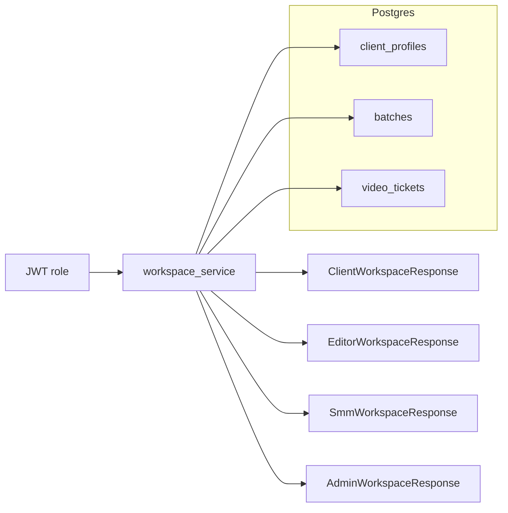
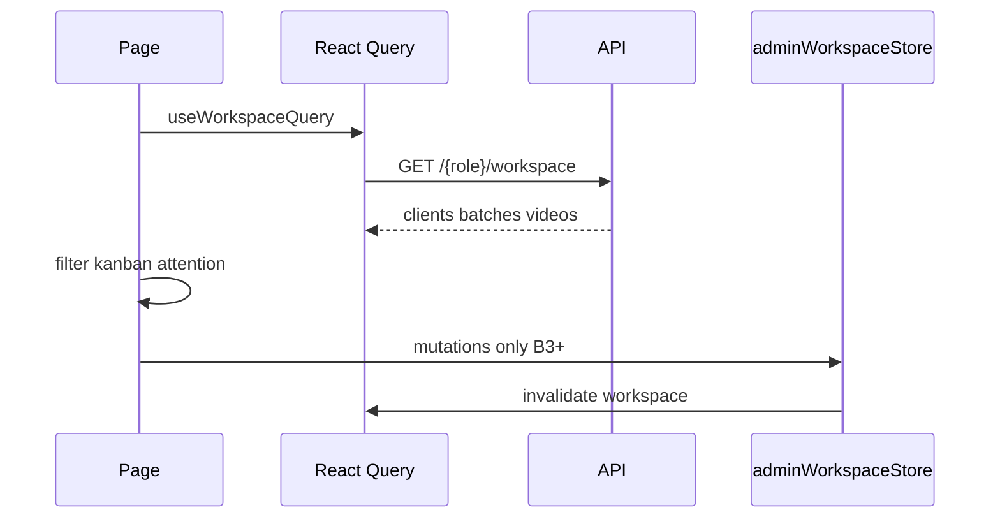

# Backend plan: B2 — Read models (all role boards)

**Epic:** B2  
**Status:** Storage reconciled  
**Depends on:** [B0](./B0-auth-and-core-schema.md), [B1](./B1-admin-clients-batches.md)  
**Blocks:** B3–B9 (commands assume boards can load current state)  
**Index:** [`README.md`](./README.md)

---

## Summary

Replace the prototype’s global in-memory workspace (`MOCK_ADMIN_*` hydrated in `AdminWorkspaceProvider`) with **role-scoped read APIs** that return the same shapes the UI already expects: `AdminClientProfile`, `AdminBatchFolder`, and `AdminVideoTicket`. All four portals (`/client/board`, `/editor/board`, `/smm/board`, `/admin`) and secondary pages (`/client/all`, completed views, admin client detail kanban) load from React Query; **kanban filtering, attention strips, and column derivation stay in frontend** (`clientBoard.ts`, `editorBoard.ts`, `smmBoard.ts`). Workflow **mutations** remain in `adminWorkspaceStore` until B3–B11, with query invalidation after each command.

---

## Scope

### Screens & routes

| Route | Role | B2 reads |
|-------|------|----------|
| `/client/board` | Client | Self profile, active batches, tickets, attention (computed client-side) |
| `/client/all` | Client | All batches + scheduled/done videos |
| `/editor/board` | Editor | Assigned clients, active batches, tickets |
| `/editor/completed` | Editor | Completed batches + tickets |
| `/smm/board` | SMM | Assigned clients, active batches, tickets |
| `/smm/completed` | SMM | Completed batches + tickets |
| `/admin` | Admin | All clients (active + decommissioned), active batches, tickets, pipeline (B1 endpoint or embedded) |
| `/admin/clients/:id` | Admin | Client + batches + tickets for kanban (may use workspace + filter, or B1 detail endpoints) |

**Out of B2:** `/admin/deadlines` task list logic is B10; page can load workspace videos until then.

### Roles & permissions

| Data | client | editor | smm | admin |
|------|--------|--------|-----|-------|
| Own `client_profiles` row | ✓ (via `me`) | — | — | ✓ all |
| Other clients’ PII | — | assigned only (id, name, team) | assigned only | ✓ |
| Batches | own client, all statuses for `/client/all` | assigned clients, `status=active` on board | same | all |
| Video tickets | own client’s batches | assigned | assigned | all |
| Staff roster | — | — | — | ✓ (B1 `GET /admin/staff`) |

**Server must enforce** the same rules as [`batchAccess.ts`](../../frontend/src/lib/batchAccess.ts): employees only see batches whose `client_profiles.assigned_*_id` matches `current_user.id`. Clients only see `client_id = me.client_profile_id`. Return `404` for cross-tenant ids (not `403`) on single-resource reads.

### User-visible operations (reads only)

| Action | Current source | B2 API |
|--------|----------------|--------|
| Load board on mount | `useAdminWorkspace()` state from `MOCK_*` | Role workspace `GET` |
| Switch batch tab | Local filter on `batches` | Same (client-side filter) |
| Open kanban card | `getVideosForBatch(batchId)` | Tickets already in workspace payload |
| Attention strip | `list*Attention(batches, videos)` | Computed client-side from workspace |
| Credits + reserved | `client.credits`, `clientReservedCredits` | Profile + batches in workspace |
| Deep link `?openVideo=` | Scan `videos` | Same |
| Pipeline overview (admin home) | `adminPipeline.ts` on store data | B1 `GET /admin/pipeline` **or** compute from admin workspace |
| Refresh after admin B1 mutation | Local `setState` | `invalidateQueries(['workspace'])` |

**No write APIs in B2.**

---

## Mock inventory

| Symbol | File | Consumers | B2 replacement |
|--------|------|-----------|----------------|
| `MOCK_ADMIN_CLIENT_PROFILES` | `adminWorkspace.ts` | All portals via store | Workspace `clients` / `client` |
| `MOCK_ADMIN_BATCH_FOLDERS` | `adminWorkspace.ts` | All boards | Workspace `batches` |
| `MOCK_ADMIN_VIDEO_TICKETS` | `adminWorkspace.ts` | Kanban, modals, attention | Workspace `videos` |
| `AdminWorkspaceProvider` initial state | `adminWorkspaceStore.tsx` | `main.tsx` wraps app | Fetch workspace on mount / auth |
| `getClient`, `getBatchesForClient`, `getVideosForBatch` | store | Pages | Selectors on query data |
| `getActiveBatchNumber` | store | Admin table | Computed client-side (unchanged) |
| `MOCK_USERS` in `resolveClientProfileId` | `clientSession.ts` | Client board | `GET /auth/me` → `clientProfileId` (B0) |
| `MOCK_USERS` in `resolveEditorStaffId` / `resolveSmmStaffId` | `*Session.ts` | Editor/SMM boards | `me.id` for employees |
| `MOCK_CLIENT_DASHBOARD` | `clientDashboard.ts` | **Unused** in `src/` | — |
| `MOCK_SMM_DASHBOARD` | `smmDashboard.ts` | **Unused** | — |
| `MOCK_EDITOR_TASKS` | `editorDashboard.ts` | **Unused** | — |
| `DRIVE_MANIFESTS` | `driveManifests.ts` | Drive sync UI | **Still client-side** in B2 |

### Store mutations (stay until later epics)

All `submitBatchIntake`, QA, schedule, etc. remain in `adminWorkspaceStore` for B2; after each mutation, call `queryClient.invalidateQueries({ queryKey: ['workspace', role] })` (or optimistic patch). Document as **B2.5 integration** task in implementation order.

---

## Domain model

### Read aggregate: “Workspace”

The prototype uses a **single shared document** for the whole studio. Production uses **four scoped views** of the same underlying tables (B0):



### Scoping rules (service layer)

| Role | `clients` query | `batches` query | `videos` query |
|------|-----------------|-----------------|----------------|
| **client** | Single profile: `users.client_profile_id` | `client_id = profile.id` | `client_id = profile.id` |
| **editor** | `assigned_editor_id = user.id` AND `account_status = active` | `client_id IN (...)` AND (`status = active` OR include completed for completed pages) | `batch_id IN (...)` |
| **smm** | `assigned_smm_id = user.id` AND active | same | same |
| **admin** | All profiles | All batches (or active-only flag — see API) | All tickets |

**Board pages** filter `batches` to `status === 'active'` in the frontend today; **completed pages** use `status === 'completed'`. Workspace endpoint should return **both** statuses for client/editor/smm so `/client/all` and completed routes work without a second API in B2.

### Field mapping: DB → `AdminBatchFolder` / `AdminVideoTicket`

Use one mapper module `app/services/workspace_mappers.py` (names illustrative) consumed by all roles.

| DB / domain | JSON (TS type) | Notes |
|-------------|----------------|--------|
| `pipeline_stage` | `demoStage?` optional during transition | Prefer exposing `pipelineStage` and map to `demoStage` in frontend adapter **or** emit both until UI renames |
| `pipeline_stage` | drives `stageLabel` | Server computes via `getPathBDemoStageLabel` equivalent |
| `pipeline_owner` | `owner` | `VideoPipelineOwner` |
| `credit_cost` | `creditCost` | |
| `credits_debited` | `creditsDebited` | |
| `source_media_url` | `sourceMediaUrl` + legacy `footageUrl` | Both set to same value for compat |
| `editor_deliverables_drive_url` | `editorDeliverablesDriveUrl` | |
| `qa_comments` table or JSONB | `qaCommentHistory` | Include for modals; map `deprecated` → sold styling |
| `qa_flags` JSONB | `qaFlags`, `qaGeneralNote` | |
| JOIN staff users | `assignedSmmName`, `assignedEditorName` | On client profile only |

**`stageLabel`:** Implement server-side `stage_label_for_ticket(batch, ticket)` porting rules from tickets’ `stage_label` strings in seeds + `pathBStateMachine` / `adminPipeline.stageLabelForBatch` where batch-level.

### Attention & kanban (remain frontend)

These functions **must not move to B2 API** (keeps UI rules in one place):

| Function | File |
|----------|------|
| `filterVideosForClientKanban` | `clientBoard.ts` |
| `filterVideosForEditorKanban` | `editorBoard.ts` |
| `filterVideosForSmmKanban` | `smmBoard.ts` |
| `listClientAttention` | `clientBoard.ts` |
| `listEditorAttention` | `editorBoard.ts` |
| `listSmmAttention` | `smmBoard.ts` |
| `clientBatchKanbanPhase`, `editorBatchKanbanPhase`, `smmBatchKanbanPhase` | respective `*Board.ts` |

Optional later epic: server-side `attention` array — not required for B2 done criteria.

### Prototype-only (reads)

| Item | B2 handling |
|------|-------------|
| Loading entire studio for every user | Scoped workspace only |
| `demoStage` without DB row | Dev seed only |
| Static `MOCK_*` in Provider `useState` initializer | Remove; empty until query resolves |

---

## Storage design

> **Superseded.** Canonical schema: [00-storage-design.md](./00-storage-design.md).

## Storage (final)

Canonical design: [00-storage-design.md](./00-storage-design.md) §§ [3](./00-storage-design.md#3-postgres-tables), [10](./00-storage-design.md#10-query-patterns-board-loads--b2).

**Epic-specific deltas (B2 only):**

| Area | Detail |
|------|--------|
| DDL | **No new tables** — read-only mappers over B0/B1 schema |
| DTOs | `pipelineStage`, `pipelineOwner`, `stageLabel` from DB columns; deprecate `demoStage` in OpenAPI (optional read alias during cutover) |
| QA thread | Eager-load `qa_comments` → `qaCommentHistory[]` on `VideoTicketDto` (§3.5) |
| Computed | `reservedCredits`, `activeBatchNumber` — not stored (§10) |

No Mongo/Redis for v1.

---

## API catalog

Base: `/api/v1`. All routes require authentication.

### Canonical DTOs (shared)

Define once in `app/schemas/workspace.py`:

- `ClientProfileDto` — mirrors `AdminClientProfile` (no password)
- `BatchFolderDto` — mirrors `AdminBatchFolder`
- `VideoTicketDto` — mirrors `AdminVideoTicket` including `qaCommentHistory`, `assetVersions`, `videoSchedule`

CamelCase aliases in OpenAPI for TypeScript codegen (`creditCost`, etc.).

### Reads — role workspace (primary B2)

| Method | Path | Roles | Response | Replaces |
|--------|------|-------|----------|----------|
| GET | `/client/workspace` | client | `ClientWorkspaceResponse` | Full store slice for client |
| GET | `/editor/workspace` | employee (editor) | `EditorWorkspaceResponse` | Editor board + completed |
| GET | `/smm/workspace` | employee (smm) | `SmmWorkspaceResponse` | SMM board + completed |
| GET | `/admin/workspace` | admin | `AdminWorkspaceResponse` | Admin boards + detail |

**`ClientWorkspaceResponse`:**

```json
{
  "client": { /* ClientProfileDto */ },
  "batches": [ /* BatchFolderDto — active + completed */ ],
  "videos": [ /* VideoTicketDto — all for those batches */ ]
}
```

**`EditorWorkspaceResponse` / `SmmWorkspaceResponse`:**

```json
{
  "clients": [ /* minimal: id, displayName, assigned* for UI labels */ ],
  "batches": [ /* active + completed for assigned client ids */ ],
  "videos": [ /* all tickets for those batches */ ]
}
```

**`AdminWorkspaceResponse`:**

```json
{
  "clients": [ /* all ClientProfileDto */ ],
  "batches": [ /* all */ ],
  "videos": [ /* all */ ]
}
```

### Reads — granular (optional complements)

Use when reducing payload size or lazy-loading admin client detail.

| Method | Path | Roles | Replaces |
|--------|------|-------|----------|
| GET | `/batches/{batch_id}` | client*, editor*, smm*, admin | Single batch + nested `videos[]` |
| GET | `/clients/{client_id}/batches` | admin, employee* | `getBatchesForClient` |
| GET | `/batches/{batch_id}/videos` | all scoped roles | `getVideosForBatch` |

\*After access check.

**Relationship to B1:** B1 admin endpoints (`GET /admin/clients`, `GET /admin/clients/{id}`, …) remain valid for **admin CRUD screens**. B2 adds **`GET /admin/workspace`** for board hydration; admin home can use **either** workspace or B1 list + B2 videos — **recommend workspace-only** on `/admin` to avoid duplicate fetches. Client detail (`/admin/clients/:id`) can filter workspace client-side or call B1 `GET .../batches` + `.../videos`.

### `GET /auth/me` extensions (B0, consumed in B2)

Ensure `MeResponse` includes:

| Field | Used by |
|-------|---------|
| `clientProfileId` | Client pages (replaces `resolveClientProfileId`) |
| `id` | Employee staff id (replaces `resolveEditorStaffId` / `resolveSmmStaffId`) |
| `role`, `employeeKind` | `ProtectedRoute` |

### Pagination & performance

| Approach | v1 recommendation |
|----------|-------------------|
| Full workspace dump | OK for demo scale (<500 tickets); matches prototype |
| `?status=active` filter | Optional query param on workspace to trim completed |
| Cursor pagination | Open question — defer until prod data size known |

### Error cases

| Case | Status |
|------|--------|
| Wrong role for path | `403` |
| Client with no `client_profile_id` | `403` + clear message |
| Batch/video id outside scope | `404` |

---

## Frontend cutover

### Data flow (target)



| Current | Replacement |
|---------|-------------|
| `useState(MOCK_ADMIN_*)` in Provider | `useWorkspaceQuery()` per role |
| `useAdminWorkspace().clients/batches/videos` | Same hook shape from query `data` |
| `resolveClientProfileId(user)` | `useMeQuery().clientProfileId` |
| `resolveEditorStaffId` / `resolveSmmStaffId` | `useMeQuery().id` |
| `MOCK_ADMIN_*` imports in store | Remove initial constants; seed only in e2e |
| Admin `AdminWorkspace` pipeline | `useAdminPipelineQuery` OR derive from workspace |

### Files to touch

| File | Change |
|------|--------|
| `frontend/src/main.tsx` | Provider loads from query, not mocks |
| `frontend/src/pages/admin/adminWorkspaceStore.tsx` | Remove MOCK initial state; sync from query or split context |
| `frontend/src/hooks/api/useClientWorkspaceQuery.ts` | New |
| `frontend/src/hooks/api/useEditorWorkspaceQuery.ts` | New |
| `frontend/src/hooks/api/useSmmWorkspaceQuery.ts` | New |
| `frontend/src/hooks/api/useAdminWorkspaceQuery.ts` | New |
| `frontend/src/pages/client/ClientBoard.tsx` | useWorkspace + me |
| `frontend/src/pages/client/ClientAllWork.tsx` | same |
| `frontend/src/pages/editor/EditorBoard.tsx` | same |
| `frontend/src/pages/editor/EditorCompleted.tsx` | same |
| `frontend/src/pages/smm/SmmBoard.tsx` | same |
| `frontend/src/pages/smm/SmmCompleted.tsx` | same |
| `frontend/src/pages/admin/AdminWorkspace.tsx` | admin workspace query |
| `frontend/src/pages/admin/AdminClientDetail.tsx` | workspace or B1 detail reads |
| `frontend/src/lib/clientSession.ts` | Thin wrapper over `me` or delete |
| B1 mutation hooks | Add `onSuccess: invalidate workspace` |

### Loading & empty states

- Show existing layout skeletons while `isLoading`
- Preserve copy: “Client account not linked…” when `me.clientProfileId` missing
- Preserve “Editor account not linked…” when employee `me` without assignment (edge case)

### Type stability

Keep importing types from `@mockData/index` **or** move shared types to `frontend/src/types/workspace.ts` and re-export from mockData during migration (B11).

Regenerate OpenAPI client: `task frontend:generate-client`.

---

## RBAC matrix (B2 routes)

| Route | client | editor | smm | admin |
|-------|--------|--------|-----|-------|
| `GET /client/workspace` | ✓ | — | — | — |
| `GET /editor/workspace` | — | ✓ | — | — |
| `GET /smm/workspace` | — | — | ✓ | — |
| `GET /admin/workspace` | — | — | — | ✓ |
| `GET /batches/{id}` | scoped | scoped | scoped | ✓ |
| `GET /admin/pipeline` (B1) | — | — | — | ✓ |

---

## Risks & open questions

| # | Question | Recommendation |
|---|----------|----------------|
| 1 | One workspace endpoint vs role paths? | Role paths — clearer guards and OpenAPI |
| 2 | Include `demoStage` in JSON for UI compat? | Prefer `pipelineStage` only; optional deprecated `demoStage` alias = same value until B11 mapper |
| 3 | Admin payload size | Full dump v1; add `?clientId=` filter later |
| 4 | Stale UI after store mutation | Mandatory `invalidateQueries` on every store action until B3 moves to API |
| 5 | `stageLabel` drift vs DB | Single mapper tested against `pathBDemoScenarios` seeds |
| 6 | QA comment thread shape | Eager-load with tickets; N+1 acceptable v1 |
| 7 | Decommissioned client login | B0 blocks login; historical batches still in DB if needed |

---

## Suggested implementation order (B2 execution)

1. **DTOs + mappers** — `BatchFolderDto`, `VideoTicketDto`, `stage_label` helper.  
2. **`workspace_service.get_*_workspace(user)`** — scoped SQLAlchemy queries.  
3. **Access helpers** — `assert_batch_access(user, batch_id)`.  
4. **Controllers** — four workspace routes + optional `GET /batches/{id}`.  
5. **pytest** — client sees only own data; editor A cannot see editor B’s client; admin sees all.  
6. **Extend `/auth/me`** if `clientProfileId` not done in B0.  
7. **OpenAPI + frontend hooks** — four workspace queries.  
8. **Refactor `AdminWorkspaceProvider`** — hydrate from query; loading state.  
9. **Swap board pages** — Client → Editor → SMM → Admin.  
10. **Wire B1 invalidation** — admin mutations refresh workspace.  
11. **Document store mutation invalidation** until B3.  
12. **Smoke:** demo logins load boards without `MOCK_ADMIN_*` in bundle path.  

---

## Quality checks

- [x] Mock/workspace symbols inventoried; unused dashboard mocks noted  
- [x] All board **read** paths mapped to workspace APIs  
- [x] RBAC matches `batchAccess` + problem-context  
- [x] Status/owner single source: Postgres (`pipeline_stage`, `pipeline_owner`)  
- [x] Response sufficient for kanban, attention, credits, modals without UI redesign  
- [x] Drive manifests explicitly remain client-side  
- [x] Mutations explicitly deferred with invalidation strategy  

---

## Links

| Artifact | Path |
|----------|------|
| B0 plan | [`B0-auth-and-core-schema.md`](./B0-auth-and-core-schema.md) |
| B1 plan | [`B1-admin-clients-batches.md`](./B1-admin-clients-batches.md) |
| UI spec — boards | [`../path-b-ui-spec.md`](../path-b-ui-spec.md) §4–6 |
| Store | [`../../frontend/src/pages/admin/adminWorkspaceStore.tsx`](../../frontend/src/pages/admin/adminWorkspaceStore.tsx) |
| Client kanban rules | [`../../frontend/src/lib/clientBoard.ts`](../../frontend/src/lib/clientBoard.ts) |
| Pipeline (admin) | [`../../frontend/src/lib/adminPipeline.ts`](../../frontend/src/lib/adminPipeline.ts) |
