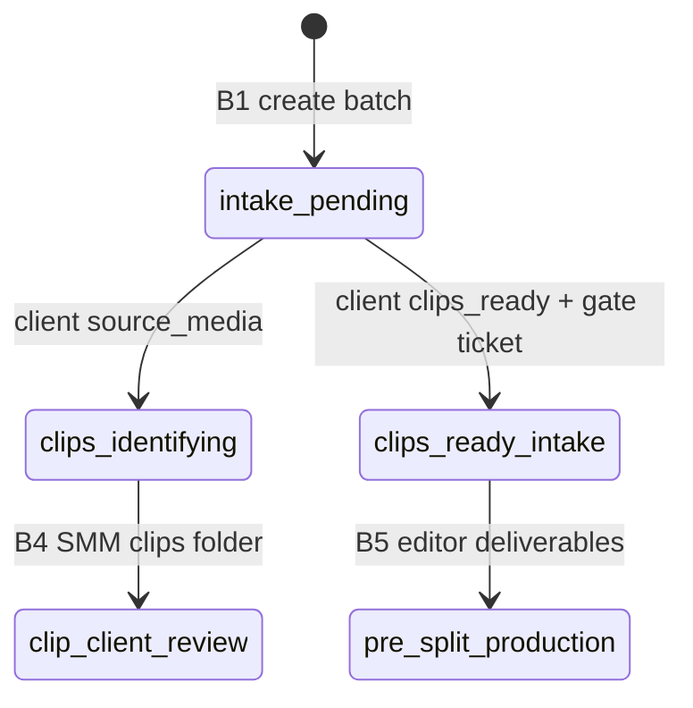

# Backend plan: B3 — Client intake

**Epic:** B3  
**Status:** Done  
**Depends on:** [B0](./B0-auth-and-core-schema.md), [B2](./B2-read-models-boards.md)  
**Blocks:** B4 (SMM clips folder assumes intake complete on podcast path)  
**Index:** [`README.md`](./README.md)

---

## Summary

Implement the **client batch kickoff** command: submit either a **podcast/raw source link** (`source_media`) or a **numbered clips-ready Drive folder** (`clips_ready`). The server updates the batch row, applies the correct `pipeline_stage` and `clip_review_phase`, and for `clips_ready` creates the **pre-split gate ticket** so the editor board shows one card. Podcast path clears existing tickets for the batch until B4 creates the clip-review gate. After success, invalidate workspace queries so SMM/editor/admin boards reflect the new state on refresh.

---

## Scope

### Screens & routes

| Route | Component | B3 involvement |
|-------|-----------|----------------|
| `/client/board` | `ClientBoard` | Shows `ClientBatchIntakeCard` when `batchNeedsClientIntake(batch)` |
| — | `ClientBatchIntakeCard` | Radio path + URL + submit |
| `/client/board` | `ClientVideoKanban` | 0 cards while intake pending; gate card after `clips_ready` |

**Out of B3:** Clip approval modal (B4), SMM find clips (B4), idea-first intake, file uploads.

### Roles & permissions

| Action | client | editor | smm | admin |
|--------|--------|--------|-----|-------|
| Submit / update intake for own batch | ✓ | — | — | — |

**Rules:**

- `batch.client_id` must equal `current_user.client_profile_id`.
- `batch.status` must be `active`.
- `client_profiles.account_status` must be `active`.
- Admin-only `footageUrl` / `source_media_url` set at batch create (B1) **does not** count as client intake — see `batchNeedsClientIntake` below.

### User-visible operations

| Action | UI | API |
|--------|-----|-----|
| Choose podcast vs clips-ready | Radio in `ClientBatchIntakeCard` | `intakePath` in body |
| Paste URL and submit | “Submit link” | `POST .../intake` |
| (Prototype) “Update link” | Shown only before `clipReviewPhase` is set; card hides after success | Same endpoint (upsert URLs) |

---

## Mock inventory

| Symbol | File | Consumers | B3 |
|--------|------|-----------|-----|
| `submitBatchIntake` | `adminWorkspaceStore.tsx` | `ClientBatchIntakeCard` | **Replace** with API mutation |
| `batchDemoStageAfterIntake` | `pathBStateMachine.ts` | Store | Server: `pipeline_stage` |
| `batchClipReviewPhaseAfterIntake` | `pathBStateMachine.ts` | Store | Server: `clip_review_phase` |
| `patchBatchDemoStage` | `pathBStateMachine.ts` | Store | Set `pipeline_stage` + `updated_at` |
| `createPreSplitGateTicket` | `pathBStateMachine.ts` | Store (`clips_ready` only) | Insert `video_tickets` row |
| `videoStateFromDemoStage('clips_ready_intake')` | `pathBStateMachine.ts` | Gate ticket | Ticket `pipeline_stage`, `pipeline_owner`, `stage_label` |
| `batchNeedsClientIntake` | `clientBoard.ts` | `ClientBoard`, intake card visibility | **Read-side rule** — document for API guards |
| `BatchIntakePath` | `adminWorkspace.ts` | Types | `source_media` \| `clips_ready` |
| `STUDIO_DRIVE_READER_EMAIL` | `studioDrive.ts` | Intake copy | No API — static config in frontend |
| `b-new` demo batch | `pathBDemoScenarios.ts` | test-ui FLOW-1 | Seed `intake_pending` for manual test |

### Not in B3

| Symbol | Epic |
|--------|------|
| `submitSmmClipsFolder` | B4 |
| `approveBatchClips` | B4 |
| `MOCK_CLIENT_IDEA_*` | Path A — out of scope |

---

## Domain model

### Intake eligibility (`batchNeedsClientIntake`)

Port logic from [`clientBoard.ts`](../../frontend/src/lib/clientBoard.ts) for API **pre-check** and documentation:

| Condition | Needs intake? |
|-----------|----------------|
| `status !== 'active'` | false |
| `intake_path` IS NULL | true |
| `clip_review_phase` IS NOT NULL | false (client already submitted) |
| `intake_path = source_media` AND `source_media_url` empty | true |
| `intake_path = clips_ready` AND `clips_folder_url` empty | true |
| else | false |

**Important:** `clip_review_phase` is set on successful submit, so the intake card disappears even if URLs are later edited only via a future “edit intake” feature. Prototype does not show the card after first submit.

**Admin reference URL:** B1 may set `source_media_url` / `footage_url` without `intake_path` or `clip_review_phase` — client still sees intake card until **client** submits.

### State transitions (server-owned)

Reference: [`pathBStateMachine.ts`](../../frontend/src/lib/pathBStateMachine.ts) + store [`submitBatchIntake`](../../frontend/src/pages/admin/adminWorkspaceStore.tsx).

#### Path A — `source_media` (podcast / raw footage)

| Field | After submit |
|-------|----------------|
| `intake_path` | `source_media` |
| `source_media_url` | trimmed URL |
| `footage_url` | same (legacy compat in API response) |
| `clips_folder_url` | unchanged / NULL |
| `clip_review_phase` | `smm_identifying` |
| `pipeline_stage` | `clips_identifying` |
| `updated_at` | now |

**Tickets:** Delete (or soft-archive) all `video_tickets` for `batch_id` — prototype `setVideos(filter batchId)`.

**Kanban (client):** 0 cards — SMM identifies clips (B4).

**Downstream:** B4 `submitSmmClipsFolder` → clip client review gate.

#### Path B — `clips_ready` (pre-cut Drive folder)

| Field | After submit |
|-------|----------------|
| `intake_path` | `clips_ready` |
| `clips_folder_url` | trimmed URL |
| `source_media_url` | optional NULL |
| `clip_review_phase` | `approved` (skips client clip review) |
| `pipeline_stage` | `clips_ready_intake` |
| `updated_at` | now |

**Tickets:** Replace batch tickets with **one** pre-split gate ticket:

| Ticket field | Value |
|--------------|--------|
| `deliverable_index` | NULL |
| `title` | `Batch — {batch.title}` |
| `pipeline_stage` | `clips_ready_intake` |
| `pipeline_owner` | `editor` |
| `stage_label` | from `getPathBDemoStageLabel('clips_ready_intake')` / “Clips ready — production” |
| `deadline_role` | `editor` |

**Kanban (client):** 1 gate card (pre-split production messaging); **no** clip approval round.

**Downstream:** Editor submit deliverables (B5); SMM may still view clips via manifest (client-side Drive).



### Invariants

- Intake command must not change `credit_cost`, `credits_debited`, or `batch_number`.
- Cannot submit intake on `completed` batch.
- `url` required, trimmed non-empty (max length TBD, e.g. 2048).
- Switching `intakePath` on resubmit (if allowed later) must reconcile tickets — v1: **reject** path change if `clip_review_phase` already set, or full reset policy in open questions.

### Prototype-only (exclude)

| Item | Production |
|------|------------|
| `demoStage` field writes | `pipeline_stage` only |
| Client-side-only `setVideos` | DB ticket insert/delete |
| In-app Drive manifest population | Still client `DRIVE_MANIFESTS` / sync — not B3 |

---

## Storage design

> **Superseded.** Canonical schema: [00-storage-design.md](./00-storage-design.md).

## Storage (final)

Canonical design: [00-storage-design.md](./00-storage-design.md) § [5.1](./00-storage-design.md#51-batch-level-transitions) (intake rows).

**Epic-specific deltas (B3 only):**

| Area | Detail |
|------|--------|
| DDL | **No new tables** — writes `batches` + `video_tickets` only |
| `source_media` | Set `intake_path`, `source_media_url`, `clip_review_phase=smm_identifying`, `pipeline_stage=clips_identifying`; delete batch tickets |
| `clips_ready` | Set `clips_folder_url`, `clip_review_phase=approved`, `pipeline_stage=clips_ready_intake`; one gate ticket |
| Audit | `batch_events` **deferred** (canonical D2) |

Single transaction per intake command.

---

## API catalog

Base: `/api/v1`. Requires authenticated **client** user.

### Commands

| Method | Path | Body | Response | Replaces |
|--------|------|------|----------|----------|
| POST | `/client/batches/{batch_id}/intake` | `SubmitBatchIntakeRequest` | `SubmitBatchIntakeResponse` | `submitBatchIntake` |

**`SubmitBatchIntakeRequest`:**

```json
{
  "intakePath": "source_media",
  "url": "https://www.youtube.com/watch?v=..."
}
```

```json
{
  "intakePath": "clips_ready",
  "url": "https://drive.google.com/drive/folders/..."
}
```

**`SubmitBatchIntakeResponse`:**

```json
{
  "batch": { /* BatchFolderDto — full batch row */ },
  "videos": [ /* VideoTicketDto[] — empty for source_media; one gate for clips_ready */ ]
}
```

Frontend merges into workspace cache or invalidates `['workspace', 'client']`.

### Reads

No new read endpoints — rely on B2 `GET /client/workspace` after invalidation.

### Validation & errors

| Case | Status | Message hint |
|------|--------|----------------|
| Not client role | `403` | — |
| Batch not found or wrong client | `404` | — |
| Decommissioned client / inactive user | `403` | — |
| Batch not `active` | `422` | — |
| Empty / whitespace URL | `422` | — |
| Invalid `intakePath` | `422` | — |
| Intake already completed (`clip_review_phase` set) | `409` | Optional — prototype hides UI; API can reject or allow URL-only PATCH (open question) |

**URL validation:** Optional `HttpUrl` / regex; accept YouTube, Drive, Dropbox, Spotify links per spec copy (do not over-restrict v1).

### Service layout

| Module | Responsibility |
|--------|----------------|
| `app/services/intake_service.py` | `submit_client_intake(user, batch_id, path, url)` |
| `app/services/path_b_transitions.py` | Shared transition helpers (reuse in B4–B9) |
| `app/controllers/client_batches.py` | Route + `require_roles("client")` |

---

## Side effects & visibility

| Role | After `source_media` | After `clips_ready` |
|------|----------------------|---------------------|
| **Client** | Intake card hidden; kanban empty | Intake hidden; 1 gate card |
| **SMM** | Board: batch in clip identification (`batchNeedsSmmFindClips`) | Batch ready for editor; may open clips folder view |
| **Editor** | Awaiting clips / find clips attention | Pre-split gate; submit deliverables when ready |
| **Admin** | Pipeline owner → SMM (via `adminPipeline` rules on refreshed data) | Owner → editor |

All roles: **`invalidateQueries`** / refetch workspace (B2).

---

## Frontend cutover

| Current | Replacement |
|---------|-------------|
| `submitBatchIntake` in store | `useSubmitBatchIntakeMutation` |
| `ClientBatchIntakeCard` → store | Call mutation; `onSuccess` invalidate client workspace |
| Optimistic local `setBatches` / `setVideos` | Remove from store for this action |

### Files to touch

- `frontend/src/components/client/ClientBatchIntakeCard.tsx`
- `frontend/src/hooks/api/useSubmitBatchIntakeMutation.ts`
- `frontend/src/pages/admin/adminWorkspaceStore.tsx` — remove or no-op `submitBatchIntake`
- Optional: `frontend/src/lib/clientBoard.ts` — keep `batchNeedsClientIntake` client-side for UI; mirror rule in API

Regenerate OpenAPI client after backend ships.

### UX parity

- Radio labels and Drive reader email copy unchanged (`STUDIO_DRIVE_READER_EMAIL`).
- Demo batch `b-new` in seeds: `intake_path` NULL, no `clip_review_phase` — for FLOW-1 in `test-ui.md`.

---

## RBAC matrix (B3)

| Route | client | editor | smm | admin |
|-------|--------|--------|-----|-------|
| `POST /client/batches/{id}/intake` | ✓ (own) | — | — | — |

---

## Risks & open questions

| # | Question | Recommendation |
|---|----------|----------------|
| 1 | Allow resubmit after `clip_review_phase` set? | v1: `409` if already submitted; add `PATCH` later if product wants “Update link” |
| 2 | Allow changing `intakePath` after submit? | Reject — requires ticket reset |
| 3 | Validate Drive folder URL format for `clips_ready`? | Light check (`drive.google.com` or `http` prefix) |
| 4 | Gate ticket title | `Batch — {title}` match prototype |
| 5 | Manifest clip count before split | Not set on intake — B5/B4 handle `video_count` |
| 6 | Audit log | **Deferred** — `batch_events` not in v1 ([00-storage-design.md](./00-storage-design.md) D2) |

---

## Suggested implementation order (B3 execution)

1. Extract `path_b_transitions.py` from `pathBStateMachine` rules (intake only).  
2. `intake_service.submit_client_intake` with transaction.  
3. Unit tests: both paths, ticket count, wrong client 404, inactive batch 422.  
4. `POST /client/batches/{batch_id}/intake` controller + schemas.  
5. pytest integration with seeded `b-new`-like batch.  
6. OpenAPI + `useSubmitBatchIntakeMutation`.  
7. Wire `ClientBatchIntakeCard`; remove store mutation.  
8. Manual: client demo login → `b-new` → podcast submit → SMM board shows identifying (after refetch).  
9. Manual: clips-ready submit → editor sees one gate card.  

---

## Quality checks

- [x] `submitBatchIntake` mapped to API  
- [x] Both `BatchIntakePath` values documented with DB + ticket effects  
- [x] RBAC client-only, own batch  
- [x] Single source of truth: Postgres `pipeline_stage` / `clip_review_phase`  
- [x] B2 workspace invalidation noted  
- [x] Admin `footageUrl` vs client intake distinguished  
- [x] Drive manifest / uploads out of scope  

---

## Links

| Artifact | Path |
|----------|------|
| B2 plan | [`B2-read-models-boards.md`](./B2-read-models-boards.md) |
| UI spec §4.2 | [`../path-b-ui-spec.md`](../path-b-ui-spec.md) |
| Fix-mode intake | [`../test-ui.md`](../test-ui.md) — `b-new`, FLOW-1 step 4 |
| Store implementation | [`../../frontend/src/pages/admin/adminWorkspaceStore.tsx`](../../frontend/src/pages/admin/adminWorkspaceStore.tsx) (lines ~343–400) |
| Intake UI | [`../../frontend/src/components/client/ClientBatchIntakeCard.tsx`](../../frontend/src/components/client/ClientBatchIntakeCard.tsx) |
