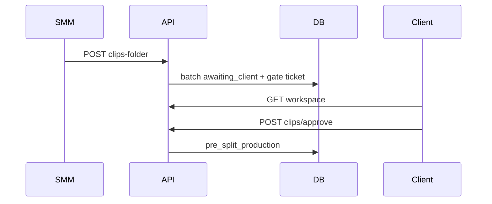

# Backend plan: B4 — SMM clips folder & client clip review

**Epic:** B4  
**Status:** Storage reconciled  
**Depends on:** [B0](./B0-auth-and-core-schema.md), [B2](./B2-read-models-boards.md), [B3](./B3-client-intake.md)  
**Blocks:** B5 (editor deliverables split assumes clip review done or skipped)  
**Index:** [`README.md`](./README.md)

---

## Summary

Implement the **podcast / raw-footage** middle of Path B: SMM or Editor submits a **numbered clips Drive folder**, which creates (or updates) the **clip review gate ticket** and moves the batch to **client clip review**; the client **approves all** or **rejects with a note**, advancing to **pre-split production** or back to **SMM clip identification**. The **`clips_ready`** intake path (B3) **skips this epic entirely** — no SMM submit or client clip approval APIs for those batches.

Drive manifest sync and clip playback remain **client-side** (v1); approve may accept an optional `clipCount` from the UI after sync.

---

## Scope

### Screens & routes

| Route | Role | B4 UI |
|-------|------|-------|
| `/smm/board` | SMM | `SmmFindClipsModal` → `FindClipsPanel` → `submitSmmClipsFolder` |
| `/smm/board` | SMM | `NumberedClipsModal` mode `view` (pre-split, folder linked) |
| `/editor/board` | Editor | `FindClipsModal` — same `submitSmmClipsFolder` (CSM offline co-ownership) |
| `/client/board` | Client | `NumberedClipsModal` mode `client` — approve / reject |
| `/client/board` | Client | Gate cards: clip identification (view), clip review (action) |

**Out of B4:** Editor deliverables submit (B5), SMM QA, client unified QA, Drive API proxy, in-app uploads.

### Roles & permissions

| Command | SMM | Editor | Client | Admin |
|---------|-----|--------|--------|-------|
| Submit clips folder | ✓ (assigned client) | ✓ (assigned client) | — | — |
| Approve clips | — | — | ✓ (own batch) | — |
| Reject clips + note | — | — | ✓ (own batch) | — |

**Access:** Same as [`batchAccess.ts`](../../frontend/src/lib/batchAccess.ts) — employee must match `assigned_smm_id` or `assigned_editor_id` on the batch’s client. Client must own `batch.client_id`.

**Path guard:** All three commands require `intake_path = source_media`. If `intake_path = clips_ready` → `422` (clip review skipped at B3).

### User-visible operations

| Action | UI | API |
|--------|-----|-----|
| Paste clips folder URL (SMM/Editor) | `FindClipsPanel` | `POST .../clips-folder` |
| View numbered clips (read-only) | `NumberedClipsModal` view | B2 reads + Drive sync (frontend) |
| Approve all clips | Client modal footer | `POST .../clips/approve` |
| Reject clips (note required) | Client modal | `POST .../clips/reject` |

---

## Mock inventory

| Symbol | File | Consumers | B4 |
|--------|------|-----------|-----|
| `submitSmmClipsFolder` | `adminWorkspaceStore.tsx` | `FindClipsPanel`, SMM/Editor modals | **Replace** |
| `approveBatchClips` | `adminWorkspaceStore.tsx` | `ClientCardDetailModal` | **Replace** |
| `rejectBatchClips` | `adminWorkspaceStore.tsx` | `ClientCardDetailModal` | **Replace** |
| `createClipReviewGateTicket` | `pathBStateMachine.ts` | Store on SMM submit | Server insert ticket |
| `batchDemoStageAfterSmmClipsFolder` | `pathBStateMachine.ts` | Store | `pipeline_stage = clip_client_review` |
| `batchDemoStageAfterClipApproval` | `pathBStateMachine.ts` | Store | `pipeline_stage = pre_split_production` |
| `videoStateFromDemoStage('clip_client_review')` | `pathBStateMachine.ts` | Gate ticket | Ticket row state |
| `videoStateFromDemoStage('pre_split_production')` | `pathBStateMachine.ts` | After approve | Ticket row state |
| `appendClipRejectNote` | `qaComments.ts` | `rejectBatchClips` | Persist `qa_comments` / JSONB |
| `getManifestForBatch` | `driveMedia.ts` | `approveBatchClips` → `videoCount` | Optional `clipCount` in approve body |
| `batchNeedsSmmFindClips` | `smmBoard.ts` | SMM kanban CTA | Precondition for submit |
| `batchNeedsEditorFindClips` | `editorBoard.ts` | Editor kanban CTA | Same submit endpoint |
| `NumberedClipsModal` | `NumberedClipsModal.tsx` | Client/SMM/Editor | No backend (manifest client-side) |
| `nextStateAfterClientAction` (clip) | `clientBoard.ts` | Reference for approve/reject | Port to server transitions |

### Clips-ready skip (B3)

| State after B3 `clips_ready` | B4 |
|------------------------------|-----|
| `clip_review_phase = approved` | No clip review APIs |
| Gate ticket `clips_ready_intake` | Not clip review ticket |

---

## Domain model

### Preconditions

#### `batchNeedsSmmFindClips` / submit clips folder

Port from [`smmBoard.ts`](../../frontend/src/lib/smmBoard.ts):

| Condition | Required |
|-----------|----------|
| `status = active` | ✓ |
| `intake_path = source_media` | ✓ |
| `source_media_url` OR `footage_url` present | ✓ (client completed B3 podcast intake) |
| `clips_folder_url` empty | ✓ for first submit; **allow update** when `clip_review_phase IN (awaiting_client, with_smm)` and resubmitting folder (open question) |
| `clip_review_phase IN (NULL, smm_identifying, with_smm)` | ✓ for initial; after reject `with_smm` allows resubmit |

Prototype **disables** submit until `rawUrl` exists (`FindClipsPanel`).

#### Client approve / reject

| Condition | Required |
|-----------|----------|
| `clip_review_phase = awaiting_client` | ✓ |
| `clips_folder_url` present | ✓ |
| Gate ticket exists (`deliverable_index` NULL, stage clip review) | ✓ |
| Reject: `note` trimmed non-empty | ✓ |

### Transition 1 — Submit clips folder (`submitSmmClipsFolder`)

**Batch updates:**

| Field | Value |
|-------|--------|
| `intake_path` | `source_media` (forced in prototype) |
| `clips_folder_url` | trimmed URL |
| `clip_review_phase` | `awaiting_client` |
| `pipeline_stage` | `clip_client_review` |
| `updated_at` | now |

**Tickets:**

1. Update any ticket on batch with stage containing “clip identification” → clip review state (`owner=client`, `pipeline_stage=clip_client_review`, title **Clip approval**).
2. If no clip-review ticket exists → **INSERT** gate ticket (`createClipReviewGateTicket`):
   - `title`: `Clip approval`
   - `deliverable_index`: NULL
   - `pipeline_owner`: `client`
   - `pipeline_stage`: `clip_client_review`
   - `stage_label`: e.g. `Clip review`

### Transition 2 — Approve clips (`approveBatchClips`)

**Batch updates:**

| Field | Value |
|-------|--------|
| `clip_review_phase` | `approved` |
| `pipeline_stage` | `pre_split_production` |
| `video_count` | `clipCount` if provided (>0), else unchanged |
| `updated_at` | now |

**Tickets:** For batch, update gate / clip-identification / clip-review tickets (`isPreSplitGateOrClipReview` logic):

| Field | Value |
|-------|--------|
| `pipeline_stage` | `pre_split_production` |
| `pipeline_owner` | `editor` |
| `stage_label` | `Awaiting deliverables folder` |
| `deadline_role` | `editor` |

Matches [`nextStateAfterClientAction`](../../frontend/src/lib/clientBoard.ts) `case 'clip'`, `action === 'approve'`.

**Kanban:** Client sees one pre-split gate (not clip review); editor awaits deliverables folder (B5).

### Transition 3 — Reject clips (`rejectBatchClips`)

**Batch updates:**

| Field | Value |
|-------|--------|
| `clip_review_phase` | `with_smm` |
| `pipeline_stage` | `clips_identifying` |
| `updated_at` | now |

**Ticket** (clip review gate id from request):

| Field | Value |
|-------|--------|
| `pipeline_stage` | `clips_identifying` |
| `pipeline_owner` | `smm` |
| `stage_label` | `Clip identification` |
| `deadline_role` | `smm` |
| `qa_comment_history` | append `clip_note`, `author_role=client`, `slot=clip` |

Prototype uses `videoStateFromDemoStage('clips_identifying')` on ticket; batch `patchBatchDemoStage('clips_identifying')` — align server to both.

**SMM:** `batchNeedsSmmFindClips` true again (folder URL may still be set — prototype keeps `clipsFolderUrl`; SMM can replace folder via resubmit). **Open question:** clear `clips_folder_url` on reject vs keep for reference — prototype **keeps** URL.

### Invariants

- Do not run B4 commands on `clips_ready` batches.
- Reject without note → `422`.
- Approve must target the clip-review gate ticket id (or server resolves single gate ticket for batch).
- Client reject routes to SMM only (never editor directly) — already enforced by returning to `clips_identifying` / SMM owner.
- Transaction per command: batch + ticket(s) + QA comment insert.

### Prototype-only

| Item | Production |
|------|------------|
| `getManifestForBatch` clip count | Optional `clipCount` on approve from client UI |
| `useDriveManifestSync` | Stays frontend |
| Editor/SMM both call same store fn | One clips-folder endpoint, two roles |

---

## Storage design

> **Superseded.** Canonical schema: [00-storage-design.md](./00-storage-design.md).

## Storage (final)

Canonical design: [00-storage-design.md](./00-storage-design.md) § [5.1](./00-storage-design.md#51-batch-level-transitions) (clip review transitions).

**Epic-specific deltas (B4 only):**

| Command | Tables | QA |
|---------|--------|-----|
| Submit clips folder | `batches`, gate `video_tickets` | — |
| Approve clips | `batches`, gate ticket | — |
| Reject clips | `batches`, gate ticket | `INSERT qa_comments` (`kind=clip_note`, `slot=clip`) — **not** JSONB `qa_comment_history` |

`drive_manifest_snapshots` / Mongo manifest: **deferred** (client-side manifest v1). Optional `clipCount` on approve from UI manifest sync.

---

## API catalog

Base: `/api/v1`. Authenticated.

### Commands — employee (SMM + Editor)

| Method | Path | Body | Response | Replaces |
|--------|------|------|----------|----------|
| POST | `/batches/{batch_id}/clips-folder` | `{ "clipsFolderUrl": "https://..." }` | `{ batch, videos }` | `submitSmmClipsFolder` |

**Auth:** `require_roles` employee; `assert_employee_batch_access(user, batch)`.

**Validation:**

- `intake_path === source_media`
- Client has submitted source URL
- `clipsFolderUrl` non-empty
- Batch `active`

**Side effects:** As Transition 1.

---

### Commands — client

| Method | Path | Body | Response | Replaces |
|--------|------|------|----------|----------|
| POST | `/client/batches/{batch_id}/clips/approve` | `{ "videoTicketId": "uuid", "clipCount"?: number }` | `{ batch, videos }` | `approveBatchClips` |
| POST | `/client/batches/{batch_id}/clips/reject` | `{ "videoTicketId": "uuid", "note": "..." }` | `{ batch, videos }` | `rejectBatchClips` |

**Auth:** client + `batch.client_id === me.client_profile_id`.

**Validation:**

- `clip_review_phase === awaiting_client`
- `videoTicketId` belongs to batch and is clip-review gate
- Reject: `note.trim().length > 0`
- `clipCount` if present: integer ≥ 0

**Alternative path design:** `POST /client/videos/{video_ticket_id}/clips/approve` — equivalent; batch-scoped paths match store signatures.

### Reads

No new reads — invalidate B2 workspace keys: `client`, `smm`, `editor`, `admin`.

### Errors

| Case | Status |
|------|--------|
| Wrong role / assignment | `403` / `404` |
| `clips_ready` batch | `422` |
| Approve when not `awaiting_client` | `422` |
| Missing gate ticket | `409` |
| Empty reject note | `422` |
| Submit clips without source media | `422` |

---

## Frontend cutover

| Current | Replacement |
|---------|-------------|
| `submitSmmClipsFolder` | `useSubmitClipsFolderMutation` |
| `approveBatchClips` | `useApproveBatchClipsMutation` |
| `rejectBatchClips` | `useRejectBatchClipsMutation` |
| Store `setBatches`/`setVideos` for B4 | Remove; `onSuccess` → invalidate all workspace queries |

### Files to touch

- `frontend/src/components/path-b/FindClipsPanel.tsx`
- `frontend/src/components/client/ClientCardDetailModal.tsx`
- `frontend/src/pages/admin/adminWorkspaceStore.tsx`
- `frontend/src/hooks/api/useClipsFolderMutations.ts` (or split files)
- Optional: pass `manifest.clips.length` as `clipCount` on approve from `NumberedClipsModal` / parent

`NumberedClipsModal` / `useDriveManifestSync` unchanged.

### Employee endpoint routing

Single `POST /batches/{id}/clips-folder` for both SMM and Editor (matches shared store function).

---

## RBAC matrix (B4)

| Route | client | editor | smm | admin |
|-------|--------|--------|-----|-------|
| `POST /batches/{id}/clips-folder` | — | ✓* | ✓* | — |
| `POST /client/batches/{id}/clips/approve` | ✓ | — | — | — |
| `POST /client/batches/{id}/clips/reject` | ✓ | — | — | — |

\*Assigned to batch’s client.

---

## Risks & open questions

| # | Question | Recommendation |
|---|----------|----------------|
| 1 | `video_count` without server manifest | Accept optional `clipCount` on approve from synced manifest |
| 2 | Resubmit clips folder after client reject | Allow POST clips-folder when `with_smm`; overwrite URL |
| 3 | Editor vs SMM both submit — conflict | Last write wins; no locking v1 |
| 4 | Multiple gate tickets | Server enforces at most one clip-review gate per batch |
| 5 | QA comments table vs JSONB | **Resolved:** `qa_comments` table from B4 reject onward (wave 2 if migrated early) |
| 6 | Validate Drive folder URL | Light pattern check |

---

## Suggested implementation order (B4 execution)

1. Extend `path_b_transitions.py` — clips folder, approve, reject.  
2. `clips_service.submit_folder(user, batch_id, url)`.  
3. `clips_service.approve_clips(client, batch_id, ticket_id, clip_count?)`.  
4. `clips_service.reject_clips(client, batch_id, ticket_id, note)`.  
5. Controller routes + schemas.  
6. pytest: full loop source_media; clips_ready returns 422 on B4 routes.  
7. OpenAPI + frontend mutations.  
8. Wire `FindClipsPanel`, `ClientCardDetailModal`.  
9. Manual test-ui: demo stage `clip_client_review` / `b-clip-review` if seeded.  

---

## Quality checks

- [x] All three store actions mapped  
- [x] `clips_ready` skip documented  
- [x] SMM + Editor share submit endpoint  
- [x] Client-only approve/reject with note on reject  
- [x] Gate ticket lifecycle matches `createClipReviewGateTicket`  
- [x] Workspace invalidation across roles  
- [x] Drive manifest remains client-side  

---

## Links

| Artifact | Path |
|----------|------|
| B3 plan | [`B3-client-intake.md`](./B3-client-intake.md) |
| B5 plan (next) | [`README.md`](./README.md) — editor deliverables split |
| UI spec §3.1, §4.3–4.4 | [`../path-b-ui-spec.md`](../path-b-ui-spec.md) |
| Store | [`../../frontend/src/pages/admin/adminWorkspaceStore.tsx`](../../frontend/src/pages/admin/adminWorkspaceStore.tsx) (~402–525) |
| Clip reject notes | [`../../frontend/src/lib/qaComments.ts`](../../frontend/src/lib/qaComments.ts) |
