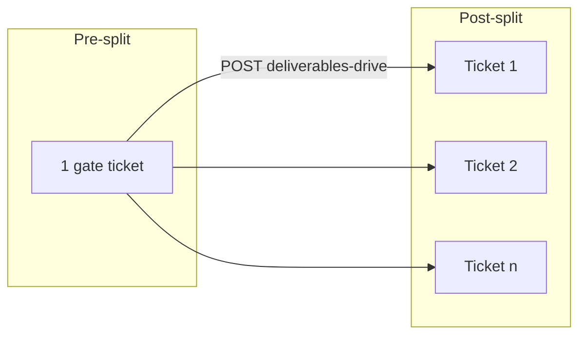

# Backend plan: B5 — Editor deliverables split

**Epic:** B5  
**Status:** Done  
**Depends on:** [B0](./B0-auth-and-core-schema.md), [B2](./B2-read-models-boards.md), [B3](./B3-client-intake.md), [B4](./B4-smm-clips-client-clip-review.md) (podcast path)  
**Blocks:** B6 (per-video production + send to SMM QA requires split tickets)  
**Index:** [`README.md`](./README.md)

---

## Summary

Implement **Submit videos for this batch**: the editor links the **deliverables Drive root** (`videos/` + `thumbnails/` subfolders). The server **removes pre-split gate tickets**, creates **`n` indexed video tickets** (`deliverable_index` 1…n), sets `video_count`, `editor_deliverables_drive_url`, and `pipeline_stage = production`. Card count on client/SMM/editor kanbans moves from **one gate** to **n deliverable cards**. Drive layout validation and manifest indexing stay **client-side** in v1; the API accepts an optional `deliverableCount` (and optional titles) when the UI has synced the manifest.

---

## Scope

### Screens & routes

| Route | Role | B5 UI |
|-------|------|-------|
| `/editor/board` | Editor | Pre-split kanban → open gate → `NumberedClipsModal` mode `editor` |
| `/editor/board` | Editor | Footer CTA **Submit videos for this batch** → `submitEditorVideosDrive` |

**Entry paths into pre-split submit:**

| Prior path | Precondition |
|------------|----------------|
| Podcast (`source_media`) | `clip_review_phase = approved` (B4) |
| Clips-ready (`clips_ready`) | `clips_folder_url` set (B3); no B4 clip review |

**Out of B5:** Per-video production fields, send to SMM QA (B6), SMM clip folder submit (B4), Drive API sync service.

### Roles & permissions

| Command | client | editor | smm | admin |
|---------|--------|--------|-----|-------|
| Submit deliverables drive | — | ✓ (assigned client) | — | — |

**Access:** `batch.client_profiles.assigned_editor_id = current_user.id` (same as [`batchAccess.ts`](../../frontend/src/lib/batchAccess.ts)).

SMM does **not** call this endpoint in the prototype (deliverables submit is editor-only in `NumberedClipsModal` mode `editor`).

### User-visible operations

| Action | UI | API |
|--------|-----|-----|
| Paste deliverables Drive root URL | `NumberedClipsModal` editor footer | `POST .../deliverables-drive` |
| Submit → kanban splits to N cards | `EditorPathBVideoKanban` post-split | Response `{ batch, videos }` |

---

## Mock inventory

| Symbol | File | Consumers | B5 |
|--------|------|-----------|-----|
| `submitEditorVideosDrive` | `adminWorkspaceStore.tsx` | `EditorBoard` | **Replace** |
| `createSplitDeliverableTicket` | `pathBStateMachine.ts` | Store | Server INSERT n rows |
| `batchDemoStageAfterDeliverablesSplit` | `pathBStateMachine.ts` | Store | `pipeline_stage = production` |
| `getManifestForBatch` | `driveMedia.ts` | Store → `n`, titles | Optional request `deliverableCount`, `deliverables[]` |
| `batchReadyForEditorWork` | `editorBoard.ts` | When kanban shows | API precondition |
| `batchAwaitingClips` | `editorBoard.ts` | Blocks submit | Must be false |
| `videoNeedsEditorVideosSubmit` | `editorBoard.ts` | CTA visibility | `editor_deliverables_drive_url` empty |
| `editorBatchKanbanPhase` | `editorBoard.ts` | pre_split → post_split | After API |
| `NumberedClipsModal` (editor mode) | `NumberedClipsModal.tsx` | Submit CTA | Unchanged UI |
| `filterVideosForEditorKanban` | `editorBoard.ts` | Post-split filter | Client-side on new tickets |

### Not B5

| Symbol | Epic |
|--------|------|
| `sendEditorDeliverableToSmmQa` | B6 |
| `saveVideoPublishTitle` | B6 |
| `resubmitEditorVideoQa` | B6/B7 (re-upload) |

---

## Domain model

### Preconditions (`batchReadyForEditorWork` + split allowed)

Port from [`editorBoard.ts`](../../frontend/src/lib/editorBoard.ts):

| Rule | Required |
|------|----------|
| `batch.status = active` | ✓ |
| `batchAwaitingClips(batch) = false` | ✓ |
| `batchReadyForEditorWork(batch) = true` | ✓ |
| `clips_ready`: `clips_folder_url` present | ✓ |
| `source_media`: `clip_review_phase = approved` | ✓ |
| `deliverables_drive_url` empty | ✓ v1 first submit (`409` if already split — see open questions) |
| `deliverablesDriveUrl` body non-empty | ✓ |

### Computing `n` (deliverable count)

Prototype ([`adminWorkspaceStore.tsx`](../../frontend/src/pages/admin/adminWorkspaceStore.tsx) ~669–672):

```text
n = max(manifest.clips.length, manifest.videos.length, batch.video_count, 1)
```

**Server v1:**

| Source | Priority |
|--------|----------|
| Request body `deliverableCount` | Use if `>= 1` (from UI after Drive sync) |
| Else `batch.video_count` if > 0 (set on B4 approve from clip count) | |
| Else `1` | Minimum one card |

Optional request `deliverables: [{ index, title }]` to override ticket titles from manifest names.

### Transition — Submit deliverables drive

**Batch updates:**

| Field | Value |
|-------|--------|
| `editor_deliverables_drive_url` | trimmed URL |
| `video_count` | `n` |
| `pipeline_stage` | `production` |
| `updated_at` | now |

**Tickets (transaction):**

1. **DELETE** all `video_tickets` where `batch_id = ?` (removes gate, clip review, any stale rows).
2. **INSERT** `n` rows via `createSplitDeliverableTicket` equivalent:

| Field | Value |
|-------|--------|
| `deliverable_index` | `1` … `n` |
| `title` | manifest name or `Deliverable {index}` |
| `pipeline_stage` | `production` |
| `pipeline_owner` | `editor` |
| `stage_label` | Production (from `videoStateFromDemoStage('production')`) |
| `deadline_role` | `editor` |
| `editor_workflow_phase` | `videos` (default) |
| `asset_versions` | `{ "video": 1, "thumbnail": 1 }` |
| `released_to_client_final_review` | `false` |



### Downstream UI effects (after B2 refetch)

| Portal | Behavior |
|--------|----------|
| **Editor** | `editorBatchKanbanPhase` → `post_split`; production column per card |
| **Client** | Kanban shows n indexed cards (not gate); no client QA until B6/B8 gates |
| **SMM** | `smmBatchKanbanPhase` → `post_split`; per-card QA/scheduling later |

### Invariants

- Split is **destructive** for batch tickets — no merge of old gate id into new rows.
- `deliverable_index` unique per batch after split.
- Does not modify `clips_folder_url`, `source_media_url`, `credit_cost`, or `clip_review_phase`.
- Titles live in DB per index (spec §3.4 — not in Drive).

### Prototype-only

| Item | Production |
|------|------------|
| Timestamp-based ticket ids `v-{batchId}-d{index}-{ts}` | UUID |
| Client-side manifest for `n` only | Request `deliverableCount` + optional titles |

---

## Storage design

> **Superseded.** Canonical schema: [00-storage-design.md](./00-storage-design.md).

## Storage (final)

Canonical design: [00-storage-design.md](./00-storage-design.md) §§ [3.3](./00-storage-design.md#33-batches), [5.1](./00-storage-design.md#51-batch-level-transitions), [6 #6](./00-storage-design.md#6-invariants-server-enforced).

**Epic-specific deltas (B5 only):**

| Area | Detail |
|------|--------|
| DDL | **No new tables** — transactional DELETE all batch tickets + INSERT `n` rows with `deliverable_index` 1…n |
| Re-submit deliverables drive | **`409 Conflict`** if `editor_deliverables_drive_url` already set (canonical D1) |
| Concurrency | Row lock on `batches` during split transaction |

---

## API catalog

Base: `/api/v1`. Authenticated **editor** (employee + `employee_kind=editor`).

### Commands

| Method | Path | Body | Response | Replaces |
|--------|------|------|----------|----------|
| POST | `/editor/batches/{batch_id}/deliverables-drive` | `SubmitDeliverablesDriveRequest` | `SubmitDeliverablesDriveResponse` | `submitEditorVideosDrive` |

**Alternative:** `POST /batches/{batch_id}/deliverables-drive` with editor guard — same semantics.

**`SubmitDeliverablesDriveRequest`:**

```json
{
  "deliverablesDriveUrl": "https://drive.google.com/drive/folders/...",
  "deliverableCount": 6,
  "deliverables": [
    { "index": 1, "title": "Hook — 0:45" },
    { "index": 2, "title": "Tip #2" }
  ]
}
```

- `deliverableCount` optional if `deliverables.length` provided.
- `deliverables` optional; sparse indices filled with default titles.

**`SubmitDeliverablesDriveResponse`:**

```json
{
  "batch": { /* BatchFolderDto */ },
  "videos": [ /* VideoTicketDto[] length n */ ]
}
```

### Reads

None — invalidate B2 workspace: `client`, `editor`, `smm`, `admin`.

### Validation & errors

| Case | Status |
|------|--------|
| Not editor / wrong assignment | `403` / `404` |
| Batch awaiting clips | `422` |
| Batch not ready for editor work | `422` |
| Empty drive URL | `422` |
| `deliverableCount < 1` | `422` |
| Deliverables drive already set (v1) | `409` |
| Batch not `active` | `422` |

**Drive folder structure** (`videos/`, `thumbnails/`): not validated server-side in v1; document in API description for operators.

### Service layout

| Module | Responsibility |
|--------|----------------|
| `app/services/deliverables_split_service.py` | `submit_deliverables_drive(editor, batch_id, payload)` |
| `app/services/path_b_transitions.py` | Reuse split ticket factory |
| `app/controllers/editor_batches.py` | Route |

---

## Frontend cutover

| Current | Replacement |
|---------|-------------|
| `submitEditorVideosDrive` | `useSubmitDeliverablesDriveMutation` |
| Store ticket replace | `onSuccess` → invalidate all workspace queries |

### Files to touch

- `frontend/src/pages/editor/EditorBoard.tsx` — mutation + pass `deliverableCount` from manifest when available:

```typescript
const manifest = /* from useDriveManifestSync in modal or parent */
const n = Math.max(manifest?.clips.length ?? 0, manifest?.videos.length ?? 0, batch.videoCount, 1)
```

- `frontend/src/components/path-b/NumberedClipsModal.tsx` — optional: expose manifest count to parent on submit
- `frontend/src/pages/admin/adminWorkspaceStore.tsx` — remove `submitEditorVideosDrive`
- `frontend/src/hooks/api/useSubmitDeliverablesDriveMutation.ts`

### UX parity

- Submit disabled until deliverables URL trimmed (`submitDeliverablesDisabled`).
- Modal requires `clipsFolderUrl` on batch to open (editor views clips while submitting deliverables root).
- Clips-ready path: client already linked clips folder in B3; editor skips B4 but still uses same modal flow.

---

## RBAC matrix (B5)

| Route | client | editor | smm | admin |
|-------|--------|--------|-----|-------|
| `POST /editor/batches/{id}/deliverables-drive` | — | ✓* | — | — |

\*Assigned editor for batch’s client.

---

## Risks & open questions

| # | Question | Recommendation |
|---|----------|----------------|
| 1 | Re-submit deliverables drive after split | **Resolved:** v1 `409` ([00-storage-design.md](./00-storage-design.md) D1) |
| 2 | `n` mismatch vs Drive files | UI sends count from sync; server trusts with min 1 |
| 3 | `video_count` from B4 approve vs manifest | `max()` logic preserved |
| 4 | Editor without `clips_folder_url` on podcast path | UI may still open modal if gate exists; server requires approved clips phase, not necessarily clips URL for submit |
| 5 | Partial insert failure | Single transaction — all or nothing |
| 6 | SMM submitting deliverables | Out of scope — editor only |

---

## Suggested implementation order (B5 execution)

1. Add `create_split_tickets(batch, n, titles)` to `path_b_transitions.py`.  
2. `deliverables_split_service.submit` with delete+insert transaction.  
3. Schemas + `POST /editor/batches/{batch_id}/deliverables-drive`.  
4. pytest: podcast path after approve → split → n tickets with indices 1..n; clips_ready after B3; awaiting clips 422; double submit 409.  
5. OpenAPI + mutation hook.  
6. Wire `EditorBoard` / `NumberedClipsModal` submit handler.  
7. Manual: demo batch with deliverables — editor board shows N cards; client board post-split filter.  

---

## Quality checks

- [x] `submitEditorVideosDrive` mapped to API  
- [x] Split logic matches `createSplitDeliverableTicket` + delete batch tickets  
- [x] `batchReadyForEditorWork` / awaiting clips guards documented  
- [x] Editor-only RBAC  
- [x] `video_count` and `pipeline_stage` updated  
- [x] Workspace invalidation across roles  
- [x] Manifest/Drive validation deferred; optional `deliverableCount`  

---

## Links

| Artifact | Path |
|----------|------|
| B4 plan | [`B4-smm-clips-client-clip-review.md`](./B4-smm-clips-client-clip-review.md) |
| B6 plan (next) | [`README.md`](./README.md) |
| UI spec §3.4, §5.2–5.3 | [`../path-b-ui-spec.md`](../path-b-ui-spec.md) |
| Store split | [`../../frontend/src/pages/admin/adminWorkspaceStore.tsx`](../../frontend/src/pages/admin/adminWorkspaceStore.tsx) (~662–707) |
| Ticket factory | [`../../frontend/src/lib/pathBStateMachine.ts`](../../frontend/src/lib/pathBStateMachine.ts) |
