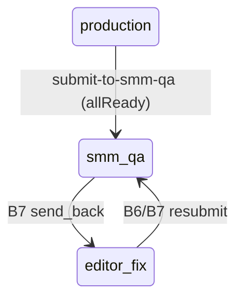

# Backend plan: B6 — Production package & SMM QA queue

**Epic:** B6  
**Status:** Done  
**Depends on:** [B0](./B0-auth-and-core-schema.md), [B2](./B2-read-models-boards.md), [B5](./B5-editor-deliverables-split.md)  
**Blocks:** B7 (SMM internal QA on tickets in `smm_qa` stage)  
**Index:** [`README.md`](./README.md)

---

## Summary

After B5 split, each indexed deliverable is filled out in **production**: **video** and **thumbnail** come from the deliverables Drive folder (manifest/sync), **title** is stored on the ticket (`editorPublishTitle`). Implement APIs to **save the title**, optionally **record Drive slot snapshots** after client-side sync, and **send to SMM QA** when all three readiness checks pass. The server enforces the same rules as [`readinessForDeliverable`](../../frontend/src/lib/pathBDeliverables.ts) and gates `POST submit-to-smm-qa`. SMM may also save title / sync thumb and **return to SMM QA** when doing asset prep (`smmNeedsAssetPrep`) — same transition as editor send, with different RBAC guards.

---

## Scope

### Screens & routes

| Route | Role | B6 UI |
|-------|------|-------|
| `/editor/board` | Editor | `EditorProductionModal` — summary, sync, title, **Send to SMM QA** |
| `/smm/board` | SMM | `SmmProductionModal` — title/thumb assist; **Return to SMM QA** when `smmNeedsAssetPrep` |

**Shared components:** `DeliverableSummaryPanel`, `DeliverableReadinessStrip`, `DriveSyncButton`, `useDriveManifestSync`.

**Out of B6:** SMM QA approve/send-back (B7), client QA (B8), `resubmitEditorVideoQa` / sold comments (B7), real Google Drive API sync service, in-app uploads.

### Roles & permissions

| Command | Editor (assigned) | SMM (assigned) | Client | Admin |
|---------|-------------------|----------------|--------|-------|
| Save publish title | ✓ | ✓* | — | — |
| Record drive slots (post-sync) | ✓ | ✓* | — | — |
| Submit to SMM QA | ✓** | ✓*** | — | — |

\*SMM when [`smmCanEditEditorDeliverable`](../../frontend/src/lib/smmBoard.ts) or `smmNeedsAssetPrep` for that ticket.  
\*\*`editorNeedsProductionWork` — ticket `owner=editor`, production-stage.  
\*\*\*`smmNeedsAssetPrep` — ticket `owner=smm`, filling missing thumb/title before re-entering QA queue.

### User-visible operations

| Action | UI | API |
|--------|-----|-----|
| Save video title | Title input in `DeliverableSummaryPanel` | `PATCH .../production` |
| Sync Drive (client) | `DriveSyncButton` | then `POST .../drive-sync` (optional snapshot) |
| Send to SMM QA | Editor production CTA | `POST .../submit-to-smm-qa` |
| Return to SMM QA | SMM production CTA | same `POST` with SMM guard |

---

## Mock inventory

| Symbol | File | Consumers | B6 |
|--------|------|-----------|-----|
| `saveVideoPublishTitle` | `adminWorkspaceStore.tsx` | Editor/SMM production modals | `PATCH` title |
| `sendEditorDeliverableToSmmQa` | `adminWorkspaceStore.tsx` | Readiness strip CTA | `POST submit-to-smm-qa` |
| `readinessForDeliverable` | `pathBDeliverables.ts` | UI + gate | Server `readiness_service` |
| `editorNeedsProductionWork` | `editorBoard.ts` | Editor CTA enable | Submit guard (editor) |
| `smmNeedsAssetPrep` | `smmBoard.ts` | SMM return CTA | Submit guard (smm) |
| `smmCanEditEditorDeliverable` | `smmBoard.ts` | SMM title edit on editor-owned | PATCH guard |
| `useDriveManifestSync` | `useDriveManifestSync.ts` | Sync UI | Triggers `POST drive-sync` (new) |
| `getManifestForBatch` / `DRIVE_MANIFESTS` | `driveMedia.ts` | Readiness | Client-only v1; snapshot POST for server |
| `DeliverableReadinessStrip` | `DeliverableReadinessStrip.tsx` | CTA | Unchanged |
| `assetVersions` on ticket | `adminWorkspace.ts` | Version bumps | B7 on re-upload; B6 sets baseline `{video:1, thumbnail:1}` at B5 |

### Not B6

| Symbol | Epic |
|--------|------|
| `submitSmmQaReview` | B7 |
| `resubmitEditorVideoQa` | B7 |
| `applyClientVideoDecision` | B8 |

---

## Domain model

### Readiness rules (canonical)

From [`pathBDeliverables.ts`](../../frontend/src/lib/pathBDeliverables.ts) and spec §3.2:

| Check | True when |
|-------|-----------|
| `videoReady` | Manifest or stored snapshot has `videos/{deliverableIndex}` |
| `thumbnailReady` | Manifest or stored snapshot has `thumbnails/{deliverableIndex}` |
| `titleReady` | `editor_publish_title` trimmed non-empty |
| `allReady` | all three |

**Server v1:** After client sync, UI posts slot snapshot so readiness does not depend on bundled `DRIVE_MANIFESTS` at API time:

```json
{
  "video": { "driveFileId": "...", "name": "1.mov", "modifiedTime": "..." },
  "thumbnail": { "driveFileId": "...", "name": "1.png", "modifiedTime": "..." }
}
```

Stored on ticket as JSONB `deliverable_drive_slots` (or columns `video_drive_file_id`, `thumb_drive_file_id` — consolidate in `00-storage-design.md`).

### Transition — Submit to SMM QA (`sendEditorDeliverableToSmmQa`)

**Ticket updates:**

| Field | Value |
|-------|--------|
| `pipeline_stage` | `smm_qa` |
| `pipeline_owner` | `smm` |
| `stage_label` | SMM QA (from `videoStateFromDemoStage`) |
| `deadline_role` | `smm` |
| `released_to_client_final_review` | `false` |

**Batch:** `updated_at` only (prototype does not change batch `pipeline_stage` per ticket).

**Preconditions (server):**

| Guard | Rule |
|-------|------|
| Post-split ticket | `deliverable_index >= 1` |
| Batch has deliverables drive | `editor_deliverables_drive_url` set |
| Readiness | `allReady` true (server-computed) |
| Editor submit | `pipeline_owner = editor` AND production-stage (not `qa flagged`) |
| SMM submit | `smmNeedsAssetPrep` equivalent: `owner=smm`, stage mentions production/thumbnail/title, was filling assets before returning to QA |

**Does not** set `releasedToClientFinalVideoReview` — B7 approve path handles release to client.



### Save title only

Updates `editor_publish_title` on ticket; does not change stage/owner. Used by editor and SMM (when allowed).

### Drive sync snapshot (new)

Does not call Google. Accepts manifest entries for one `deliverable_index` from the UI after `reloadDriveManifestForBatch` (still client-side). Updates `deliverable_drive_slots` and optionally `batch.drive_manifest_synced_at` if batch-level timestamp needed.

---

## Storage design

> **Superseded.** Canonical schema: [00-storage-design.md](./00-storage-design.md).

## Storage (final)

Canonical design: [00-storage-design.md](./00-storage-design.md) § [3.4](./00-storage-design.md#34-video_tickets) (`deliverable_drive_slots`, `drive_slots_synced_at`, `editor_publish_title`); § [6 #2](./00-storage-design.md#6-invariants-server-enforced).

**Epic-specific deltas (B6 only):**

| Column / write | Detail |
|----------------|--------|
| `editor_publish_title` | PATCH production |
| `deliverable_drive_slots` | JSONB `{ video?, thumbnail? }` per ticket after client `POST …/drive-sync` |
| `drive_slots_synced_at` | Set on sync |
| Submit to SMM QA | Transition `production` → `smm_qa`; enforce readiness invariant #2 |

**No Mongo** — Drive manifest generation stays client-side; server stores URL + slot snapshot only (conflict #8).

---

## API catalog

Base: `/api/v1`. Authenticated.

### Commands — production (per video ticket)

| Method | Path | Roles | Body | Replaces |
|--------|------|-------|------|----------|
| PATCH | `/videos/{video_ticket_id}/production` | editor*, smm* | `UpdateProductionRequest` | `saveVideoPublishTitle` (+ slots) |

**`UpdateProductionRequest`:**

```json
{
  "editorPublishTitle": "My Short Title"
}
```

Partial PATCH — only sent fields updated.

### Commands — drive snapshot (recommended for server readiness)

| Method | Path | Roles | Body | Replaces |
|--------|------|-------|------|----------|
| POST | `/videos/{video_ticket_id}/drive-sync` | editor*, smm* | `DeliverableDriveSyncRequest` | Client sync side-effect |

**`DeliverableDriveSyncRequest`:**

```json
{
  "deliverableIndex": 2,
  "video": { "index": 2, "driveFileId": "...", "name": "2.mov", "mimeType": "video/quicktime", "modifiedTime": "..." },
  "thumbnail": { "index": 2, "driveFileId": "...", "name": "2.png", "mimeType": "image/png", "modifiedTime": "..." },
  "syncedAt": "2026-05-15T16:49:06.328Z"
}
```

Response: `{ ticket, readiness: DeliverableReadinessDto }`.

### Commands — submit to SMM QA

| Method | Path | Roles | Body | Replaces |
|--------|------|------|------|----------|
| POST | `/videos/{video_ticket_id}/submit-to-smm-qa` | editor*, smm* | optional `{}` | `sendEditorDeliverableToSmmQa` |

**Response:** `{ ticket, batch?, readiness }` — updated ticket in `smm_qa`.

**Errors:**

| Case | Status |
|------|--------|
| Not all ready | `422` with `{ readiness, missing: ['video'|'thumbnail'|'title'] }` |
| Wrong owner/stage for role | `422` |
| Pre-split / gate ticket | `422` |
| No deliverables drive on batch | `422` |
| Cross-tenant / assignment | `404` |

### Reads

`GET /videos/{id}/readiness` optional convenience — else compute in PATCH/sync responses. B2 workspace still primary.

### Alternative route prefix

`POST /editor/videos/{id}/submit-to-smm-qa` for editor-only; SMM uses `/smm/videos/...` — or unified `/videos/...` with role guards (recommended).

---

## Frontend cutover

| Current | Replacement |
|---------|-------------|
| `saveVideoPublishTitle` | `useUpdateProductionMutation` |
| `sendEditorDeliverableToSmmQa` | `useSubmitToSmmQaMutation` |
| Sync only local override | After `sync()`, call `useDeliverableDriveSyncMutation` with manifest entries for index |

### Files to touch

- `frontend/src/components/editor/EditorProductionModal.tsx`
- `frontend/src/components/smm/SmmProductionModal.tsx`
- `frontend/src/components/path-b/DeliverableSummaryPanel.tsx` (if sync hooks from parent)
- `frontend/src/hooks/useDriveManifestSync.ts` — optional callback after sync
- `frontend/src/pages/admin/adminWorkspaceStore.tsx` — remove B6 mutations
- `frontend/src/hooks/api/useProductionMutations.ts`

Invalidate workspace queries on PATCH, drive-sync, and submit.

### UX parity

- Editor: `canSendSmm = editorNeedsProductionWork && readiness.allReady` — server enforces on POST.
- SMM: `Return to SMM QA` only when `smmNeedsAssetPrep && allReady`.
- Preview-only copy when ticket not editor production — unchanged.

---

## RBAC matrix (B6)

| Route | client | editor | smm | admin |
|-------|--------|--------|-----|-------|
| `PATCH /videos/{id}/production` | — | ✓* | ✓** | — |
| `POST /videos/{id}/drive-sync` | — | ✓* | ✓** | — |
| `POST /videos/{id}/submit-to-smm-qa` | — | ✓*** | ✓**** | — |

\*Assigned editor for batch’s client.  
\*\*Assigned SMM when ticket allows title/slot edit per `smmCanEditEditorDeliverable` / `smmNeedsAssetPrep`.  
\*\*\*Editor production submit.  
\*\*\*\*SMM asset-prep return-to-QA submit.

---

## Risks & open questions

| # | Question | Recommendation |
|---|----------|----------------|
| 1 | Readiness without `POST drive-sync` | Require drive-sync before submit OR accept readiness flags in submit body (weaker) — prefer snapshot POST |
| 2 | SMM sending editor-owned package to QA | Editor-only submit when `owner=editor`; SMM only when `smmNeedsAssetPrep` |
| 3 | Re-submit while already `smm_qa` | `422` unless B7 resubmit flow |
| 4 | Title field name `editorPublishTitle` vs `publishTitle` | Keep `editorPublishTitle` in JSON for UI compat |
| 5 | Version bump on sync | Only bump `asset_versions` when file `modifiedTime` changes — B7 concern; B6 may store modifiedTime |
| 6 | Unified vs role-prefixed paths | Unified `/videos/{id}` + guards |

---

## Suggested implementation order (B6 execution)

1. `readiness_service.compute(ticket, batch)` using title + `deliverable_drive_slots`.  
2. `production_service.update_title` + PATCH route.  
3. `production_service.record_drive_sync` + POST route.  
4. `production_service.submit_to_smm_qa` with guards + transition.  
5. pytest: not ready → 422; ready → `smm_qa`; SMM asset prep path.  
6. OpenAPI + hooks.  
7. Wire Editor + SMM production modals; drive-sync after manifest reload.  
8. Remove store mutations; invalidate workspace.  

---

## Quality checks

- [x] `saveVideoPublishTitle` and `sendEditorDeliverableToSmmQa` mapped  
- [x] Readiness triple (video, thumb, title) documented  
- [x] Server enforces `allReady` before submit  
- [x] SMM production assist paths covered  
- [x] Drive manifest generation stays client; snapshot POST for server truth  
- [x] B7 QA actions explicitly out of scope  

---

## Links

| Artifact | Path |
|----------|------|
| B5 plan | [`B5-editor-deliverables-split.md`](./B5-editor-deliverables-split.md) |
| B7 plan (next) | [`README.md`](./README.md) |
| UI spec §3.2–3.3 | [`../path-b-ui-spec.md`](../path-b-ui-spec.md) |
| Readiness | [`../../frontend/src/lib/pathBDeliverables.ts`](../../frontend/src/lib/pathBDeliverables.ts) |
| Store | [`../../frontend/src/pages/admin/adminWorkspaceStore.tsx`](../../frontend/src/pages/admin/adminWorkspaceStore.tsx) (~709–732) |
