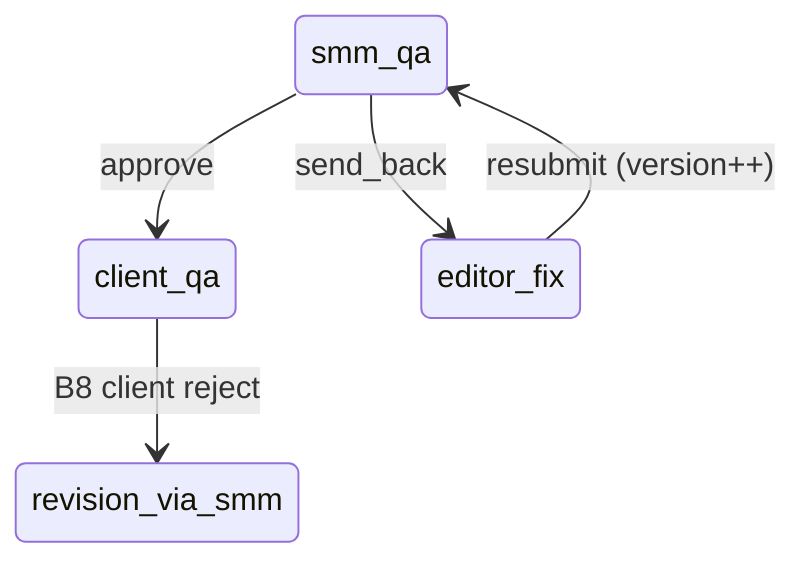

# Backend plan: B7 — SMM internal QA

**Epic:** B7  
**Status:** Done  
**Depends on:** [B0](./B0-auth-and-core-schema.md), [B2](./B2-read-models-boards.md), [B6](./B6-production-readiness-smm-qa-queue.md)  
**Blocks:** B8 (client unified QA requires SMM-approved release)  
**Index:** [`README.md`](./README.md)

---

## Summary

Implement the **internal SMM video QA loop** on post-split deliverables: SMM **adds comments**, **approves and releases to client** (moves ticket to client QA), or **sends back to editor** with feedback. Editors **resubmit** after Drive re-upload, which **bumps video version**, marks prior video-slot comments **sold** (`deprecated`), and returns the ticket to **SMM QA**. Path B v1 uses plain-text comments in `QaCommentWorkspace` (no server-side timestamp UI); legacy `timestampFlags` on `SubmitSmmQaInput` remain optional for API compat.

---

## Scope

### Screens & routes

| Route | Role | B7 UI |
|-------|------|-------|
| `/smm/board` | SMM | `SmmVideoQaModal` → `QaCommentWorkspace` role `smm` |
| `/editor/board` | Editor | `EditorQaFixModal` / `EditorQaFixPanel` — read comments, **Resubmit to SMM QA** |

**Out of B7:** Client QA approve/reject (B8), SMM client revision triage (`smmTriageClientRevision` — B8), scheduling (B9), production title/sync (B6).

### Roles & permissions

| Command | client | editor | smm | admin |
|---------|--------|--------|-----|-------|
| SMM QA approve | — | — | ✓ | — |
| SMM QA send back | — | — | ✓ | — |
| Append SMM QA comment | — | — | ✓ | — |
| Editor resubmit after fix | — | ✓ | — | — |

**Access:** SMM/editor assigned to batch’s client ([`batchAccess.ts`](../../frontend/src/lib/batchAccess.ts)).

### User-visible operations

| Action | UI | API |
|--------|-----|-----|
| Post comment (no state change) | QA workspace “Post comment” | `POST .../qa-comments` |
| Approve & release to client | Approve button | `POST .../smm-qa` `action=approve` |
| Send back to editor | Request changes (draft required) | `POST .../smm-qa` `action=send_back` |
| Resubmit after Drive re-upload | Editor QA fix footer | `POST .../resubmit-to-smm-qa` |

---

## Mock inventory

| Symbol | File | Consumers | B7 |
|--------|------|-----------|-----|
| `submitSmmQaReview` | `adminWorkspaceStore.tsx` | `SmmVideoQaModal` | `POST smm-qa` |
| `appendSmmQaComment` | `adminWorkspaceStore.tsx` | `SmmVideoQaModal` | `POST qa-comments` |
| `SubmitSmmQaInput` | `adminWorkspaceStore.tsx` | Types | Request body |
| `resubmitEditorVideoQa` | `adminWorkspaceStore.tsx` | `EditorQaFixPanel` | `POST resubmit-to-smm-qa` |
| `buildQaCommentsFromFeedback` | `qaComments.ts` | Legacy send_back | Optional timestamp payload |
| `activeCommentsForSlot` | `qaComments.ts` | Thread display | `deprecated=false` filter |
| `flagsToQaComments` | `qaComments.ts` | Legacy `qaFlags` fallback | Read-side compat |
| `videoNeedsSmmQa` | `smmBoard.ts` | Modal guard | `pipeline_stage=smm_qa` |
| `videoEditorQaReturn` | `editorBoard.ts` | Editor fix modal | `pipeline_stage=editor_fix` |
| `QaComment` | `adminWorkspace.ts` | Thread | `qa_comments` rows or JSONB |
| `QaCommentWorkspace` | `QaCommentWorkspace.tsx` | UI shell | Unchanged |

### Not B7

| Symbol | Epic |
|--------|------|
| `smmTriageClientRevision` | B8 |
| `applyClientVideoDecision` | B8 |
| `appendClientQaComment` | B8 |

---

## Domain model

### Eligibility

| Action | Ticket state (server) |
|--------|------------------------|
| SMM QA actions | `pipeline_owner=smm`, `pipeline_stage=smm_qa` (matches [`videoNeedsSmmQa`](../../frontend/src/lib/smmBoard.ts)) |
| Append comment only | Same (stay in `smm_qa`) |
| Editor resubmit | `pipeline_owner=editor`, `pipeline_stage=editor_fix` (matches [`videoEditorQaReturn`](../../frontend/src/lib/editorBoard.ts)) |

Post-split only: `deliverable_index >= 1`.

### Transition 1 — Approve (`action: approve`)

**Ticket:**

| Field | Value |
|-------|--------|
| `pipeline_stage` | `client_qa` |
| `pipeline_owner` | `client` |
| `stage_label` | Client QA |
| `released_to_client_final_review` | `true` |
| `qa_flags` / legacy | cleared (`NULL`) |
| `qa_general_note` | cleared |

From `videoStateFromDemoStage('client_qa')` — [`adminWorkspaceStore`](../../frontend/src/pages/admin/adminWorkspaceStore.tsx) ~583–588.

**Batch:** `updated_at` only.

**Invariant:** Client never sees package before this (B6 `released_to_client_final_review` was false until now).

**Precondition:** Ticket in `smm_qa`. Optional: re-verify B6 readiness still true (title + drive slots) — recommend **yes** on server.

### Transition 2 — Send back (`action: send_back`)

**Requires feedback** (prototype skips if empty):

- `commentBody` trimmed non-empty, **or**
- `timestampFlags[]` non-empty, **or**
- `generalNote` trimmed non-empty

Path B UI only sends `commentBody` via `onRequestChanges(draft)`.

**Ticket:**

| Field | Value |
|-------|--------|
| `pipeline_stage` | `editor_fix` |
| `pipeline_owner` | `editor` |
| `stage_label` | QA flagged (includes “qa flagged” for [`videoEditorQaReturn`](../../frontend/src/lib/editorBoard.ts)) |
| `deadline_role` | `editor` |
| `last_revision_requested_by` | `smm` |
| `qa_flags` | optional legacy array from timestamp flags |
| `qa_general_note` | optional |

**Comments:** Append new `QaComment` rows:

| Source | `kind` | `slot` | `author_role` |
|--------|--------|--------|---------------|
| `commentBody` | `general` | `video` | `smm` |
| `buildQaCommentsFromFeedback` | `timestamp` / `general` | `video` | `smm` |

`asset_version` = current `asset_versions.video` (default 1).

### Transition 3 — Append comment (no workflow change)

Insert `QaComment`: `slot=video`, `kind=general`, `author_role=smm`, `deprecated=false`, tied to current video `asset_version`.

Ticket stage unchanged (`smm_qa`).

### Transition 4 — Editor resubmit (`resubmitEditorVideoQa`)

After editor re-uploads file in Drive (client-side sync; optional B6 `drive-sync` POST with new `modifiedTime`).

**Ticket:**

| Field | Value |
|-------|--------|
| `pipeline_stage` | `smm_qa` |
| `pipeline_owner` | `smm` |
| `asset_versions.video` | `+1` |
| `qa_flags` / `qa_general_note` | cleared |
| Comments where `slot=video` AND `deprecated=false` | set `deprecated=true` (sold) |

**Prototype note:** Resubmit **always** returns to `smm_qa`, even when UI copy mentions “Resubmit to client QA” if `lastRevisionRequestedBy === 'client'`. Server v1 should match **prototype store** unless product amends in B8.



---

## Storage design

> **Superseded.** Canonical schema: [00-storage-design.md](./00-storage-design.md).

## Storage (final)

Canonical design: [00-storage-design.md](./00-storage-design.md) §§ [3.4](./00-storage-design.md#34-video_tickets) (`qa_flags`, `qa_general_note`), [3.5](./00-storage-design.md#35-qa_comments), [5.2](./00-storage-design.md#52-video-level-transitions-post-split-deliverable_index--1).

**Epic-specific deltas (B7 only):**

| Area | Detail |
|------|--------|
| `qa_comments` | **Final** — normalized table only (conflict #2); no JSONB `qa_comment_history` on ticket |
| Sold comments | On video resubmit: `UPDATE qa_comments SET deprecated=true` where `slot=video` and `asset_version < new_version` (invariant #7) |
| Legacy | Optional write `qa_flags` / `qa_general_note` on SMM send-back when using timestamp payload API |
| Reads | B2 mapper: `qaCommentHistory[]` from `qa_comments` |

---

## API catalog

Base: `/api/v1`. Authenticated.

### Commands — SMM

| Method | Path | Body | Response | Replaces |
|--------|------|------|----------|----------|
| POST | `/videos/{video_ticket_id}/smm-qa` | `SubmitSmmQaRequest` | `{ ticket }` | `submitSmmQaReview` |
| POST | `/videos/{video_ticket_id}/qa-comments` | `{ body: string }` | `{ ticket, comment }` | `appendSmmQaComment` |

**`SubmitSmmQaRequest`:**

```json
{
  "action": "approve"
}
```

```json
{
  "action": "send_back",
  "commentBody": "Trim the hook — too long before 0:08"
}
```

Optional legacy:

```json
{
  "action": "send_back",
  "timestampFlags": [{ "atSeconds": 63, "note": "Cut earlier" }],
  "generalNote": ""
}
```

### Commands — Editor

| Method | Path | Body | Response | Replaces |
|--------|------|------|----------|----------|
| POST | `/videos/{video_ticket_id}/resubmit-to-smm-qa` | optional `{ bumpVideoVersion?: true }` | `{ ticket }` | `resubmitEditorVideoQa` |

Typically called after Drive re-upload + optional `POST /videos/{id}/drive-sync` (B6) detecting new `modifiedTime`.

### Reads

| Method | Path | Roles | Notes |
|--------|------|-------|-------|
| GET | `/videos/{id}/qa-comments?slot=video` | editor, smm, client* | Optional; workspace may suffice |

\*Client only after B8 release.

### Validation & errors

| Case | Status |
|------|--------|
| Wrong stage for action | `422` |
| Send back without feedback | `422` |
| Approve when not `smm_qa` | `422` |
| Resubmit when not `editor_fix` | `422` |
| Empty comment body on append | `422` |
| Assignment / tenant | `404` |

---

## Side effects & visibility

| Role | After approve | After send back | After resubmit |
|------|---------------|-----------------|----------------|
| **SMM** | Ticket leaves SMM QA queue | Editor fix attention | Ticket back in SMM QA |
| **Editor** | Waiting on client | QA fix modal | Re-enter SMM QA |
| **Client** | Card in client QA (B8 UI) | No change | No change |

Invalidate all B2 workspace queries after each command.

---

## Frontend cutover

| Current | Replacement |
|---------|-------------|
| `submitSmmQaReview` | `useSubmitSmmQaMutation` |
| `appendSmmQaComment` | `useAppendQaCommentMutation` |
| `resubmitEditorVideoQa` | `useResubmitToSmmQaMutation` |

### Files to touch

- `frontend/src/components/smm/SmmVideoQaModal.tsx`
- `frontend/src/components/editor/EditorQaFixPanel.tsx`
- `frontend/src/pages/admin/adminWorkspaceStore.tsx`
- `frontend/src/hooks/api/useSmmQaMutations.ts`

`QaCommentWorkspace` / `QaCommentWorkspaceThread` unchanged; thread reads `qaCommentHistory` from workspace refetch.

---

## RBAC matrix (B7)

| Route | client | editor | smm | admin |
|-------|--------|--------|-----|-------|
| `POST /videos/{id}/smm-qa` | — | — | ✓* | — |
| `POST /videos/{id}/qa-comments` | — | — | ✓* | — |
| `POST /videos/{id}/resubmit-to-smm-qa` | — | ✓* | — | — |

\*Assigned to batch’s client.

---

## Risks & open questions

| # | Question | Recommendation |
|---|----------|----------------|
| 1 | `qa_comments` table vs JSONB | **Resolved:** `qa_comments` table (wave 2 or 5 per migration plan) |
| 2 | Approve without re-checking readiness | Re-run B6 readiness on approve |
| 3 | Resubmit → `client_qa` when client already approved once | Match prototype (`smm_qa`); fix in B8 if needed |
| 4 | Auto resubmit on drive-sync version change | Manual button v1; auto-detect later |
| 5 | Timestamp flags in API | Support but document Path B UI uses `commentBody` only |
| 6 | SMM append comment while not in smm_qa | `422` |

---

## Suggested implementation order (B7 execution)

1. Migration `qa_comments` + mapper to `QaComment` DTO.  
2. `qa_service.append_comment(smm, ticket_id, body)`.  
3. `qa_service.submit_smm_review` approve / send_back.  
4. `qa_service.resubmit_editor_video(editor, ticket_id)` with deprecate + version bump.  
5. Controllers + schemas.  
6. pytest: approve → client_qa + released flag; send_back → editor_fix + comment; resubmit → smm_qa + sold comment.  
7. OpenAPI + hooks.  
8. Wire SMM modal + editor fix panel.  

---

## Quality checks

- [x] `submitSmmQaReview` and `appendSmmQaComment` mapped  
- [x] `resubmitEditorVideoQa` / sold comments documented  
- [x] Send-back requires feedback  
- [x] Approve sets `released_to_client_final_review`  
- [x] Never client-direct from send-back (editor_fix + smm owner)  
- [x] B8 triage explicitly out of scope  

---

## Links

| Artifact | Path |
|----------|------|
| B6 plan | [`B6-production-readiness-smm-qa-queue.md`](./B6-production-readiness-smm-qa-queue.md) |
| B8 plan (next) | [`README.md`](./README.md) |
| UI spec §3.3 | [`../path-b-ui-spec.md`](../path-b-ui-spec.md) |
| Store QA | [`../../frontend/src/pages/admin/adminWorkspaceStore.tsx`](../../frontend/src/pages/admin/adminWorkspaceStore.tsx) (~527–626, ~734–760) |
| Comments lib | [`../../frontend/src/lib/qaComments.ts`](../../frontend/src/lib/qaComments.ts) |
