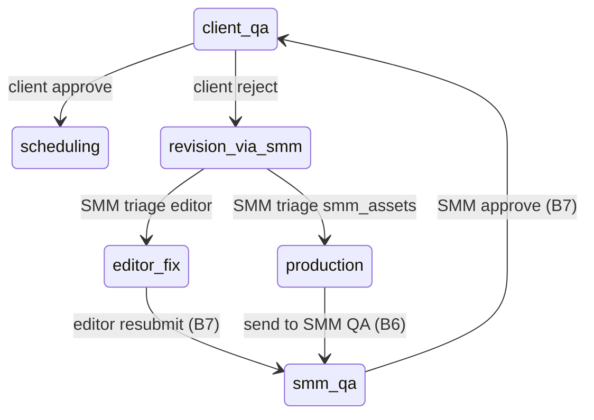

# Backend plan: B8 — Client unified QA & revision via SMM

**Epic:** B8  
**Status:** Storage reconciled  
**Depends on:** [B0](./B0-auth-and-core-schema.md), [B2](./B2-read-models-boards.md), [B7](./B7-smm-internal-qa.md)  
**Blocks:** [B9](./B9-scheduling-credits.md) (client approve → scheduling)  
**Index:** [`README.md`](./README.md)

---

## Summary

Implement **unified client final QA** on post-split deliverables: the client **approves** the video + thumbnail + title package (moves to scheduling), **rejects with feedback** (always routes to **SMM**, never the editor), and **posts comments** without changing workflow. SMM **triages** client revisions by sending video fixes to the **editor** or keeping **thumbnail/title** work in SMM production. After internal rework, the ticket must re-enter **SMM internal QA** (B7) before the client sees it again. Path B v1 uses plain-text feedback in `QaCommentWorkspace`; optional timestamp markers remain API-compatible.

**Scope boundary:** Final / unified QA only (`pipeline_stage=client_qa` with `released_to_client_final_review=true`). Clip approve/reject stays in [B4](./B4-smm-clips-client-clip-review.md).

---

## Scope

### Screens & routes

| Route | Role | B8 UI |
|-------|------|-------|
| `/client/board` | Client | `ClientCardDetailModal` → `ClientUnifiedQaModal` |
| `/client/all` | Client | Same modal when opening completed/in-review cards |
| `/smm/board` | SMM | `SmmClientRevisionModal` → `SmmClientRevisionPanel` |

**Out of B8:** Clip review (`NumberedClipsModal` — B4), SMM internal QA (B7), editor resubmit (B7), scheduling & credits (B9), production field save / send-to-SMM-QA (B6).

### Roles & permissions

| Command | client | editor | smm | admin |
|---------|--------|--------|-----|-------|
| Client QA approve (final) | ✓ | — | — | — |
| Client QA reject (final) | ✓ | — | — | — |
| Append client QA comment | ✓ | — | — | — |
| SMM triage client revision | — | — | ✓ | — |

**Access:** Client → own `client_profile_id` on ticket’s batch. SMM/editor → assigned batch ([`batchAccess.ts`](../../frontend/src/lib/batchAccess.ts)). Editor **does not** receive client revision commands in B8 (read-only visibility via B2 boards + B7 fix flow after SMM routes to editor).

### User-visible operations

| Action | UI | API |
|--------|-----|-----|
| Approve package | `QaCommentWorkspace` Approve (client) | `POST .../client-qa` `action=approve` |
| Request changes | Request changes (draft required) | `POST .../client-qa` `action=reject` |
| Post comment (no state change) | Post comment | `POST .../qa-comments` (`author_role=client`) |
| Route video fix to editor | SMM “Send to editor” | `POST .../client-revision-triage` `route=editor` |
| SMM updates thumb/title | SMM “I'll update thumbnail or title” | `POST .../client-revision-triage` `route=smm_assets` |

---

## Mock inventory

| Symbol | File | Consumers | B8 |
|--------|------|-----------|-----|
| `applyClientVideoDecision` | `adminWorkspaceStore.tsx` | `ClientCardDetailModal` | `POST client-qa` |
| `appendClientQaComment` | `adminWorkspaceStore.tsx` | `ClientUnifiedQaModal` | `POST qa-comments` (reuse B7 table) |
| `smmTriageClientRevision` | `adminWorkspaceStore.tsx` | `SmmClientRevisionModal` | `POST client-revision-triage` |
| `nextStateAfterClientAction` | `clientBoard.ts` | Store + server reference | Final branch only in B8 |
| `videoNeedsClientFinalReview` | `clientBoard.ts` | Modal guard, sidebar | Server eligibility check |
| `videoNeedsSmmClientRevision` | `smmBoard.ts` | SMM kanban + modal | Server eligibility check |
| `buildClientFinalReviewSidebarRows` | `deliverableSidebar.ts` | `ClientUnifiedQaModal` | Filter on read DTO fields |
| `ClientUnifiedQaModal` | `ClientUnifiedQaModal.tsx` | Client QA shell | Wire mutations |
| `SmmClientRevisionPanel` | `SmmClientRevisionPanel.tsx` | Triage CTAs | Wire mutations |
| `QaCommentWorkspace` | `QaCommentWorkspace.tsx` | Shared QA shell | Unchanged |
| `flagsToQaComments` | `qaComments.ts` | Thread display | Read-side compat |
| `buildQaCommentsFromFeedback` | `qaComments.ts` | Reject payload | Optional markers |
| `VideoReviewFeedback` | `VideoDeliverableReviewPanel.tsx` | Reject body | Request schema |
| Seed `v-p-3` | `adminWorkspace.ts` | FLOW-2 step 5 | `client_qa` + released |
| Seed `v-p-rev` | `adminWorkspace.ts` | FLOW-5 / SMM triage | `revision_via_smm` + client comments |

### Not B8

| Symbol | Epic |
|--------|------|
| `applyClientVideoDecision` (clip branch) | B4 |
| `submitSmmQaReview` | B7 |
| `scheduleVideo` | B9 |

---

## Domain model

### Eligibility

| Action | Ticket state (server) |
|--------|------------------------|
| Client approve / reject / append comment | `pipeline_owner=client`, `pipeline_stage=client_qa`, `released_to_client_final_review=true`, `deliverable_index >= 1` |
| SMM triage | `pipeline_owner=smm`, `pipeline_stage=revision_via_smm`, `last_revision_requested_by=client` (recommended strict check) |

Matches [`videoNeedsClientFinalReview`](../../frontend/src/lib/clientBoard.ts) and [`videoNeedsSmmClientRevision`](../../frontend/src/lib/smmBoard.ts):

```60:66:frontend/src/lib/smmBoard.ts
export function videoNeedsSmmClientRevision(video: AdminVideoTicket): boolean {
  if (video.owner !== 'smm') return false
  const stage = video.stageLabel.toLowerCase()
  return (
    stage.includes('client revision') ||
    (video.lastRevisionRequestedBy === 'client' && stage.includes('revision'))
  )
}
```

**Precondition (reject/approve):** B6 readiness should still be true (video + thumbnail + title). Recommend **re-verify on server** before accept/reject — same as B7 approve guard.

### Transition 1 — Client approve (`action: approve`, final only)

Port [`nextStateAfterClientAction`](../../frontend/src/lib/clientBoard.ts) `kind === 'final'`:

| Field | Value |
|-------|--------|
| `pipeline_stage` | `scheduling` |
| `pipeline_owner` | `scheduling` |
| `stage_label` | Scheduling (from `getPathBDemoStageLabel`) |
| `deadline_role` | `NULL` |
| `released_to_client_final_review` | `false` |
| `editor_workflow_phase` | `handed_off` |

**Batch:** `updated_at` only (no credit debit — B9).

**Invariant:** Client cannot approve until B7 released package (`released_to_client_final_review` was true entering `client_qa`).

### Transition 2 — Client reject (`action: reject`, final only)

**Requires feedback** (match B7 send-back):

- `commentBody` / `generalNote` trimmed non-empty, **or**
- `timestampFlags[]` / `markers[]` non-empty (legacy compat)

Path B UI sends only `generalNote` via [`ClientUnifiedQaModal`](../../frontend/src/components/client/ClientUnifiedQaModal.tsx) (`markers: []`).

| Field | Value |
|-------|--------|
| `pipeline_stage` | `revision_via_smm` |
| `pipeline_owner` | `smm` |
| `stage_label` | Client revisions |
| `deadline_role` | `smm` |
| `released_to_client_final_review` | `false` |
| `last_revision_requested_by` | `client` |

**Comments:** Append `qa_comments` rows (`author_role=client`, `slot=video`, `asset_version` = current video version) from `buildQaCommentsFromFeedback` or single general comment.

**Critical invariant (product + FLOW-5 / FLOW-7):** Client reject **never** sets `pipeline_owner=editor`. Editor only sees work after SMM triage `route=editor`.

### Transition 3 — Append client comment (no workflow change)

Insert `QaComment`: `author_role=client`, `slot=video`, `deprecated=false`, current video `asset_version`.

Ticket remains `client_qa` / `client` owner.

**Validation:** Non-empty body; same eligibility as Transition 1.

### Transition 4 — SMM triage `route=editor`

From [`smmTriageClientRevision`](../../frontend/src/pages/admin/adminWorkspaceStore.tsx) ~634–639:

| Field | Value |
|-------|--------|
| `pipeline_stage` | `editor_fix` |
| `pipeline_owner` | `editor` |
| `stage_label` | QA flagged |
| `deadline_role` | `editor` |
| `last_revision_requested_by` | `smm` |

**Note:** Prototype **overwrites** `last_revision_requested_by` from `client` → `smm`. SMM revision queue detection then relies on `stage_label` (“QA flagged”), not `last_revision_requested_by`. Server should match prototype.

**Next steps (out of B8 commands, documented):** Editor fixes → B7 `resubmit-to-smm-qa` → B7 `smm-qa` approve → `client_qa` again.

### Transition 5 — SMM triage `route=smm_assets`

| Field | Value |
|-------|--------|
| `pipeline_stage` | `production` |
| `pipeline_owner` | `smm` |
| `stage_label` | Production (or context-specific label if thumb/title missing) |
| `deadline_role` | `smm` |
| `last_revision_requested_by` | `client` (unchanged) |

SMM uses existing production UI ([`smmNeedsAssetPrep`](../../frontend/src/lib/smmBoard.ts), B6 save + send-to-SMM-QA) before B7 re-release.

### End-to-end revision loop



---

## Storage design

> **Superseded.** Canonical schema: [00-storage-design.md](./00-storage-design.md).

## Storage (final)

Canonical design: [00-storage-design.md](./00-storage-design.md) §§ [3.4](./00-storage-design.md#34-video_tickets), [3.5](./00-storage-design.md#35-qa_comments), [5.2](./00-storage-design.md#52-video-level-transitions-post-split-deliverable_index--1), [6 #3](./00-storage-design.md#6-invariants-server-enforced).

**Epic-specific deltas (B8 only):**

| Area | Detail |
|------|--------|
| DDL | **No new tables** |
| Client reject | `pipeline_owner=smm`, `pipeline_stage=revision_via_smm` — **never** `editor` (invariant #3) |
| Client approve | → `scheduling`; `editor_workflow_phase=handed_off` |
| Comments | `qa_comments` via shared append endpoint; `author_role=client` |
| Triage | SMM `editor` → `editor_fix`; `smm_assets` → `production` |

---

## API catalog

Base: `/api/v1`. Authenticated.

### Commands — client

| Method | Path | Body | Response | Replaces |
|--------|------|------|----------|----------|
| POST | `/client/videos/{video_ticket_id}/client-qa` | `ClientQaRequest` | `{ ticket }` | `applyClientVideoDecision` (final) |
| POST | `/videos/{video_ticket_id}/qa-comments` | `{ body: string }` | `{ ticket, comment }` | `appendClientQaComment` |

**Alternative (reference skill):** `POST /clients/me/videos/{id}/qa-decision` — prefer **video-scoped** paths for consistency with B7.

**`ClientQaRequest`:**

```json
{ "action": "approve" }
```

```json
{
  "action": "reject",
  "commentBody": "Thumbnail feels off-brand — warmer tone."
}
```

Optional legacy:

```json
{
  "action": "reject",
  "timestampFlags": [{ "atSeconds": 42, "note": "Hook too slow" }],
  "generalNote": "Overall pacing"
}
```

**Auth:** `require_roles(client)`; `ticket.client_id == me.client_profile_id`.

**Validation:**

| Case | Status |
|------|--------|
| Not `client_qa` / not released / wrong owner | `422` |
| Reject without feedback | `422` |
| Approve when readiness incomplete | `422` (recommended) |
| Post-split only (`deliverable_index >= 1`) | `422` |
| Clip gate ticket | `422` (use B4 endpoints) |

### Commands — SMM

| Method | Path | Body | Response | Replaces |
|--------|------|------|----------|----------|
| POST | `/videos/{video_ticket_id}/client-revision-triage` | `{ "route": "editor" \| "smm_assets" }` | `{ ticket }` | `smmTriageClientRevision` |

**Auth:** `require_roles(smm)` + batch assignment.

**Validation:**

| Case | Status |
|------|--------|
| Not `revision_via_smm` | `422` |
| `last_revision_requested_by != client` (if enforced) | `422` |
| Unknown `route` | `422` |

### Reads

No new reads — B2 workspace + ticket DTO must expose:

- `releasedToClientFinalVideoReview`
- `lastRevisionRequestedBy`
- `qaCommentHistory` (or embedded comments) with `authorRole`, `deprecated`

Optional filter endpoint (defer): `GET /videos/{id}/qa-comments?slot=video&author_role=client` for SMM panel — prototype filters client comments client-side.

### Side effects & visibility

| Role | After client reject | After client approve | After SMM triage |
|------|---------------------|----------------------|------------------|
| **Client** | Card leaves in-review / “With SMM” | Scheduling column (B9) | Waiting |
| **SMM** | Client revision queue (`v-p-rev`) | Schedule queue later | Editor fix or asset prep |
| **Editor** | No direct notification | No action | QA fix modal if `editor` route |

Invalidate all B2 workspace queries after each command.

---

## Frontend cutover

| Current | Replacement |
|---------|-------------|
| `applyClientVideoDecision` (final) | `useClientQaDecisionMutation` |
| `appendClientQaComment` | `useAppendQaCommentMutation` (role=client; same endpoint as B7 with auth) |
| `smmTriageClientRevision` | `useClientRevisionTriageMutation` |

### Files to touch

- `frontend/src/components/client/ClientCardDetailModal.tsx`
- `frontend/src/components/client/ClientUnifiedQaModal.tsx` (optional: stop closing modal before refetch completes)
- `frontend/src/components/smm/SmmClientRevisionModal.tsx`
- `frontend/src/pages/admin/adminWorkspaceStore.tsx` (remove B8 writes)
- `frontend/src/hooks/api/useClientQaMutations.ts`
- `frontend/src/hooks/api/useSmmRevisionMutations.ts`

`QaCommentWorkspace`, `DeliverableSummaryPanel`, `buildClientFinalReviewSidebarRows` unchanged; data from React Query workspace.

### Regeneration

After OpenAPI: `task frontend:generate-client` → wire generated services in hooks.

---

## RBAC matrix (B8)

| Route | client | editor | smm | admin |
|-------|--------|--------|-----|-------|
| `POST /client/videos/{id}/client-qa` | ✓* | — | — | — |
| `POST /videos/{id}/qa-comments` (client session) | ✓* | — | — | — |
| `POST /videos/{id}/client-revision-triage` | — | — | ✓** | — |

\*Own client’s tickets only.  
\*\*Assigned to batch’s client.

---

## Risks & open questions

| # | Question | Recommendation |
|---|----------|----------------|
| 1 | Single `applyClientVideoDecision` for clip + final | B8 handler validates `client_qa` + post-split; clip paths stay on B4 routes |
| 2 | Re-check B6 readiness on client approve | Yes — prevent scheduling with missing assets |
| 3 | B7 resubmit copy “Resubmit to client QA” when `lastRevisionRequestedBy=client` | After triage→editor, loop is editor_fix → smm_qa → client_qa; optional UI copy fix in B8, not a skip |
| 4 | `qa-comments` POST shared by SMM/client/editor | Infer `author_role` from JWT; validate stage per role |
| 5 | Client comment while not in `client_qa` | `422` |
| 6 | Approve from `revision_via_smm` by mistake | `422` — only scheduling from `client_qa` |
| 7 | Multiple client rejects without version bump | Allowed; append comments; same `revision_via_smm` |
| 8 | SMM triage without reading client comments | Allowed (offline triage); UI shows `qaCommentHistory` |

---

## Suggested implementation order (B8 execution)

1. `qa_service.submit_client_qa(client, ticket_id, action, feedback?)` — approve/reject transitions + comments on reject.  
2. `qa_service.append_comment(client, ...)` — or extend B7 append with role-aware guards.  
3. `qa_service.triage_client_revision(smm, ticket_id, route)`.  
4. Controllers: `client_videos.py` (or `client_qa.py`) + reuse `qa_comments` router from B7.  
5. pytest: reject → `revision_via_smm` + owner smm + comment; approve → `scheduling`; triage editor → `editor_fix`; triage smm_assets → `production`; client never routes reject to editor.  
6. OpenAPI + React Query hooks.  
7. Wire `ClientCardDetailModal`, `SmmClientRevisionModal`.  
8. Fix mode: FLOW-2 step 5 (`v-p-3`), FLOW-5 (`v-p-rev` or fresh batch), FLOW-7 step 3.

---

## Quality checks

- [x] `applyClientVideoDecision`, `appendClientQaComment`, `smmTriageClientRevision` mapped  
- [x] Client reject → `revision_via_smm` / `smm` owner (never editor)  
- [x] Client approve (final) → `scheduling`  
- [x] SMM triage routes documented with downstream B6/B7 dependency  
- [x] `released_to_client_final_review` cleared on reject/approve  
- [x] Clip QA explicitly out of scope (B4)  
- [x] Response shapes sufficient for `ClientUnifiedQaModal` + `SmmClientRevisionPanel` without UI redesign  

---

## Links

| Artifact | Path |
|----------|------|
| B7 plan | [`B7-smm-internal-qa.md`](./B7-smm-internal-qa.md) |
| B9 plan (next) | [`README.md`](./README.md) |
| UI spec §3.3, §4.4 | [`../path-b-ui-spec.md`](../path-b-ui-spec.md) |
| Domain invariant | [`../problem-context.md`](../problem-context.md) |
| Store B8 actions | [`../../frontend/src/pages/admin/adminWorkspaceStore.tsx`](../../frontend/src/pages/admin/adminWorkspaceStore.tsx) (~628–660, ~845–942) |
| Client transitions | [`../../frontend/src/lib/clientBoard.ts`](../../frontend/src/lib/clientBoard.ts) (~252–317) |
| Fix-mode flows | [`../test-ui.md`](../test-ui.md) (FLOW-2 §5, FLOW-5, FLOW-7 §3) |
