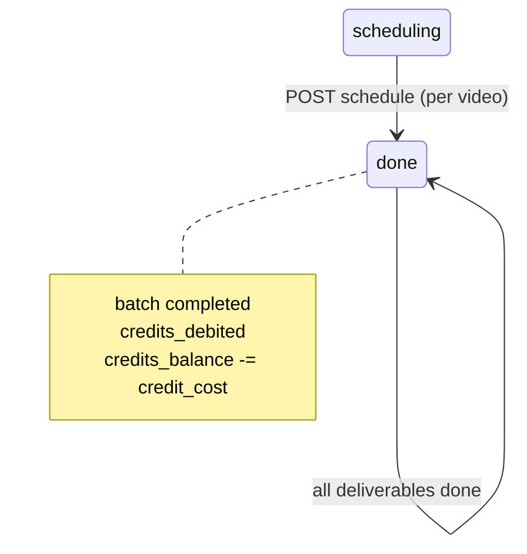

# Backend plan: B9 — Scheduling & credits

**Epic:** B9  
**Status:** Storage reconciled  
**Depends on:** [B0](./B0-auth-and-core-schema.md), [B2](./B2-read-models-boards.md), [B8](./B8-client-qa-revision-via-smm.md)  
**Blocks:** [B11](./B11-mock-removal-integration.md) (Path B terminus), stable enums for [B10](./B10-deadlines-pipeline.md)  
**Index:** [`README.md`](./README.md)

---

## Summary

Implement **per-video scheduling** by SMM: each client-approved deliverable moves from `scheduling` → `done` with a persisted **go-live** record (`platform`, `goLiveAt`, `scheduledAt`). When **every** post-split deliverable in the batch is `done`, the server **closes the batch** (`status=completed`, `credits_debited=true`) and **debits `credit_cost` once** from `client_profiles.credits_balance` inside a single transaction. Path B v1 has **no publish/post URL** on the schedule form ([`fix-flow-1-issues.md`](../fix-flow-1-issues.md) Epic 5). Reads for `/client/all`, `/smm/completed`, and `/editor/completed` come from B2 workspace DTOs with `videoSchedule` / `batchSchedule` populated.

---

## Scope

### Screens & routes

| Route | Role | B9 |
|-------|------|-----|
| `/smm/board` | SMM | `SmmScheduleVideoModal`, schedule column on `SmmPathBVideoKanban` |
| `/client/all` | Client | Scheduled/done rows; `batchSchedule` summary on completed batches |
| `/smm/completed` | SMM | Completed batches; batch-level schedule summary |
| `/editor/completed` | Editor | Read-only archive (batch schedule display) |
| `/admin/clients/:id` | Admin | `creditsDebited` on batch rows; debited total (computed read) |

**Out of B9:** Admin top-up / batch `creditCost` on create (B1), client approve → scheduling (B8), publish-link capture, automated platform posting, credit **reservation** enforcement at batch create (optional hard check — open question).

### Roles & permissions

| Command | client | editor | smm | admin |
|---------|--------|--------|-----|-------|
| Schedule video (mark go-live) | — | — | ✓ | — |
| Read scheduled / completed work | ✓ | ✓ | ✓ | ✓ |

**Access:** SMM must be assigned to the batch’s client. Client reads own batches/videos only.

### User-visible operations

| Action | UI | API |
|--------|-----|-----|
| Set platform + go-live date/time | `SmmScheduleVideoModal` → “Mark scheduled” | `POST /videos/{id}/schedule` |
| (implicit) Batch complete + credit debit | Modal copy + credits badge update | Same response when last video scheduled |
| View scheduled videos | `/client/all` list | B2 `GET /client/workspace` |
| View completed batch archive | `/smm/completed`, `/editor/completed` | B2 workspace (completed batches) |

---

## Mock inventory

| Symbol | File | Consumers | B9 |
|--------|------|-----------|-----|
| `scheduleVideo` | `adminWorkspaceStore.tsx` | `SmmScheduleVideoModal` | `POST .../schedule` |
| `ScheduleVideoInput` | `adminWorkspaceStore.tsx` | Modal form | Request body |
| `VideoScheduleRecord` | `adminWorkspace.ts` | Kanban card hint, modal prefill | `video_schedule` JSONB |
| `BatchScheduleRecord` | `adminWorkspace.ts` | Client all-work, completed pages | `batch_schedule` JSONB |
| `videoNeedsSmmSchedule` | `smmBoard.ts` | Modal guard, kanban | `pipeline_owner=scheduling` |
| `batchReadyForSmmClose` | `smmBoard.ts` | Hints (optional) | All deliverables `done` + not debited |
| `clientReservedCredits` | `clientBoard.ts` | Credits badge | Unchanged formula; debited batch leaves “active” |
| `listSmmAttention` (`kind: schedule`) | `smmBoard.ts` | Attention strip | Client-side from workspace |
| Seed `b-schedule` | `adminWorkspace.ts` | FLOW-1 step 18, FLOW-3 step 8 | `v-sc-1` done, `v-sc-2`/`v-sc-3` scheduling |
| Seed `b-archive` | `adminWorkspace.ts` | `/client/all` completed | `creditsDebited: true`, `batchSchedule` |
| `batchDemoStageAfterScheduleComplete` | `pathBStateMachine.ts` | Store batch patch | `pipeline_stage=completed` on batch |

### Not B9

| Symbol | Epic |
|--------|------|
| `topUpCredits` | B1 |
| `createBatchFolder` (`creditCost`) | B1 |
| `applyClientVideoDecision` (approve → scheduling) | B8 |
| `videoPublishLinks` | Deprecated — do not add to schedule API |

---

## Domain model

### Eligibility — schedule one video

| Check | Rule |
|-------|------|
| Ticket | `pipeline_owner=scheduling`, `pipeline_stage=scheduling` |
| Post-split | `deliverable_index >= 1` |
| Batch | `status=active`, `credits_debited=false` |
| Prior step | Client approved package (B8) — owner should already be `scheduling` |

Matches [`videoNeedsSmmSchedule`](../../frontend/src/lib/smmBoard.ts):

```106:108:frontend/src/lib/smmBoard.ts
export function videoNeedsSmmSchedule(video: AdminVideoTicket): boolean {
  return video.owner === 'scheduling'
}
```

**Reschedule:** Prototype only allows schedule while `owner === 'scheduling'`. Already-`done` tickets are not re-opened via `scheduleVideo` — defer PATCH reschedule to a later epic unless product asks.

### Transition 1 — Schedule video (`scheduleVideo`)

**Ticket** (from store ~777–785, `videoStateFromDemoStage('completed')`):

| Field | Value |
|-------|--------|
| `pipeline_stage` | `completed` |
| `pipeline_owner` | `done` |
| `stage_label` | Scheduled |
| `deadline_role` | `NULL` |
| `video_schedule` | `{ platform, goLiveAt, scheduledAt }` |

- `goLiveAt` = combine `goLiveDate` + `goLiveTime` (document timezone strategy below).
- `scheduledAt` = server `now()` UTC.

**Batch (partial):** `updated_at` only if siblings still scheduling.

### Transition 2 — Batch complete + credit debit (when all deliverables done)

After updating the scheduled ticket, evaluate **post-split deliverables only**:

```788:796:frontend/src/pages/admin/adminWorkspaceStore.tsx
        const batchDeliverables = nextVideos.filter(
          (v) =>
            v.batchId === batchId &&
            v.deliverableIndex != null &&
            v.deliverableIndex > 0,
        )
        const allDone =
          batchDeliverables.length > 0 &&
          batchDeliverables.every((v) => v.owner === 'done')
```

**When `allDone && !credits_debited`:**

| Entity | Field | Value |
|--------|-------|--------|
| **Batch** | `status` | `completed` |
| | `pipeline_stage` | `completed` |
| | `credits_debited` | `true` |
| | `completed_at` | now |
| | `batch_schedule` | `{ platform, goLiveAt, completedAt }` from **this** schedule request (last video wins in prototype) |
| **Client profile** | `credits_balance` | `max(0, balance - credit_cost)` |

**Invariants:**

1. **Debit exactly once** per batch — guard with `credits_debited` + row lock / `SELECT FOR UPDATE` in transaction.
2. **Debit only when all** indexed deliverables are `done` — gate tickets (`deliverable_index` null) do not count.
3. **Per-video scheduling** — sibling videos may still be `scheduling` until each is scheduled; credits do not debit early.
4. **No publish URL** in v1 — omit `videoPublishLinks` on write; keep read compat for legacy seed (`b-archive`).

### State diagram



Entry to `scheduling`: B8 client approve (final).

---

## Storage design

> **Superseded.** Canonical schema: [00-storage-design.md](./00-storage-design.md).

## Storage (final)

Canonical design: [00-storage-design.md](./00-storage-design.md) §§ [3.3](./00-storage-design.md#33-batches) (`batch_schedule`, `credits_debited`), [3.4](./00-storage-design.md#34-video_tickets) (`video_schedule`), [3.6](./00-storage-design.md#36-credit_adjustments-recommended), [6 #4](./00-storage-design.md#6-invariants-server-enforced).

**Epic-specific deltas (B9 only):**

| JSONB | API keys (camelCase) |
|-------|----------------------|
| `video_schedule` | `platform`, `goLiveAt`, `scheduledAt` |
| `batch_schedule` | Set on batch complete: `platform`, `goLiveAt`, `completedAt` — **do not write** `video_publish_links` (§11) |

**Debit transaction** (single tx, `FOR UPDATE` on batch): ticket → `done`; when all indexed tickets done and `credits_debited=false` → `status=completed`, `credits_debited=true`, debit `credit_cost` from `client_profiles.credits_balance`; optional `credit_adjustments` (`kind=debit_batch`, `amount=-credit_cost`).

---

## API catalog

Base: `/api/v1`. Authenticated.

### Commands — SMM

| Method | Path | Body | Response | Replaces |
|--------|------|------|----------|----------|
| POST | `/videos/{video_ticket_id}/schedule` | `ScheduleVideoRequest` | `ScheduleVideoResponse` | `scheduleVideo` |

**`ScheduleVideoRequest`:**

```json
{
  "platform": "YouTube Shorts",
  "goLiveDate": "2026-05-20",
  "goLiveTime": "17:00"
}
```

Alternative: accept single `goLiveAt` ISO string from client — only if frontend is updated; v1 match prototype fields.

**`ScheduleVideoResponse`:**

```json
{
  "ticket": { /* VideoTicketDto */ },
  "batch": { /* BatchFolderDto — always */ },
  "client": { /* ClientProfileDto — only when batch just completed + debited */ }
}
```

Include updated `client.credits` when debit runs so credits badge updates without extra round-trip.

### Reads

No new read endpoints — B2 workspace must expose:

| DTO field | Source |
|-----------|--------|
| `videoSchedule` | `video_schedule` JSONB |
| `batchSchedule` | `batch_schedule` JSONB |
| `creditsDebited` | `credits_debited` |
| `client.credits` | `credits_balance` |

Ensure completed batches and done tickets appear on:

- `GET /client/workspace`
- `GET /smm/workspace`
- `GET /editor/workspace`

(B2 scoping already includes `status=completed`.)

### Validation & errors

| Case | Status |
|------|--------|
| Not `pipeline_owner=scheduling` | `422` |
| Batch already `credits_debited` / completed | `422` (or allow reschedule of last pending video only if batch still active — match prototype: batch completed blocks new schedules) |
| Empty platform / date / time | `422` |
| Invalid date/time | `422` |
| `deliverable_index` null (gate ticket) | `422` |
| SMM not assigned | `404` |
| `goLiveDate` in the past | Warn only in UI; server may allow (scheduled in the past for demos) |

### Platform values

Match UI `<select>` options:

`YouTube Shorts`, `Instagram Reels`, `TikTok`, `Facebook`, `LinkedIn`

Server: enum or allow-list validation; reject unknown strings with `422`.

### Timezone

Prototype: `new Date(\`${goLiveDate}T${goLiveTime}\`)` in browser local TZ.

**Recommendation:** Server interprets date+time as **UTC** if sent as ISO from frontend in a follow-up; for B9 parity, accept date/time strings and document “stored as UTC combining fields” or require frontend to send `goLiveAt` ISO in workspace mutation hook.

---

## Side effects & visibility

| Role | After one video scheduled | After batch completes |
|------|---------------------------|------------------------|
| **SMM** | Card moves to done column; siblings may stay in scheduling | Batch leaves active board; appears in `/smm/completed` |
| **Client** | `/client/all` shows row when `owner=done` | Credits decrease; reserved drops (`status=completed`); “Credits debited” on batch |
| **Editor** | Completed archive when batch closes | Read-only batch summary |
| **Admin** | Pipeline counts ↓ | `creditsDebited` on client detail |

Invalidate B2 workspace queries: `client`, `smm`, `editor`, `admin` after schedule.

---

## Frontend cutover

| Current | Replacement |
|---------|-------------|
| `scheduleVideo` | `useScheduleVideoMutation` |

### Files to touch

- `frontend/src/components/smm/SmmScheduleVideoModal.tsx`
- `frontend/src/pages/smm/SmmBoard.tsx`
- `frontend/src/pages/admin/adminWorkspaceStore.tsx` (remove schedule + debit writes)
- `frontend/src/hooks/api/useScheduleVideoMutation.ts`
- `frontend/src/pages/client/ClientAllWork.tsx` (no store; refetch workspace)
- `frontend/src/components/client/ClientCreditsBadge.tsx` (uses profile from query)

`SmmPathBVideoKanban`, `SmmAttentionStrip`, `listSmmAttention` unchanged — driven by `owner` / `videoSchedule` on refetch.

### Regeneration

`task frontend:generate-client` after OpenAPI.

---

## RBAC matrix (B9)

| Route | client | editor | smm | admin |
|-------|--------|--------|-----|-------|
| `POST /videos/{id}/schedule` | — | — | ✓* | — |
| Workspace reads (scheduled/done) | ✓** | ✓* | ✓* | ✓ |

\*Assigned to batch’s client.  
\*\*Own client only.

---

## Risks & open questions

| # | Question | Recommendation |
|---|----------|----------------|
| 1 | `batch_schedule` from last video only | Match prototype; future: aggregate “multi-platform” summary |
| 2 | Negative `credits_balance` after debit | v1: `max(0, balance - cost)` like store; log warning |
| 3 | Block batch create when `credit_cost > available - reserved` | B1 left as UI warn; optional hard `422` in B9 service |
| 4 | `video_count` vs actual ticket count | `allDone` uses existing tickets with `deliverable_index > 0`; if count mismatch, batch may never close — add admin repair or enforce on B5 split |
| 5 | Reschedule done videos | Out of scope v1 |
| 6 | Publish links in problem-context | Superseded by Path B v1 UI — no field in B9 |
| 7 | Double-submit schedule (double-click) | Idempotent: second POST on same ticket if already `done` → `422` |
| 8 | Concurrent schedules on last two videos | Transaction + `credits_debited` guard prevents double debit |
| 9 | Timezone for `goLiveAt` | Document in API; prefer ISO from client in hook later |

---

## Suggested implementation order (B9 execution)

1. Alembic: ensure `video_schedule` / `batch_schedule` JSONB columns exist (B0 nullable).  
2. `schedule_service.schedule_video(smm_user, ticket_id, input)` with eligibility checks.  
3. `schedule_service.try_complete_batch(batch_id, schedule_payload)` — all-done detection + debit.  
4. Wire transaction + `credit_adjustments` optional row.  
5. Controller + Pydantic `ScheduleVideoRequest` / response with `ticket`, `batch`, optional `client`.  
6. pytest: partial schedule leaves batch active; final schedule debits once; second complete attempt does not debit again; gate tickets ignored in all-done.  
7. OpenAPI + `useScheduleVideoMutation`.  
8. Wire `SmmScheduleVideoModal`.  
9. Fix mode: FLOW-3 steps 7–8, FLOW-6, FLOW-1 step 18 (`b-schedule`), FLOW-7 step 3 (client reject path unrelated — scheduling only after approve).

---

## Quality checks

- [x] `scheduleVideo` mapped to one command endpoint  
- [x] Per-video schedule + batch-level debit when all deliverables done  
- [x] `credits_debited` idempotency documented  
- [x] No publish URL in v1 API  
- [x] `videoSchedule` / `batchSchedule` on read DTOs (B2)  
- [x] Post-split deliverable filter matches prototype store  
- [x] B8 entry (`scheduling`) referenced; B1 top-up separate  

---

## Links

| Artifact | Path |
|----------|------|
| B8 plan | [`B8-client-qa-revision-via-smm.md`](./B8-client-qa-revision-via-smm.md) |
| B1 credits | [`B1-admin-clients-batches.md`](./B1-admin-clients-batches.md) |
| B2 reads | [`B2-read-models-boards.md`](./B2-read-models-boards.md) |
| UI spec §6, credits § | [`../path-b-ui-spec.md`](../path-b-ui-spec.md) |
| Per-video schedule UX | [`../fix-flow-1-issues.md`](../fix-flow-1-issues.md) (Epic 5) |
| Store schedule | [`../../frontend/src/pages/admin/adminWorkspaceStore.tsx`](../../frontend/src/pages/admin/adminWorkspaceStore.tsx) (~762–837) |
| Fix-mode | [`../test-ui.md`](../test-ui.md) (FLOW-3, FLOW-6, FLOW-1 §18) |
| Demo batch | `b-schedule` / `v-sc-*` in [`../../frontend/mockData/adminWorkspace.ts`](../../frontend/mockData/adminWorkspace.ts) |
