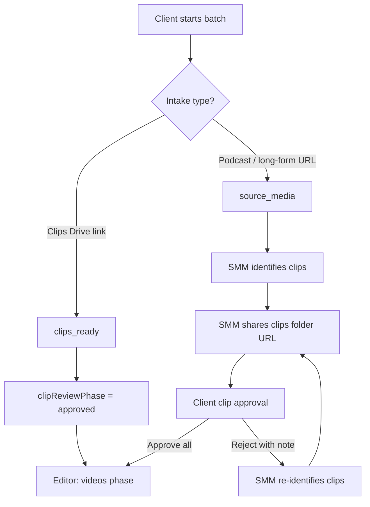

# Content lifecycle — batch delivery model

This document is the **authoritative description** of how a content batch moves from client intake to scheduled delivery for Scale Brands Lab Studio. It reflects the workflow the team agreed on in product discussions and what the **current frontend prototype** implements.

For broader product vision, roles, and an older pipeline sketch (idea-first path, SMM text creation before editing), see [`problem-context.md`](./problem-context.md). That doc is still useful for access control and long-term scope; **this doc supersedes it for the raw-footage / clips delivery path** we are building first.

---

## What a batch is

A **batch** is one client content cycle: a fixed set of short-form deliverables numbered **1…n**, from intake through scheduling. Each batch has:

- Its own **clips Google Drive folder** (identified or client-supplied cuts).
- Its own **editor deliverables Google Drive folder** (edited videos + thumbnails).
- **Per-deliverable tickets** in Studio (one row per index `1…n` on the Kanban boards).
- A **credit cost** debited when every deliverable in the batch reaches `done` / scheduled.

Studio does **not** host uploads in v1. Media lives on Drive; the platform stores **folder URLs**, **synced file metadata**, and **QA / approval state**.

---

## Roles and ownership

At any moment, work is owned by exactly one party:

| Owner | Typical work |
|--------|----------------|
| **Client** | Intake URL, clip approval, final video QA, thumbnail QA |
| **SMM** | Find clips, share clips folder, video QA, scheduling, receive publish titles |
| **Editor** | Edit videos, upload to Drive, thumbnails, send titles to SMM |
| **Scheduling** | Transitional owner while SMM schedules all videos in the batch |
| **Done** | Scheduled; batch can close and credits debit |

Admins create clients/batches, assign SMM/Editor, set deadlines, and view pipeline health. They do not sit in the approval chain for each deliverable unless escalated offline.

---

## Google Drive layout (per batch)

Two separate folder links per batch:

### 1. Clips folder

- **Purpose:** Candidate or final clip files before editing.
- **Structure:** Flat folder; files numbered **1…n** (e.g. `1.mov`, `2.mov`, or `Video 1.mov`).
- **Who creates it:** SMM (after identifying clips from a podcast/long-form link), or the client (if they already have cuts).
- **Example (dev):** [Trimmed clips folder](https://drive.google.com/drive/folders/13Dw03A1s7tLQOBm8jj5XmwzxR94AK1ut).

### 2. Editor deliverables folder

- **Purpose:** Finished videos and thumbnails for QA.
- **Structure:** Root folder with two subfolders (any casing):
  - **`Video/`** — edited videos numbered **1…n** (aligned with clip indices).
  - **`Thumbnail/`** — thumbnail images numbered **1…n**.
- **Who creates it:** Editor, after clips are approved and editing starts.
- **Example (dev):** [April deliverables folder](https://drive.google.com/drive/folders/1lnwiGh3b-UQ5PYwPvWmvpRxOcRpSjFkV).

Every folder used in Studio must be shared with the **Google service account** (Viewer) so a dev script can list files and the app can embed previews.

---

## Intake paths

| Path | `intakePath` | Clip QA |
|------|----------------|---------|
| Client sends podcast / raw footage URL | `source_media` | Required after SMM submits clips folder |
| Client sends pre-cut clips folder | `clips_ready` | Skipped — editing can start once URL is saved |

**Batch-level clip approval** is approve-all or reject-with-note (which clip numbers need changes). It is not per-clip approve/reject in v1, though rejection notes should cite clip numbers.

On clip approval, `videoCount` should match the number of indexed files in the clips manifest (prototype: `approveBatchClips` reads manifest length).

---

## Deliverable lifecycle (per index 1…n)

Each numbered deliverable moves through phases independently on the boards, but follows the same rules.

```mermaid
stateDiagram-v2
  direction LR
  [*] --> editing: clips_approved
  editing --> smmVideoQA: editor_submits_videos_drive
  smmVideoQA --> clientVideoQA: smm_approves
  smmVideoQA --> editing: smm_requests_changes
  clientVideoQA --> thumbEditing: client_approves_video
  clientVideoQA --> clientVideoQA: client_requests_changes
  editing --> smmVideoQA: reupload_after_smm_reject
  editing --> clientVideoQA: reupload_after_client_reject
  thumbEditing --> clientThumbQA: editor_submits_thumbnails
  clientThumbQA --> awaitingTitle: client_approves_thumb
  clientThumbQA --> thumbEditing: client_rejects_thumb
  awaitingTitle --> scheduling: editor_submits_title
  scheduling --> done: smm_schedules_batch
```

### Phase detail

| Phase | Who acts | Drive | Studio |
|--------|----------|-------|--------|
| **Editing — videos** | Editor | Uploads to `Video/` | Editor shares deliverables folder URL → all in-scope tickets → `owner: smm`, stage SMM QA |
| **SMM video QA** | SMM | Reviews `Video/{n}` | Timestamp + general comments; approve → client, or send back → editor |
| **Client video QA** | Client | Same file | Same comment UX; approve → editor `thumbnails` phase; reject → editor |
| **Editing — thumbnails** | Editor | Uploads to `Thumbnail/` | Editor marks thumbnails ready → `owner: client`, thumbnail review |
| **Client thumbnail QA** | Client | `Thumbnail/{n}` | **No SMM QA** on thumbnails; approve / reject with note |
| **Titles** | Editor | N/A (text only) | Per-video publish title submitted to SMM **after** thumbnail approval |
| **Scheduling** | SMM | N/A | Platform, go-live, publish links; all videos → `done`; batch may complete |

### Re-upload routing

When the editor replaces a file on Drive and resubmits:

| Last rejection by | After resubmit, goes to |
|-------------------|-------------------------|
| **SMM** | SMM video QA |
| **Client** | Client video QA (SMM already approved) |

Tracked on the ticket as `lastRevisionRequestedBy: 'smm' | 'client'`.

### QA comment history

- Comments are stored per deliverable in `qaCommentHistory` (slot: `clip` | `video` | `thumbnail`).
- On re-upload, when Drive sync detects a file change (`modifiedTime` / size), the asset **version** increments and prior comments for that slot are marked **`deprecated: true`** — not deleted.
- UI shows active comments plus a collapsible “previous version” section.

---

## Batch completion

A batch is **completed** when:

1. Every deliverable ticket in the batch has `owner: done` (scheduled).
2. SMM has filled batch scheduling metadata (`batchSchedule`: platform, `goLiveAt`, per-video publish links).
3. Credits for the batch are debited (`creditsDebited: true` on the batch).

Until all videos are scheduled, the batch stays `status: active`.

---

## How Studio surfaces the lifecycle (prototype)

### Data model (in-memory mock)

Implemented in [`frontend/mockData/adminWorkspace.ts`](../frontend/mockData/adminWorkspace.ts) and mutated via [`adminWorkspaceStore.tsx`](../frontend/src/pages/admin/adminWorkspaceStore.tsx):

| Concept | Fields / behavior |
|---------|-------------------|
| Batch | `clipsFolderUrl`, `editorDeliverablesDriveUrl`, `clipReviewPhase`, `intakePath`, `videoCount`, `batchSchedule` |
| Deliverable ticket | `owner`, `stageLabel`, `editorPhase`, `deliverableIndex`, `qaCommentHistory`, `lastRevisionRequestedBy` |
| Boards | Client / SMM / Editor Kanban derive columns from `owner` + `stageLabel` + `editorPhase` |

There is **no backend persistence** yet; refresh resets to seed data.

### Google Drive integration (prototype)

Problem: the browser cannot safely hold service-account credentials, and Drive files are not directly playable via a simple public URL.

**Approach chosen:**

1. **Service account** — folders shared with SA email; JSON key in `backend-app/secrets/` (gitignored).
2. **Dev script** — `npm run drive:sync-manifests` ([`scripts/sync-drive-manifest.ts`](../scripts/sync-drive-manifest.ts)) lists folders and writes [`frontend/mockData/driveManifests.ts`](../frontend/mockData/driveManifests.ts) with `{ index, driveFileId, name, mimeType, modifiedTime }` per slot.
3. **In-app playback** — Drive **preview iframe** (`/file/d/{id}/preview`) and thumbnail image URL; plus “Open folder on Drive” at the top of each review screen.

Config for which batches to sync: [`scripts/drive-manifest-config.ts`](../scripts/drive-manifest-config.ts) (dev batch `b-204` wired to the real sample folders).

**Limitation:** Timestamp comments at the playhead need a native `<video>` element; with iframe preview, users rely more on **general comments** or opening the file on Drive. A future backend stream proxy would fix that.

### UI entry points

| Step | Role | Component / screen |
|------|------|---------------------|
| Clip approval | Client | `ClientClipReviewPanel` + `DriveFolderReviewShell` |
| SMM video QA | SMM | `SmmVideoQaModal` + `DriveVideoReviewLayout` |
| Client final video | Client | `ClientFinalReviewPanel` |
| Client thumbnail | Client | `ThumbnailReviewPanel` |
| Editor fix / resubmit | Editor | `EditorQaFixModal` + `QaCommentThread` |
| Find clips / schedule | SMM | `SmmFindClipsModal`, `SmmScheduleBatchModal` |

Helpers: [`frontend/src/lib/driveMedia.ts`](../frontend/src/lib/driveMedia.ts), [`frontend/src/lib/qaComments.ts`](../frontend/src/lib/qaComments.ts).

---

## Divergence from `problem-context.md`

| Topic | `problem-context.md` | This lifecycle / prototype |
|--------|----------------------|----------------------------|
| Entry | Idea-first **or** raw footage | **Raw footage / clips** path is primary; idea-first not wired on boards |
| Before editing | SMM **text creation** + client text approval | **Not in this path** — titles come **after** thumbnails from editor |
| SMM QA | Video **and** thumbnail together before client | **Video only**; thumbnails go **straight to client** |
| Client reject (final) | Back to SMM QA | Re-upload → **client QA** if client rejected; **SMM QA** if SMM rejected |
| Media | External links only | Same, plus **manifest sync** and embedded Drive preview |
| Persistence | Implied server state | **Mock store only** today |

---

## Implementation status

| Capability | Status |
|------------|--------|
| Batch + ticket state machine in mock store | Implemented |
| Clip / video / thumbnail review with Drive preview | Implemented (batch `b-204` + manifest) |
| QA history + deprecated comments on version bump | Types + store; version bump on sync is script-time (re-run sync + reload) |
| Resubmit routing (SMM vs client) | Implemented |
| Titles after thumbnails → SMM scheduling | Implemented |
| `npm run drive:sync-manifests` | Implemented |
| Backend API + DB | **Not started** |
| Live “Refresh from Drive” in UI | **Not started** (re-run script) |
| Idea-first path, SMM pre-edit text | **Deferred** |
| Byte-stream video proxy for seek + timestamps | **Deferred** |

---

## Operational checklist (team)

1. Create batch in admin; client completes intake (`source_media` or `clips_ready`).
2. Ensure **clips folder** exists and is shared with the service account.
3. SMM pastes clips folder URL (or client already did for `clips_ready`).
4. Run `npm run drive:sync-manifests` after folder contents change.
5. Client approves clips in Studio (or skips if `clips_ready`).
6. Editor edits, creates **deliverables folder** with `Video/` and later `Thumbnail/`, shares URL in Studio.
7. Re-sync manifests after re-uploads.
8. SMM video QA → client video QA → editor thumbnails → client thumbnail QA → editor titles → SMM schedule.
9. Batch completes; credits debit.

---

## Related files

- Product context: [`problem-context.md`](./problem-context.md)
- Feature notes: [`features/client-dashboard-context.md`](./features/client-dashboard-context.md), [`features/smm-dashboard-context.md`](./features/smm-dashboard-context.md), [`features/editor-dashboard-context.md`](./features/editor-dashboard-context.md)
- Drive setup: [README — Google Drive manifests](../README.md#google-drive-manifests-prototype)
- Plan history: Drive media prototype (mock-only, no product API)
